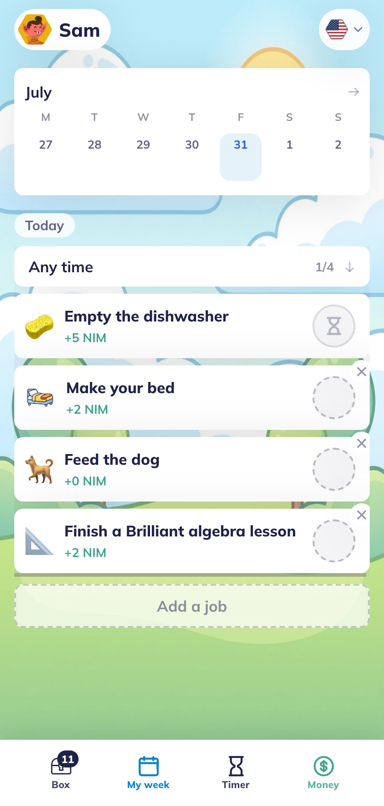
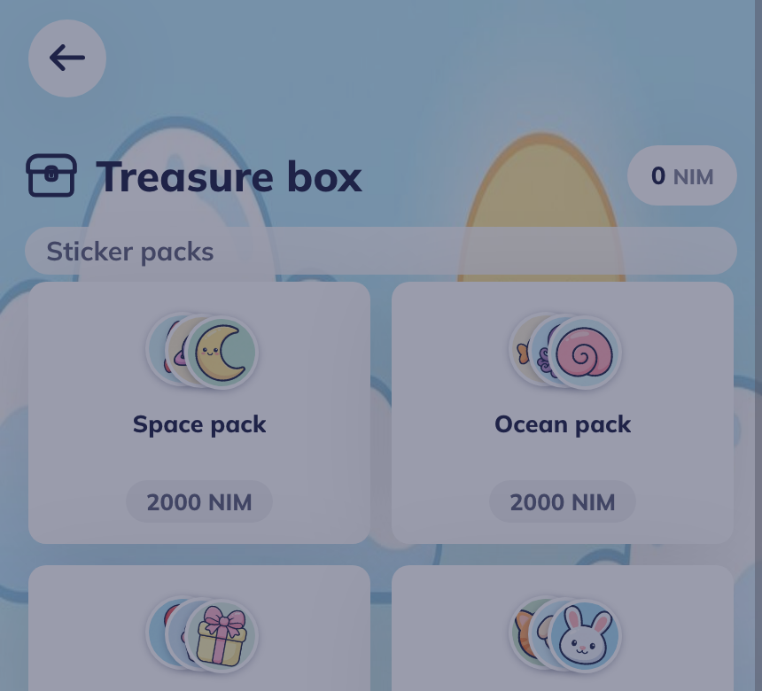
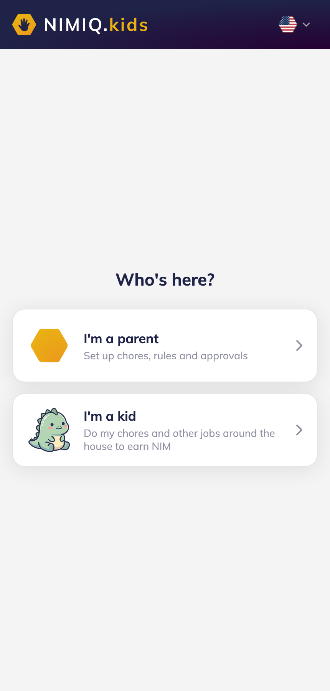
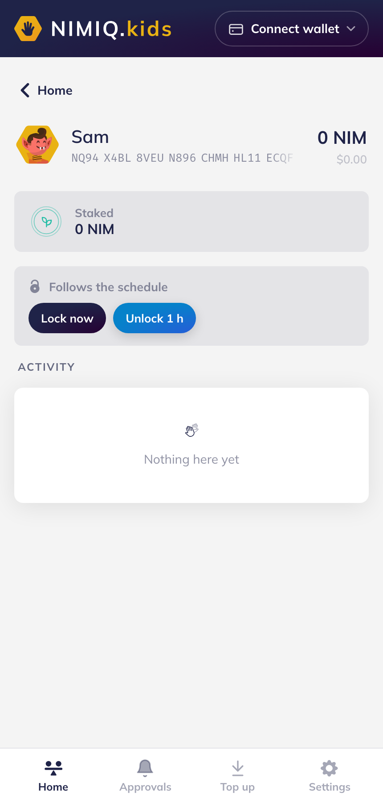
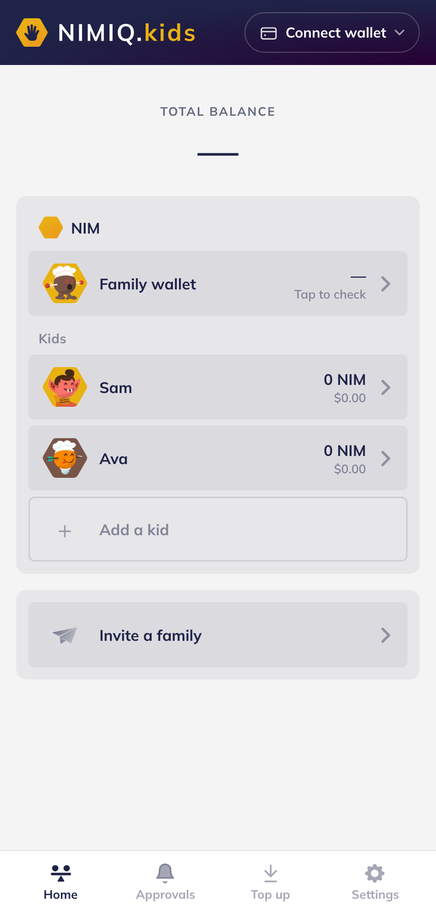

# Nimiq.kids

> Teaching kids how to be their own bank

| Field | Value |
| --- | --- |
| Category | Lifestyle |
| Pricing | Free |
| Team name | _Not provided — optional_ |
| Team members | _Not provided — optional_ |
| X account | andjroo111 |
| Contact email | andjroo111@gmail.com |
| GitHub login | @Andjroo111 |
| Submitted at | 2026-07-31T23:56:05.457Z |

## Links

| Link | URL |
| --- | --- |
| Repo | [https://github.com/Andjroo111/nimiq.kids](<https://github.com/Andjroo111/nimiq.kids>) |
| Demo | [https://nimiq.kids](<https://nimiq.kids>) |
| Video | [https://nimiq.kids/video](<https://nimiq.kids/video>) |

## Description

A family allowance that runs on real money: a parent prices a chore, the kid does it, one approval sends real NIM to the kid's own account, and the kid spends it back inside the family, so the household's net position stays flat. It teaches a kid to be their own bank, speaks five

## Builder story

I have kids almost 7 and 4, and I have been a father for 15 years. Screens are addicting and a kid cannot manage that on their own, but a chart works. Every parent already knows this. So I built the chart, and then I made the reward real.

A parent sets the job and sets the price. The kid does the work. The parent approves it from their own phone and a real Nimiq transaction lands in an account that belongs to the kid, a genuine derived account whose private key is never written to the database and is only re-derived to sign. Then the kid spends it back to the parent on the things only a parent can sell: screen time, a trip to the pool, a toy at the store. The parent re-funds and it runs again. Two transactions in opposite directions between the same two accounts, so the family's net position stays flat. Nobody in the house loses a dollar. What actually changes hands is effort.

That circle is the whole point, because it is what makes "be your own bank" teachable to a four year old. The kid has their own address, their own balance, a Grow side that stakes to a real validator, and a spend side. They earn it, they save it, they spend it, and they watch it move. No ads, no loot boxes, no accounts for kids, no kid PII ever.

It speaks five languages, German, English, Spanish, French and Portuguese, and it runs in two places off one build. Inside Nimiq Pay it uses the injected mini-app provider. In a plain browser it falls back to a browser wallet. One branch in the code picks. A parent on a laptop and a kid on a tablet open the same link and both of them just work.

Nimiq is the thesis of crypto, but easy. Borderless, transparent, self-custodial, beautiful. What it has never had is an ecosystem, somewhere people actually spend. That is what I am building, and this app is one drop into that ocean. Investing in kids is investing in humanity. I am here temporarily, and they are the world next, no matter where in the world they are. The rest of the fleet is at andjroo.com.

## Thumbnail

## Screenshots

---

_Generated from the submission form. `submission.yaml` in this folder is the machine-readable source of truth._
