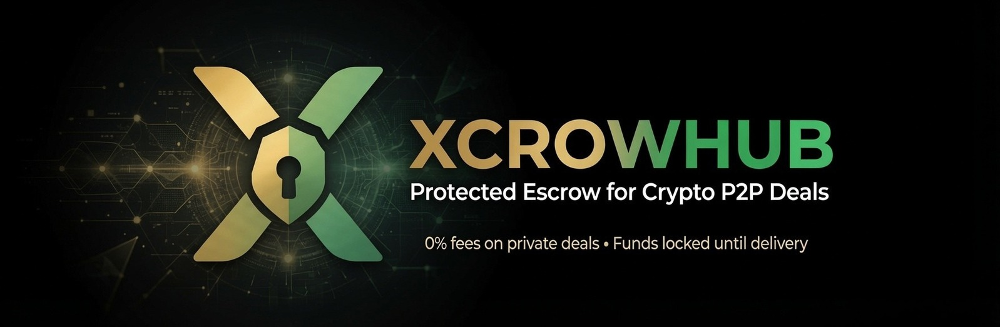
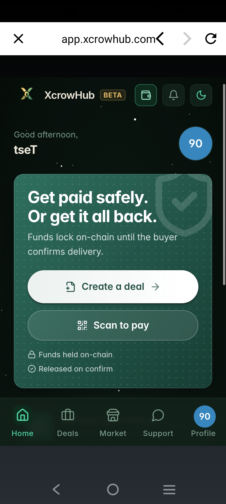
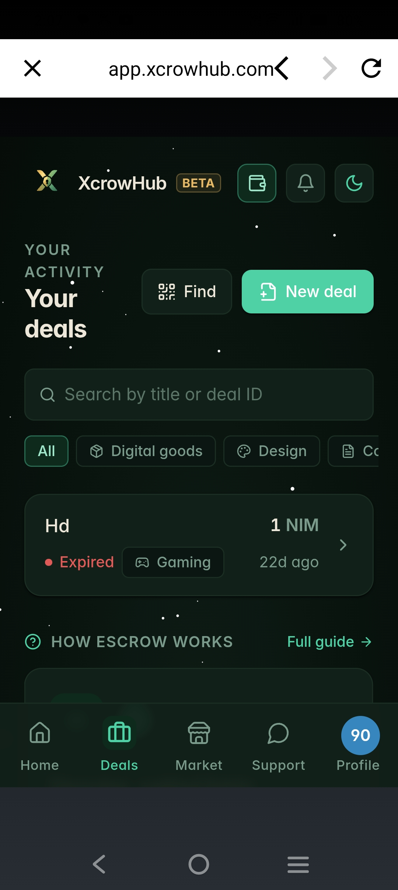
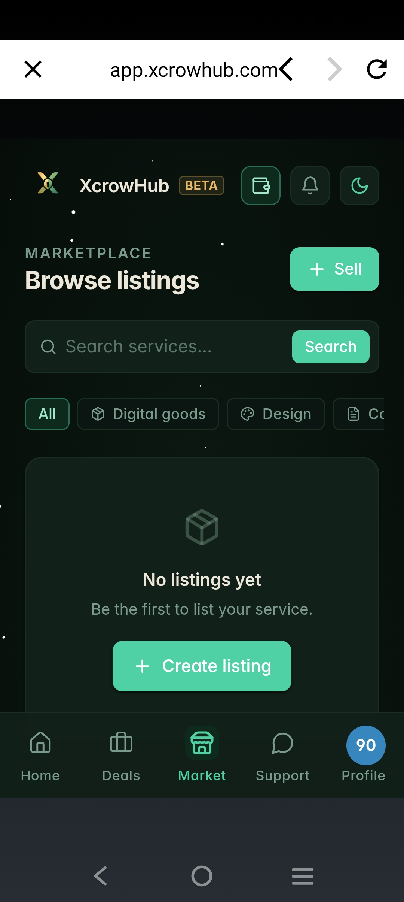
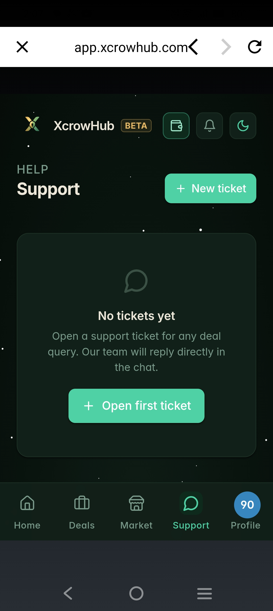

# XcrowHub

> Protected deals for crypto P2P. Money stays locked in escrow until delivery is confirmed. No fees on deals.

| Field | Value |
| --- | --- |
| Category | Shopping & deals |
| Pricing | Free |
| Team name | _Not provided — optional_ |
| Team members | _Not provided — optional_ |
| X account | xcrowhub |
| Contact email | dynamofaizi@gmail.com |
| GitHub login | @DropXpert |
| Submitted at | 2026-07-14T09:05:31.194Z |

## Links

| Link | URL |
| --- | --- |
| Repo | [https://github.com/dropxpert/xcrowhub](<https://github.com/dropxpert/xcrowhub>) |
| Demo | [https://app.xcrowhub.com](<https://app.xcrowhub.com>) |
| Video | [https://x.com/xcrowhub/status/2076548258193952909](<https://x.com/xcrowhub/status/2076548258193952909>) |

## Description

XcrowHub locks buyer funds in escrow until delivery is confirmed. Zero fees on private deals, 1% seller-side fee on marketplace deals. Built on Nimiq Pay as a Mini App with wallet-signature auth (no KYC). Human-reviewed proof-based disputes ensure fairness never automatic payou

## Builder story

Built XcrowHub solo as a Web3 founder and AI developer to fix the trust gap in P2P crypto deals. Designed a zero-fee private escrow + low-fee marketplace layer with wallet-only auth and human-reviewed proof disputes (instead of blind smart-contract releases or centralized platforms). Full end-to-end build: React + TypeScript + Tailwind frontend, Supabase backend + Edge Functions, custom Node.js custody signer, Nimiq Pay Mini App SDK integration, dual support for NIM and USDT (Polygon). Launched with clear positioning around safer, private Web3 transactions. No KYC, no passwords, on-chain finality with real human oversight for disputes.

## Thumbnail

## Screenshots

---

_Generated from the submission form. `submission.yaml` in this folder is the machine-readable source of truth._
