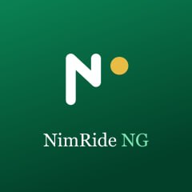
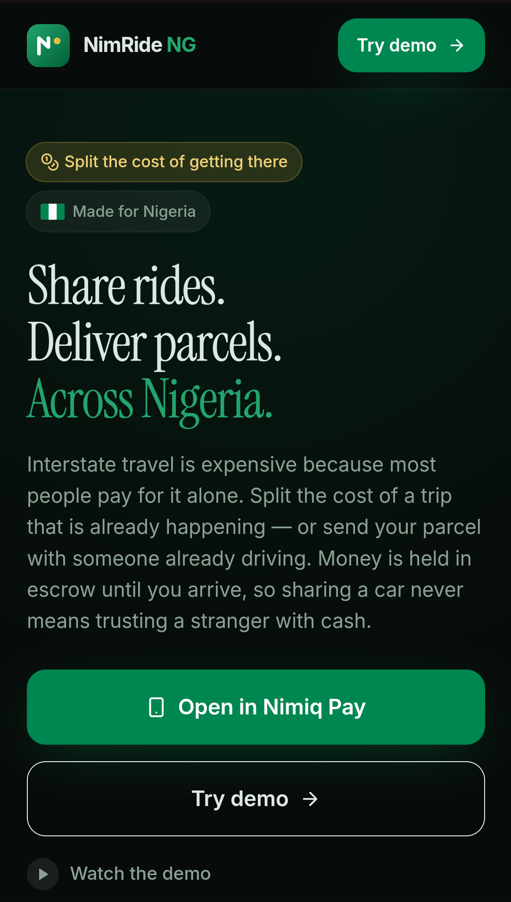
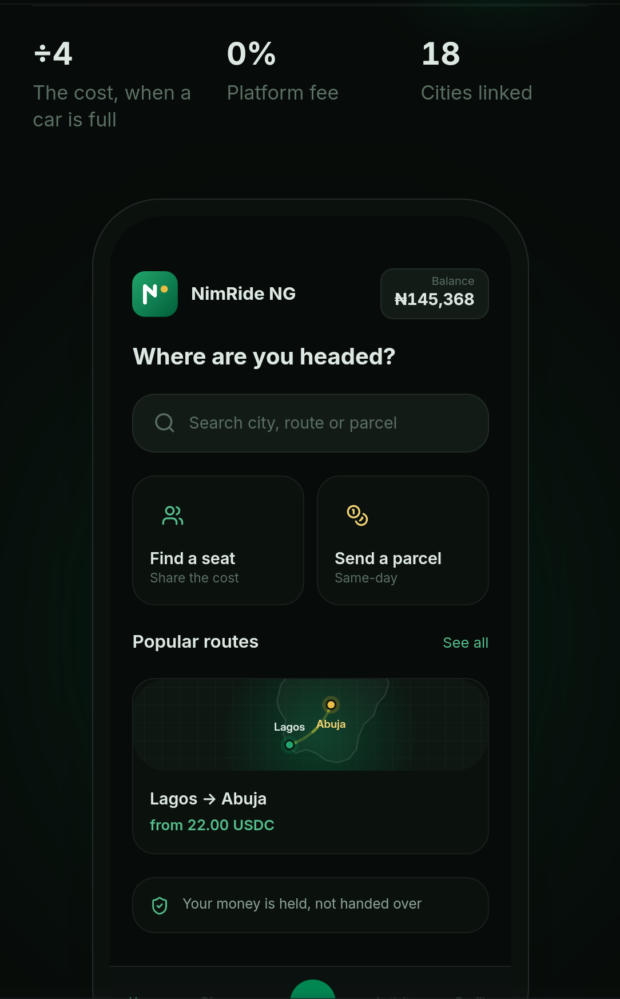
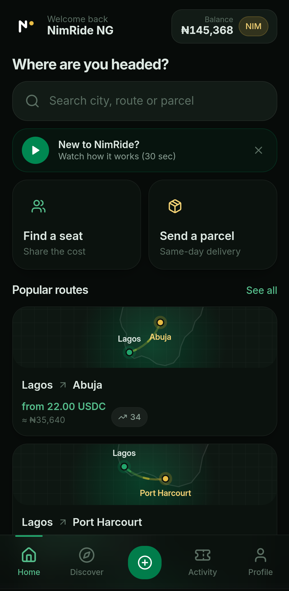
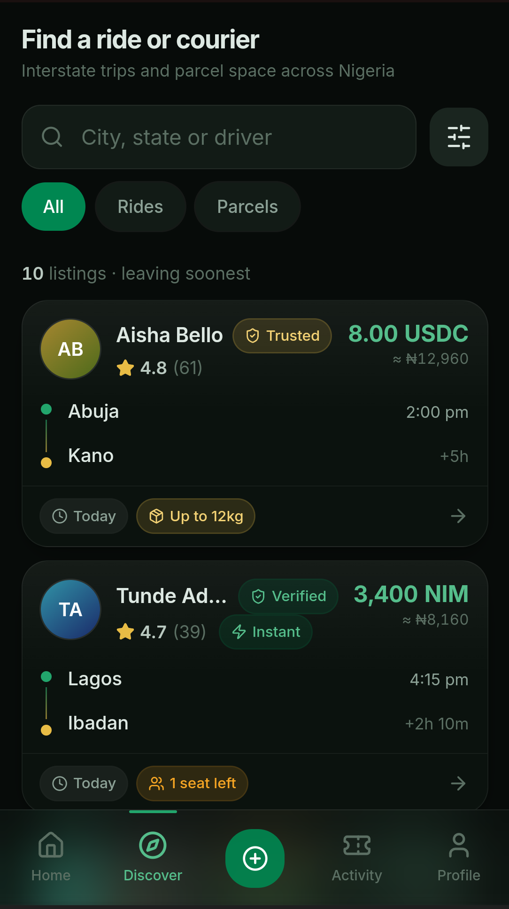
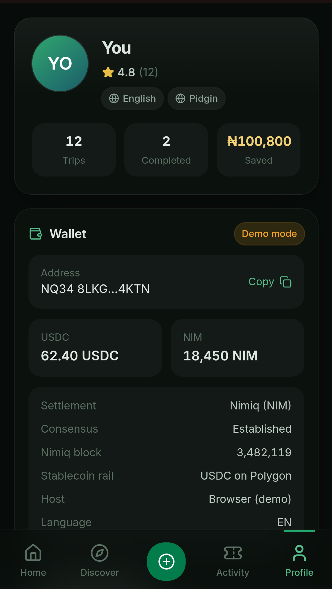

# NimRide NG

> Share rides. Deliver parcels. Across Nigeria

| Field | Value |
| --- | --- |
| Category | Marketplaces |
| Pricing | Free |
| Team name | Megacollins |
| Team members | _Not provided — optional_ |
| X account | Megacollins |
| Contact email | paulchristian1800@gmail.com |
| GitHub login | @Megacollins |
| Submitted at | 2026-07-30T20:38:12.426Z |

## Links

| Link | URL |
| --- | --- |
| Repo | [https://github.com/Megacollins/nimride-ng](<https://github.com/Megacollins/nimride-ng>) |
| Demo | [https://nimride.vercel.app](<https://nimride.vercel.app>) |
| Video | [https://youtu.be/aL1XPzFqGV8](<https://youtu.be/aL1XPzFqGV8>) |

## Description

NimRide NG lets Nigerians travelling between states share the cost of trips that are already happening. book a seat in a car going your way, or send a parcel with someone already driving there. Payment is held in escrow and released only when the passenger confirms arrival.

## Builder story

Millions of Nigerians cannot afford to travel. Not "would rather not" cannot.
Transport is one of the first things people cut when money is tight, and since fuel subsidy removal it has climbed past what a lot of households can absorb.

I know that one personally. As a student I barely went home for celebrations. Not
because I didn't want to be there, but because the fare was more than I had. You tell people you're busy, or that you have exams. The real reason is that you
counted what was in your account and the number didn't work. Christmas, weddings, burials, you follow them from a phone screen while everyone else is in the room.

What always got to me is that the cars were going anyway.

On any given morning there are vehicles running Lagos to Abuja with three empty seats in them. A car burns the same fuel whether one person is inside it or four same petrol, same tolls, same wear. So one person carries the entire cost of a journey and uses a quarter of the space, while someone else, who is going to the exact same place, stays home.

That gap is the whole product. NimRide NG doesn't create new journeys or put more.vehicles on the road. It fills seats and boot space that were already travelling empty, so the cost lands on four people instead of one.

The hard part was never the booking screen. It was trust why would you get into a stranger's car, or hand them your parcel, or pay before you have moved? So verification is a checklist rather than a score, both sides sign the trip terms
from their own wallets, and the money is held rather than handed over: a six-digit code that only the passenger has is the only thing that releases payment on arrival. No cash at the park.

I built the thing I needed as a student, for the millions of people still in that
position.

## Thumbnail

## Screenshots

---

_Generated from the submission form. `submission.yaml` in this folder is the machine-readable source of truth._
