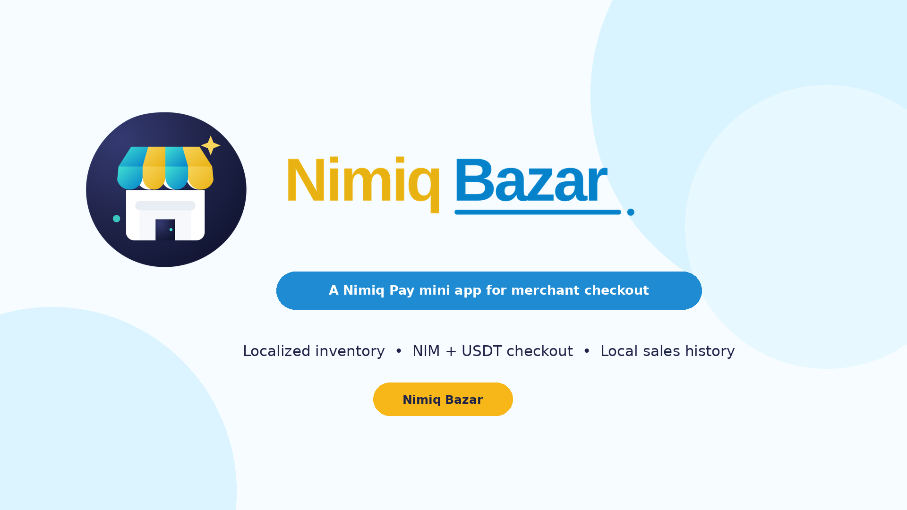
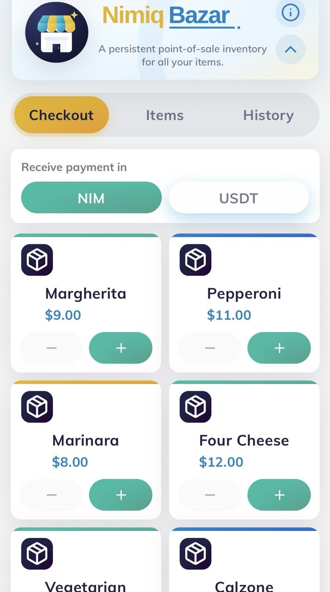
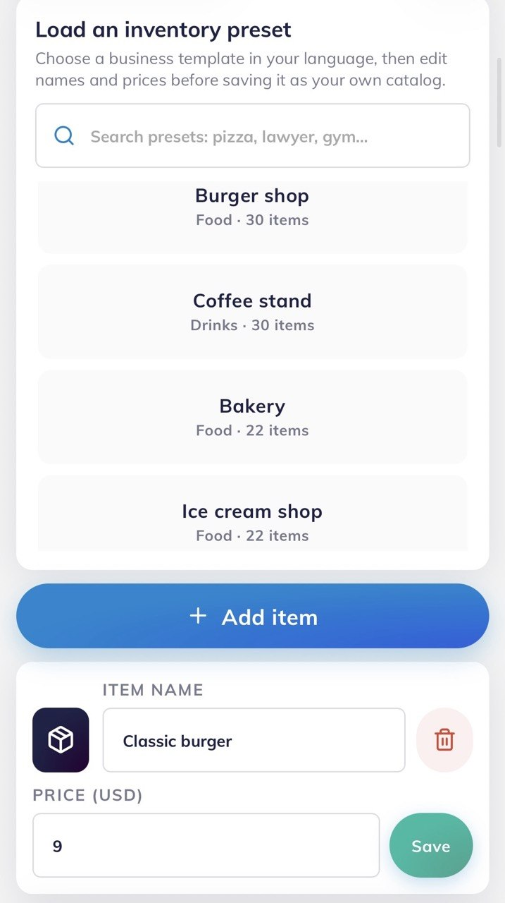
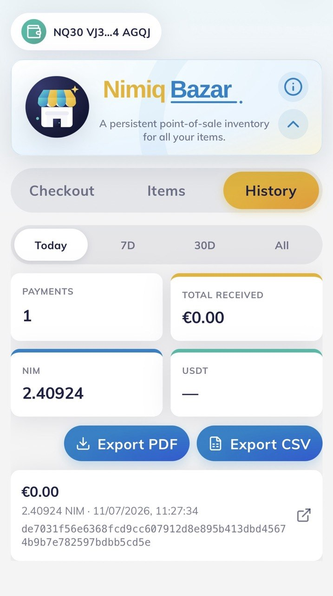
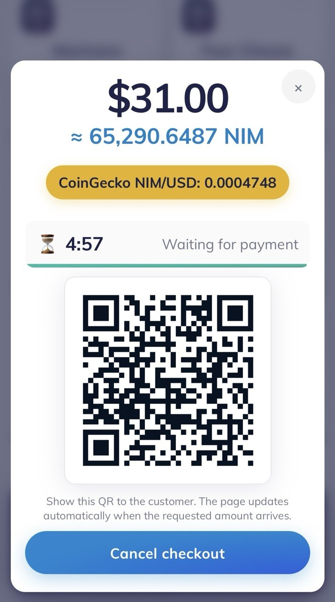

# Nimiq Bazar

> A persistent point-of-sale inventory for all your items. Stored locally in your device.

| Field | Value |
| --- | --- |
| Category | Marketplaces |
| Pricing | Free |
| Team name | _Not provided — optional_ |
| Team members | _Not provided — optional_ |
| X account | vpn4access |
| Contact email | angelofornasieri@gmail.com |
| GitHub login | @NimiqBlue |
| Submitted at | 2026-07-11T11:26:58.040Z |

## Links

| Link | URL |
| --- | --- |
| Repo | [https://github.com/NimiqBlue/nimiq-bazar/](<https://github.com/NimiqBlue/nimiq-bazar/>) |
| Demo | [https://bazar.nimiq.fyi/](<https://bazar.nimiq.fyi/>) |
| Video | [https://www.youtube.com/shorts/_Me83woBW1s](<https://www.youtube.com/shorts/_Me83woBW1s>) |

## Description

Nimiq Bazar turns Nimiq Pay into a lightweight merchant POS. Merchants can load a localized inventory preset or build their own, price items in their preferred fiat currency, accept NIM or US

## Builder story

_Not provided — optional_

## Thumbnail

## Screenshots

---

_Generated from the submission form. `submission.yaml` in this folder is the machine-readable source of truth._
