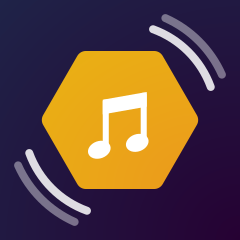
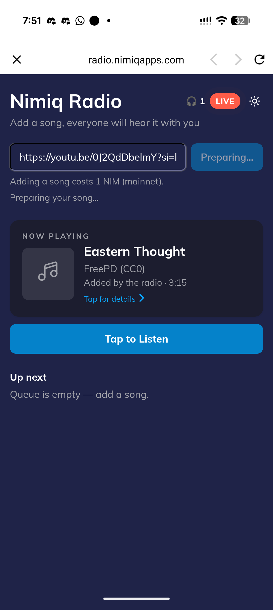
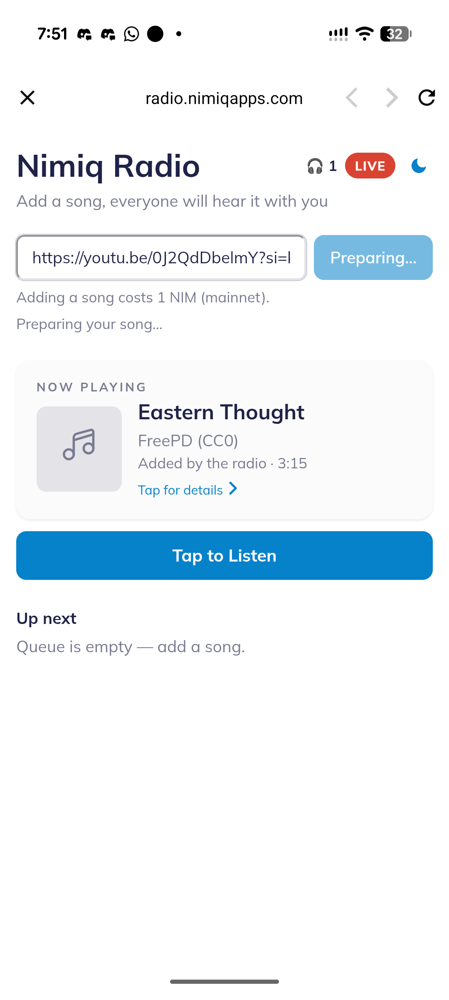
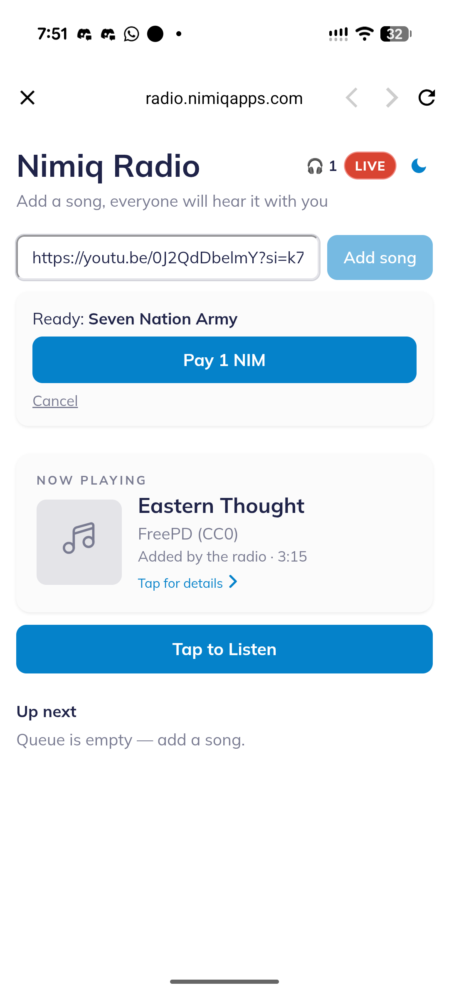
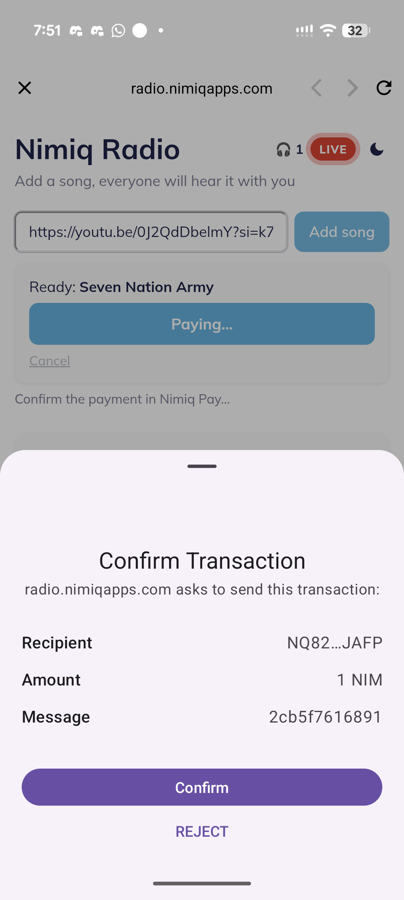
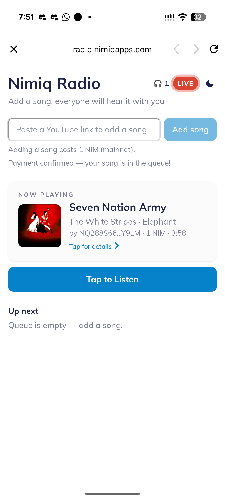

# Nimiq Radio

> One shared radio. Everyone hears the same song at the same moment.

| Field | Value |
| --- | --- |
| Category | Social |
| Pricing | Free |
| Team name | _Not provided — optional_ |
| Team members | _Not provided — optional_ |
| X account | _Not provided — optional_ |
| Contact email | richy@nimiq.com |
| GitHub login | @PanoramicRum |
| Submitted at | 2026-07-22T13:52:57.252Z |

## Links

| Link | URL |
| --- | --- |
| Repo | [https://github.com/PanoramicRum/nimiq-radio](<https://github.com/PanoramicRum/nimiq-radio>) |
| Demo | [https://radio.nimiqapps.com/](<https://radio.nimiqapps.com/>) |
| Video | [https://github.com/PanoramicRum/nimiq-radio/blob/main/assets/demo.gif](<https://github.com/PanoramicRum/nimiq-radio/blob/main/assets/demo.gif>) |

## Description

Nimiq Radio is a synchronized community radio powered by Nimiq Pay. Add a song from YouTube, SoundCloud, Bandcamp, or Audius, pay a small NIM fee, and it joins a shared global queue that everyone hears together in real time.

## Builder story

_Not provided — optional_

## Thumbnail

## Screenshots

---

_Generated from the submission form. `submission.yaml` in this folder is the machine-readable source of truth._
