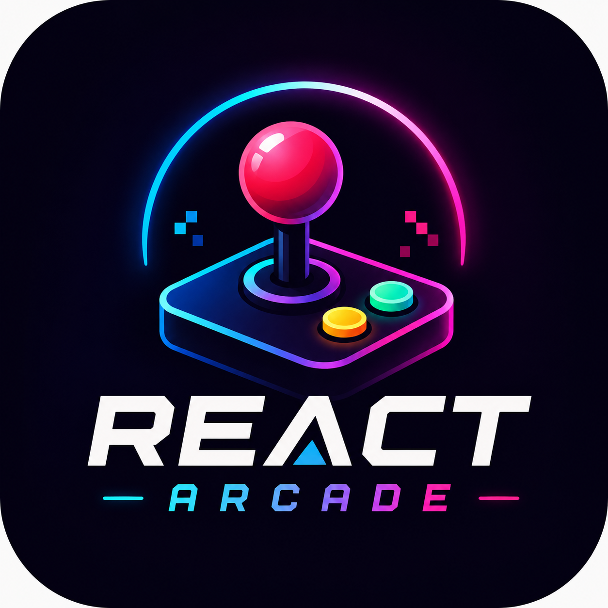
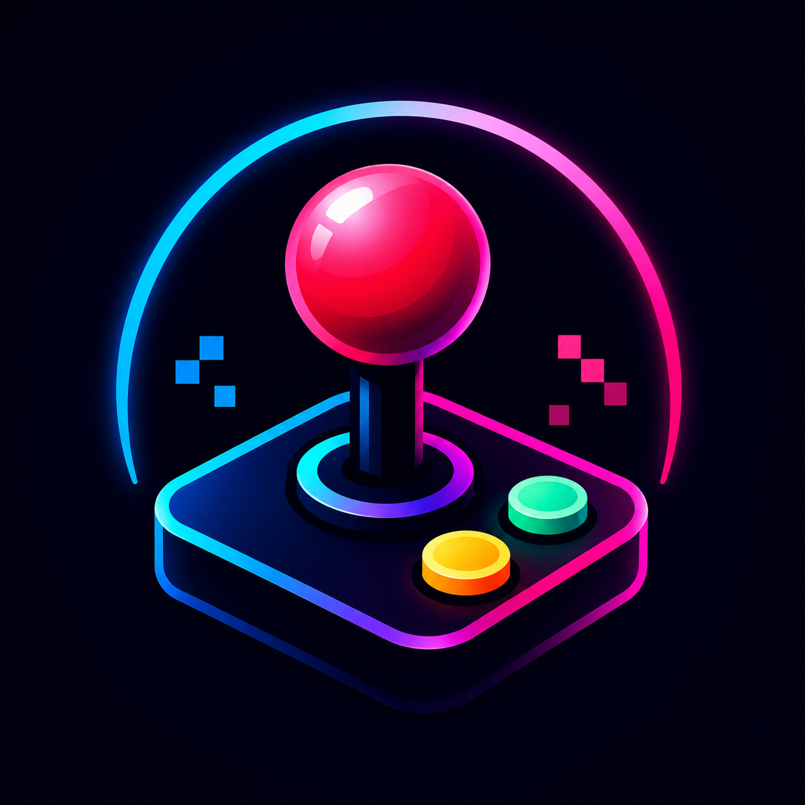
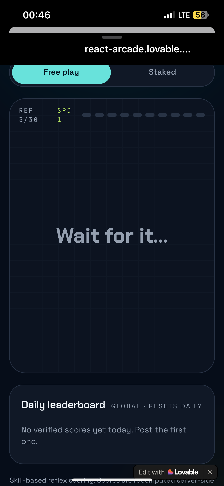
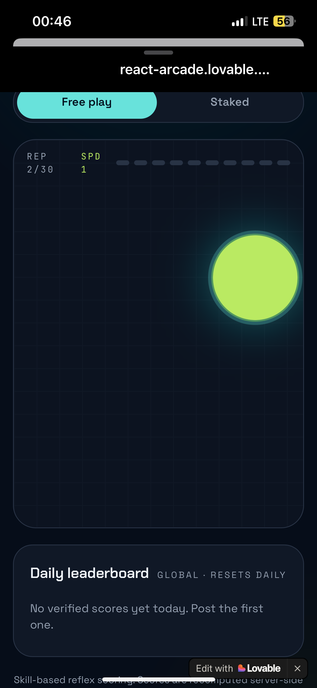
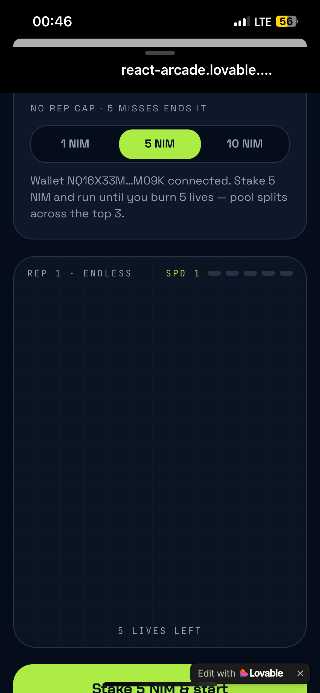

# React Arcade

> Think fast with your fingers

| Field | Value |
| --- | --- |
| Category | Games |
| Pricing | Freemium |
| Team name | _Not provided — optional_ |
| Team members | _Not provided — optional_ |
| X account | _Not provided — optional_ |
| Contact email | aoki91460@gmail.com |
| GitHub login | @aoki-non |
| Submitted at | 2026-07-31T23:51:11.661Z |

## Links

| Link | URL |
| --- | --- |
| Repo | [https://github.com/aoki-non/react-arcade](<https://github.com/aoki-non/react-arcade>) |
| Demo | [https://react-arcade.lovable.app/](<https://react-arcade.lovable.app/>) |
| Video | [https://x.com/oja_market/status/2083338283484864637?s=46](<https://x.com/oja_market/status/2083338283484864637?s=46>) |

## Description

A simple game that users click the object on screen to react to, the more users react the faster the object appears quickly

## Builder story

_Not provided — optional_

## Thumbnail

## Screenshots

---

_Generated from the submission form. `submission.yaml` in this folder is the machine-readable source of truth._
