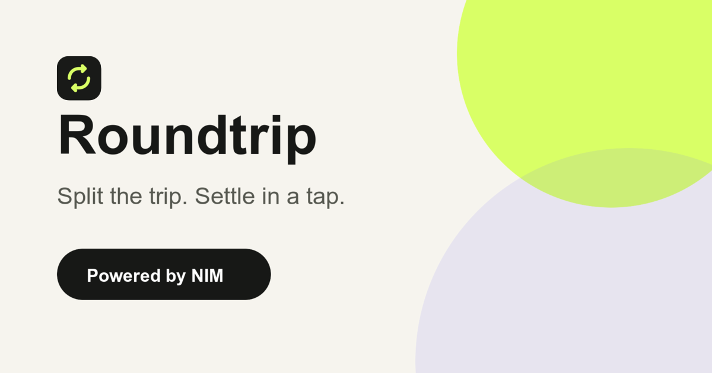
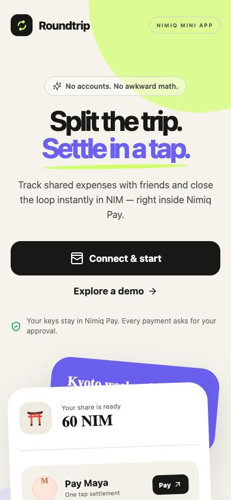
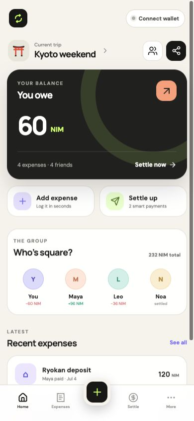
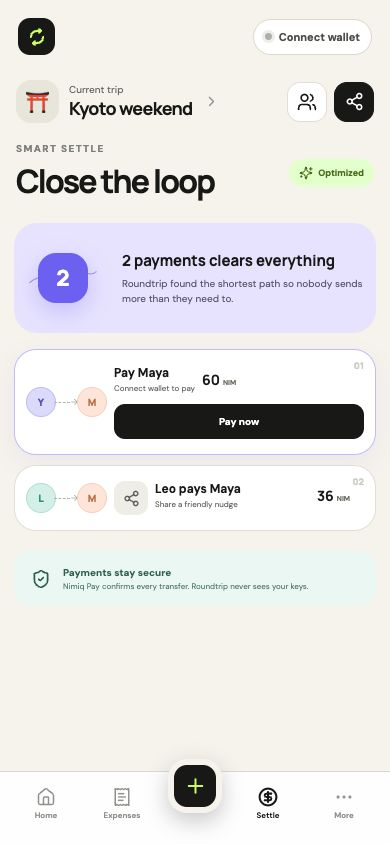
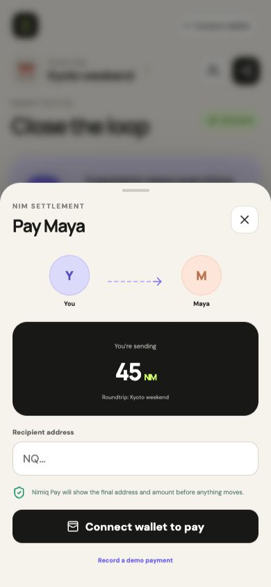

# Roundtrip

> Split the trip. Settle in a tap.

| Field | Value |
| --- | --- |
| Category | Productivity |
| Pricing | Free |
| Team name | Doraking |
| Team members | _Not provided — optional_ |
| X account | doraking_en |
| Contact email | hatatomo0310@gmail.com |
| GitHub login | @dorakingx |
| Submitted at | 2026-07-10T12:36:19.329Z |

## Links

| Link | URL |
| --- | --- |
| Repo | [https://github.com/dorakingx/nimiq-roundtrip](<https://github.com/dorakingx/nimiq-roundtrip>) |
| Demo | [https://nimiq-roundtrip.vercel.app/](<https://nimiq-roundtrip.vercel.app/>) |
| Video | [https://youtube.com/shorts/VW2VYI5OGyk](<https://youtube.com/shorts/VW2VYI5OGyk>) |

## Description

Roundtrip tracks shared expenses, finds the shortest settlement path, and lets friends settle in NIM inside Nimiq Pay—no accounts, awkward math, or separate payment app required.

## Builder story

_Not provided — optional_

## Thumbnail

## Screenshots

---

_Generated from the submission form. `submission.yaml` in this folder is the machine-readable source of truth._
