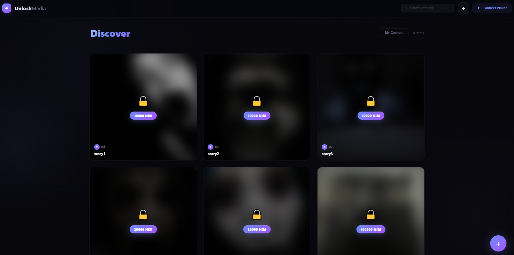
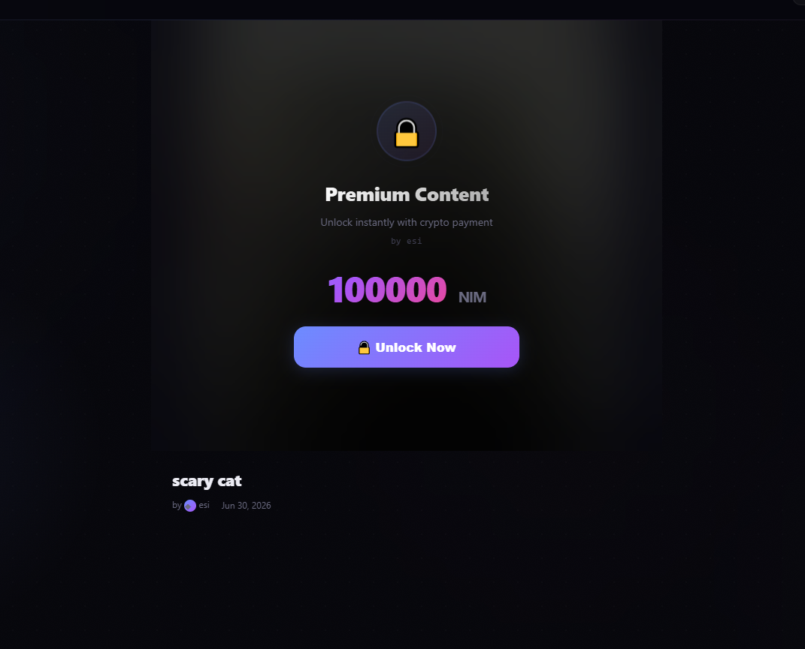
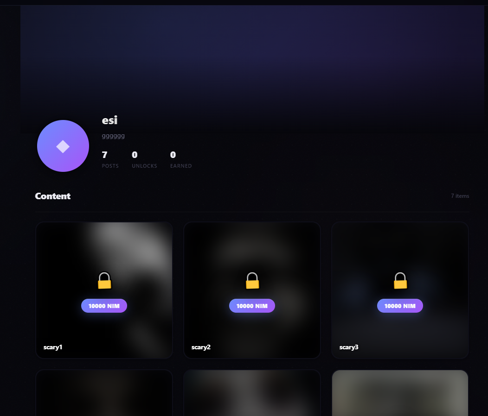
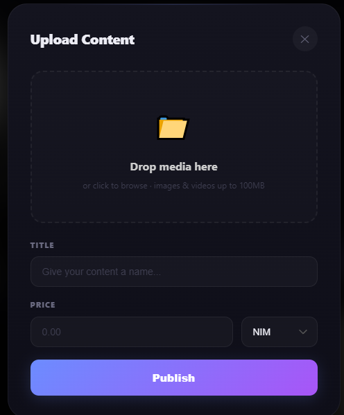

# UnlockMedia

> Crypto pay-per-view for creators

| Field | Value |
| --- | --- |
| Category | Creator tools |
| Pricing | Free |
| Team name | _Not provided — optional_ |
| Team members | _Not provided — optional_ |
| X account | unlockmedias |
| Contact email | grimstroke1980@gmail.com |
| GitHub login | @grimstroke1980 |
| Submitted at | 2026-07-17T09:03:49.333Z |

## Links

| Link | URL |
| --- | --- |
| Repo | [https://github.com/grimstroke1980/unlockmedia](<https://github.com/grimstroke1980/unlockmedia>) |
| Demo | [https://unlockmedia.shop/](<https://unlockmedia.shop/>) |
| Video | [https://youtu.be/yOnWx3DNAKM](<https://youtu.be/yOnWx3DNAKM>) |

## Description

UnlockMedia lets creators upload content and get paid in NIM. Fans unlock posts with their Nimiq wallet — no accounts, no middleman, just peer-to-peer crypto payments.

## Builder story

Built UnlockMedia in 10 days for the Nimiq Mini App Competition. The goal: a simple, beautiful platform where creators monetize content with crypto. No KYC, no platform fees, just NIM flowing directly from fans to creators. The UI features glassmorphism, ambient cursor effects, and mobile-first responsive design.

## Thumbnail

## Screenshots

---

_Generated from the submission form. `submission.yaml` in this folder is the machine-readable source of truth._
