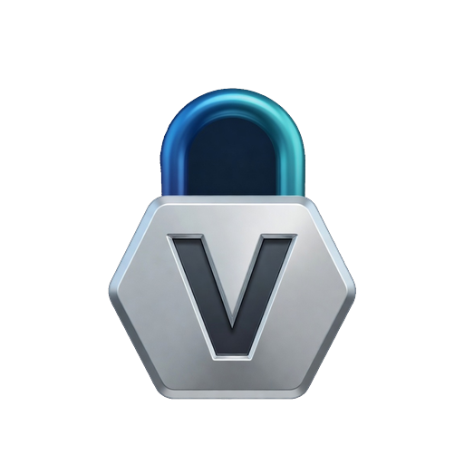
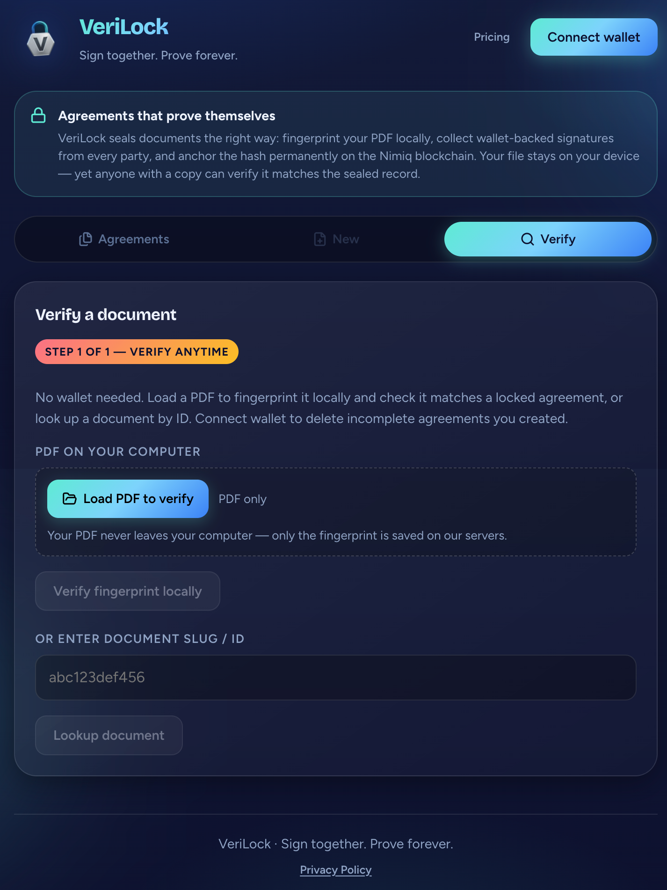
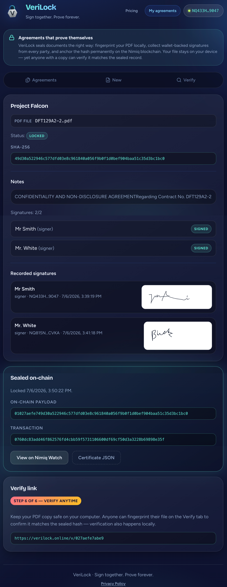
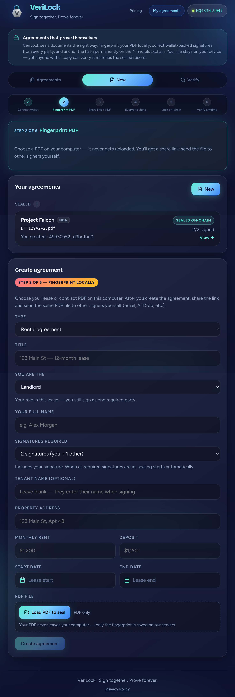
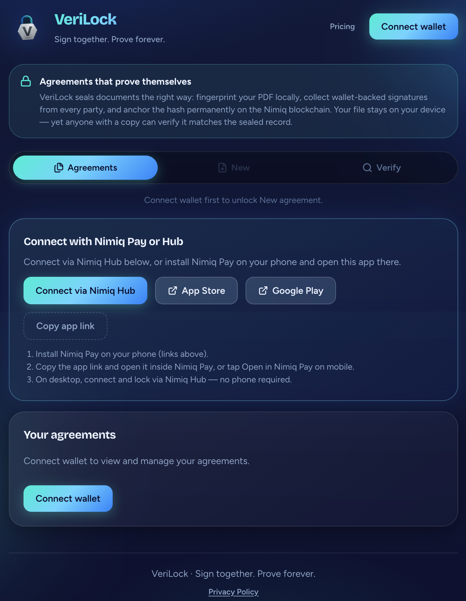

# VeriLock

> Sign together. Prove forever.

| Field | Value |
| --- | --- |
| Category | Productivity |
| Pricing | Freemium |
| Team name | _Not provided — optional_ |
| Team members | _Not provided — optional_ |
| X account | harmssam |
| Contact email | harmssam@gmail.com |
| GitHub login | @harmssam |
| Submitted at | 2026-07-07T00:27:55.091Z |

## Links

| Link | URL |
| --- | --- |
| Repo | [https://github.com/harmssam/verilock](<https://github.com/harmssam/verilock>) |
| Demo | [https://verilock.online/](<https://verilock.online/>) |
| Video | [https://ComingSoon.com](<https://ComingSoon.com>) |

## Description

Verilock lets landlords, freelancers, and small teams sign PDF agreements with Nimiq wallet-backed signatures, then permanently anchor the document fingerprint on-chain. Your PDF never leaves your device - anyone with a copy can verify it matches the sealed record.

## Builder story

I built VeriLock after seeing how rental and freelance agreements get disputed months later - with no easy way to prove everyone signed the same document. Existing e-sign tools store your PDFs on their servers and charge monthly fees. VeriLock takes a different approach: fingerprint the PDF locally, collect wallet-backed signatures from each party, and anchor the final hash on the Nimiq blockchain with a single seal transaction. The file stays on your device, but the proof is permanent and publicly verifiable. I used Cursor and Grok to ship the full stack - React mini app, Express API, SQLite on Railway - in time for the competition.

## Thumbnail

## Screenshots

---

_Generated from the submission form. `submission.yaml` in this folder is the machine-readable source of truth._
