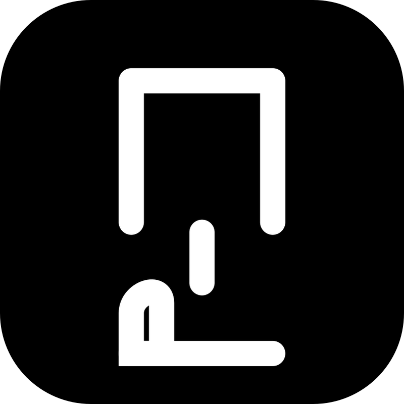
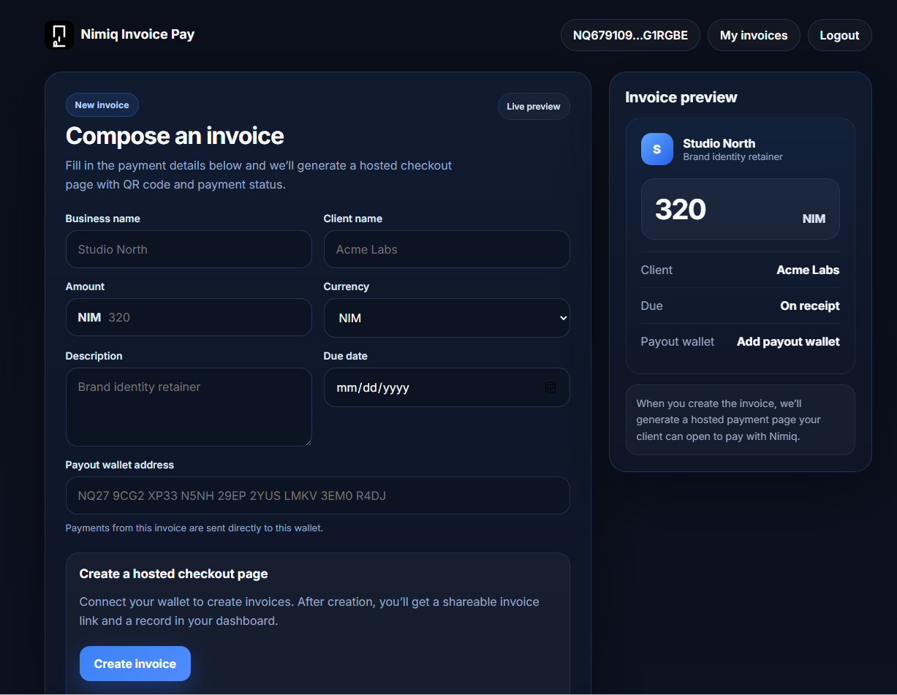
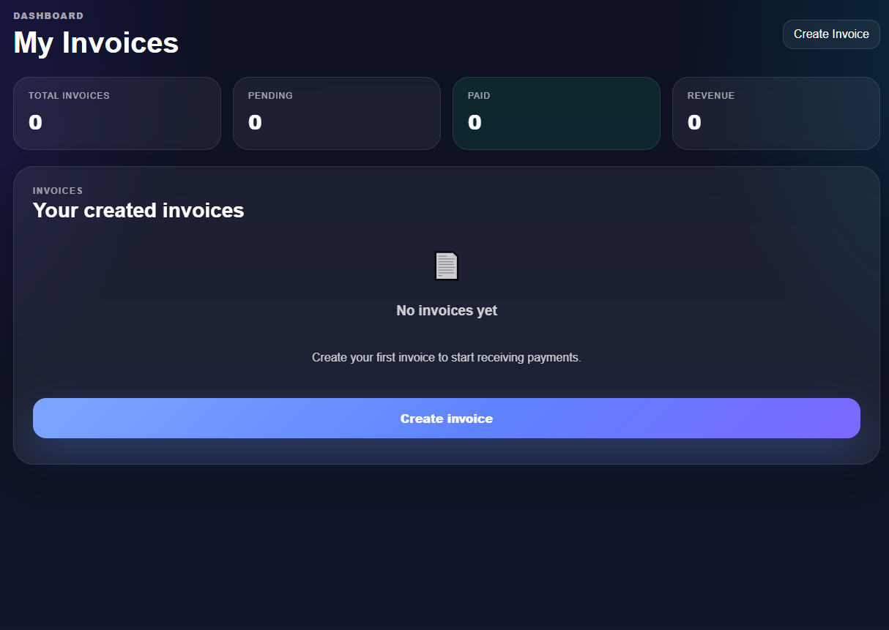
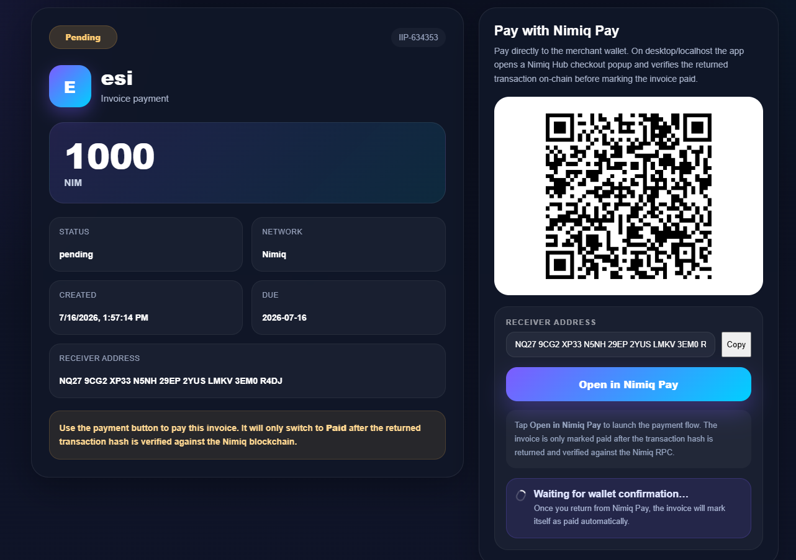

# Nimiq Invoice Pay

> Create invoices and get paid directly from your Nimiq wallet.

| Field | Value |
| --- | --- |
| Category | Creator tools |
| Pricing | Free |
| Team name | _Not provided — optional_ |
| Team members | _Not provided — optional_ |
| X account | nimipdotspace |
| Contact email | hiska4520@gmail.com |
| GitHub login | @hiska-pj |
| Submitted at | 2026-07-16T12:22:42.270Z |

## Links

| Link | URL |
| --- | --- |
| Repo | [https://github.com/hiska-pj/nimip](<https://github.com/hiska-pj/nimip>) |
| Demo | [https://nimip.space](<https://nimip.space>) |
| Video | [https://youtu.be/v7BAeNhp8C4](<https://youtu.be/v7BAeNhp8C4>) |

## Description

Self-custodial invoicing tool for freelancers and businesses. Sign in with your Nimiq wallet, create an invoice in 30 seconds, share a hosted payment page, and get paid on-chain — no banks or middlemen needed.

## Builder story

_Not provided — optional_

## Thumbnail

## Screenshots

---

_Generated from the submission form. `submission.yaml` in this folder is the machine-readable source of truth._
