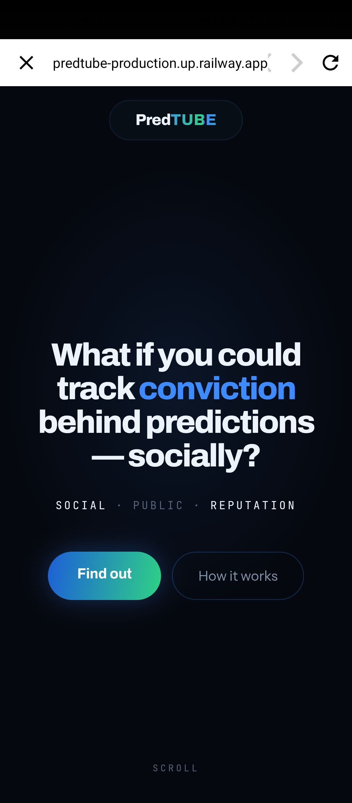
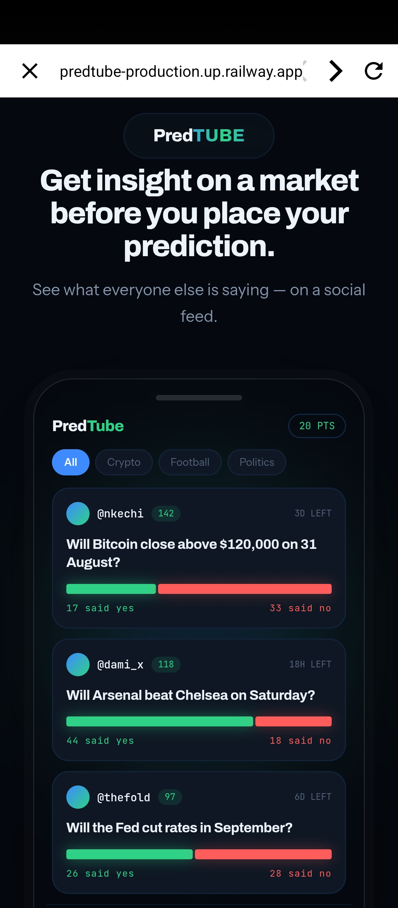
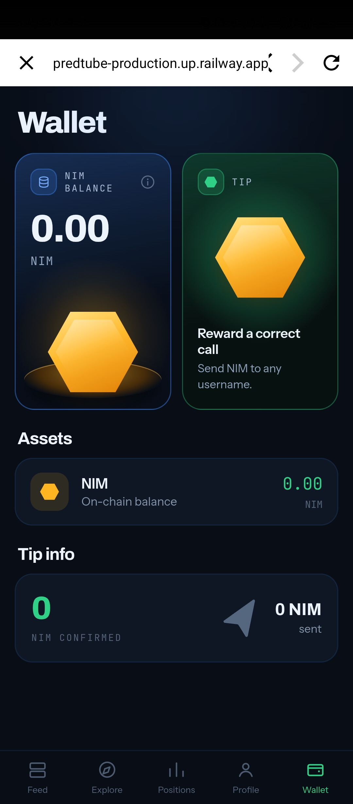
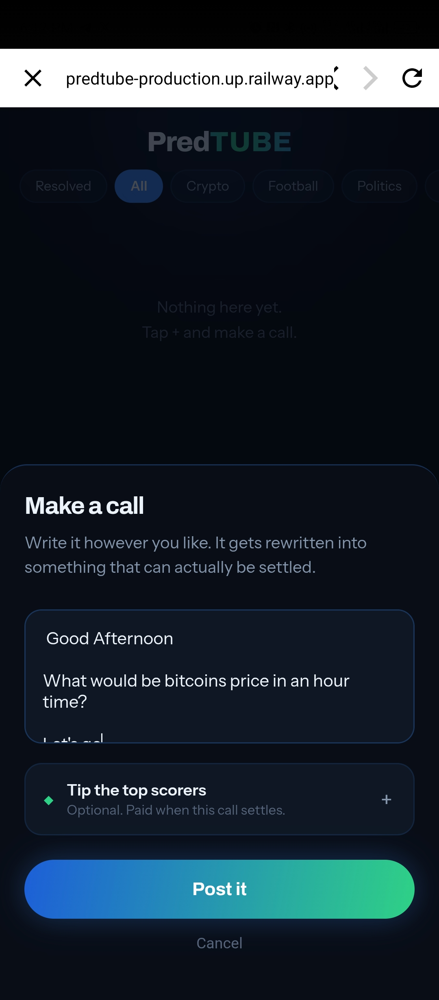

# PREDTUBE

> Prediction decision layer that runs socially

| Field | Value |
| --- | --- |
| Category | Social |
| Pricing | Free |
| Team name | Kazzy |
| Team members | _Not provided — optional_ |
| X account | saxxyweb3 |
| Contact email | projectskazzy@gmail.com |
| GitHub login | @kazzysax |
| Submitted at | 2026-07-31T22:24:16.567Z |

## Links

| Link | URL |
| --- | --- |
| Repo | [https://github.com/kazzysax/predtube](<https://github.com/kazzysax/predtube>) |
| Demo | [https://predtube-production.up.railway.app](<https://predtube-production.up.railway.app>) |
| Video | [https://x.com/i/status/2083307938010046873](<https://x.com/i/status/2083307938010046873>) |

## Description

PredTUBE is a social app that allows users to see people opinions and convictions placed on markets by public posts, with users marked by reputation giving them higher effects on affecting feed.

## Builder story

I FOUND IT REALLY FUN BUILDING THIS INNOVATION AND THE DOCS FOR NIMIQ WERE EASY TO UNDERSTAND AND IMPLEMENT. I BELIEVE WITH MORE TIME AND RESURCES I CAN UPGRADE PREDTUBE TO BECOME BETTER AND MORE SOCIALLY ATTRACTIVE. THIS IS A YOUNG IDEA I BELIEVE CAN GROW INTO SOMETHING GREAT AND ATTRACT LOTS OF USERS.

TIP USERS WITH THEIR USERNAMES ON PRED TUBE

## Thumbnail

## Screenshots

---

_Generated from the submission form. `submission.yaml` in this folder is the machine-readable source of truth._
