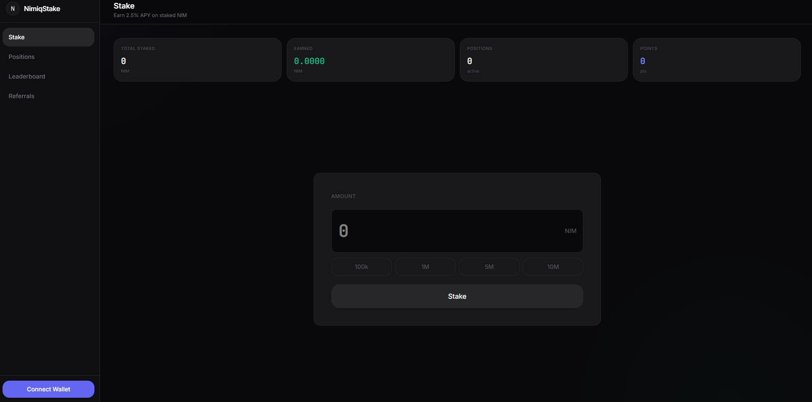
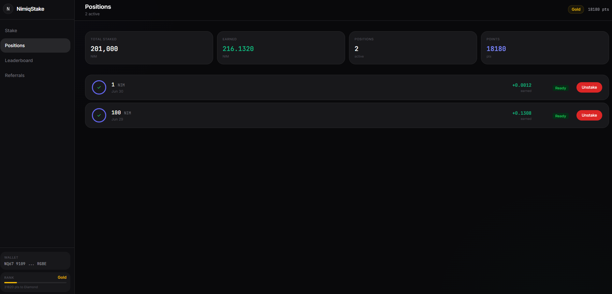
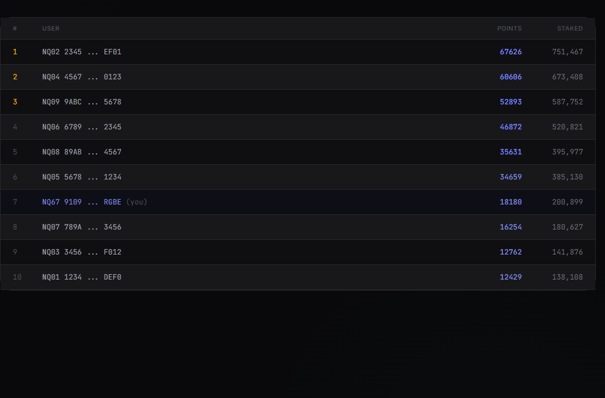

# NimiqStake

> Stake NIM, earn rewards, climb the leaderboard.

| Field | Value |
| --- | --- |
| Category | Earning |
| Pricing | Free |
| Team name | _Not provided — optional_ |
| Team members | _Not provided — optional_ |
| X account | nimiqstake |
| Contact email | lvrojhan@gmail.com |
| GitHub login | @lvrojhan |
| Submitted at | 2026-07-18T09:08:05.599Z |

## Links

| Link | URL |
| --- | --- |
| Repo | [https://github.com/lvrojhan/nimiqstake](<https://github.com/lvrojhan/nimiqstake>) |
| Demo | [https://nimiqstake.xyz/](<https://nimiqstake.xyz/>) |
| Video | [https://youtu.be/_cFANkQiu4g](<https://youtu.be/_cFANkQiu4g>) |

## Description

A staking platform for the Nimiq blockchain where users stake NIM to earn 2.5% APY and compete on a ranked leaderboard.

## Builder story

_Not provided — optional_

## Thumbnail

## Screenshots

---

_Generated from the submission form. `submission.yaml` in this folder is the machine-readable source of truth._
