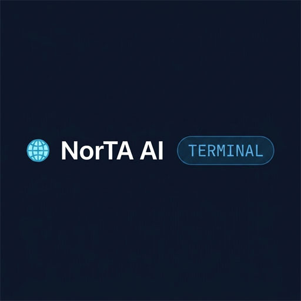
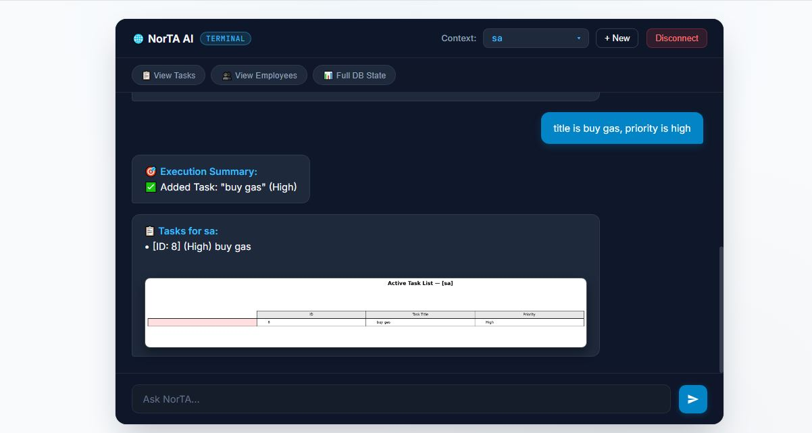
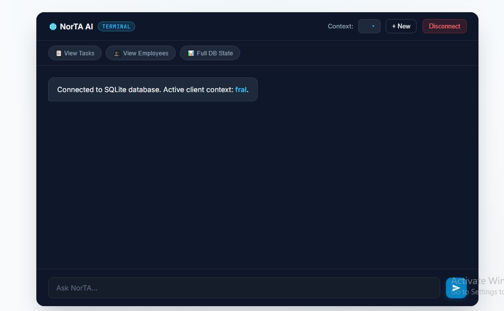
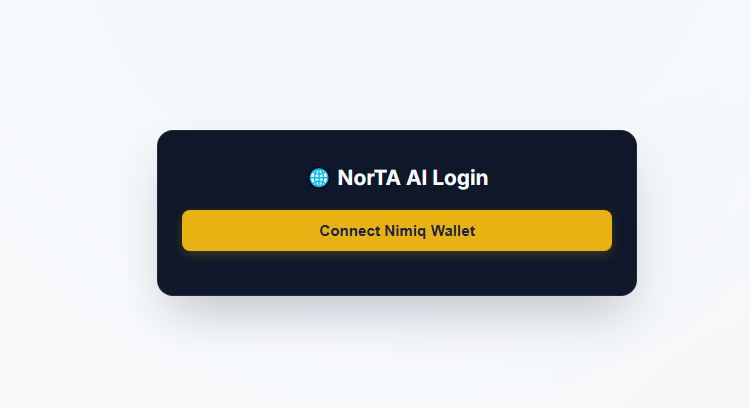
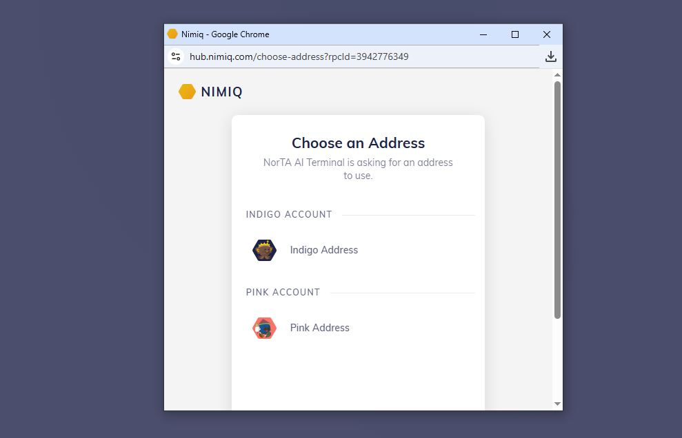

# NorTA AI

> An AI enabled  task manager and Personal assistant.

| Field | Value |
| --- | --- |
| Category | Productivity |
| Pricing | Free |
| Team name | _Not provided — optional_ |
| Team members | _Not provided — optional_ |
| X account | thedeafEYE |
| Contact email | chukwukafranciis@gmail.com |
| GitHub login | @montana419 |
| Submitted at | 2026-07-31T10:40:44.748Z |

## Links

| Link | URL |
| --- | --- |
| Repo | [https://github.com/montana419/norta](<https://github.com/montana419/norta>) |
| Demo | [https://norta-ai.vercel.app/](<https://norta-ai.vercel.app/>) |
| Video | [https://www.youtube.com/watch?v=Hyj2I86X6kY](<https://www.youtube.com/watch?v=Hyj2I86X6kY>) |

## Description

A task manager for startups and individual. Can be used for task scheduling,  saving employee data, founder wellness routines and payroll overview.

## Builder story

As an individual and  start up founder ,i realized that events could happen so fast without my realization , due to my busy schedules. I decided to build a virtual diary integrated with gemini and chat GPT capabilities, i get to record task in real-time and also onboard employees and their personal data. this workflow has greatly improved my productivity.

## Thumbnail

## Screenshots

---

_Generated from the submission form. `submission.yaml` in this folder is the machine-readable source of truth._
