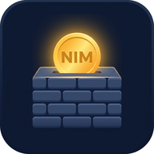
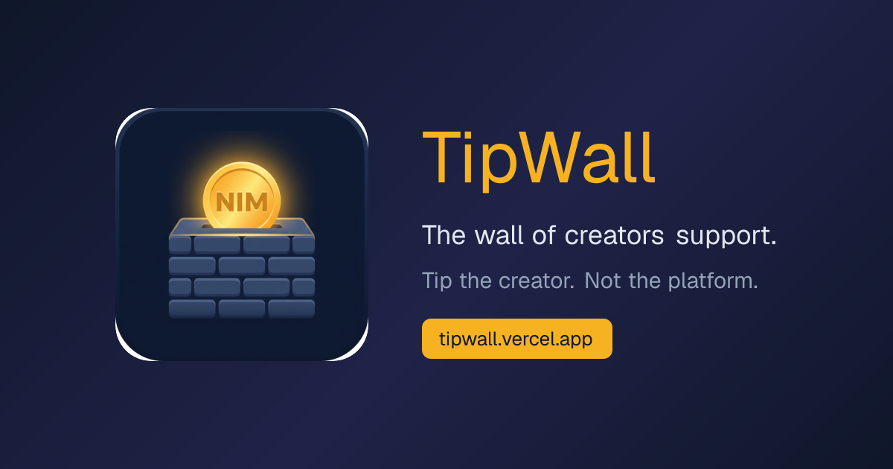
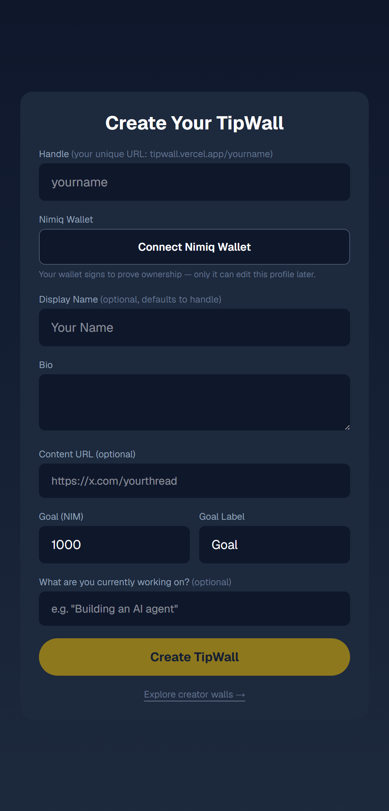
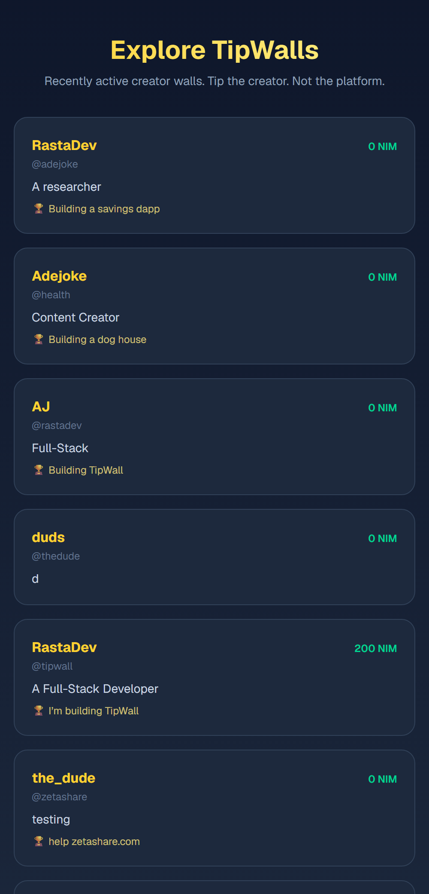
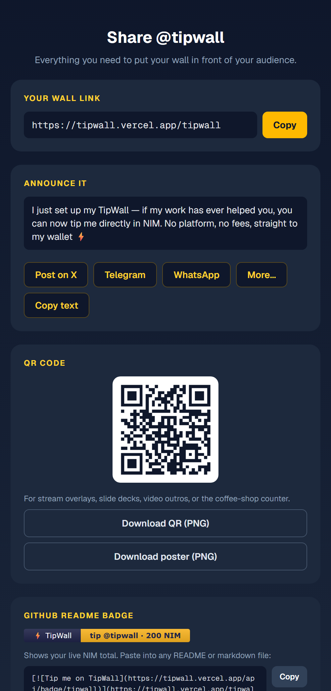
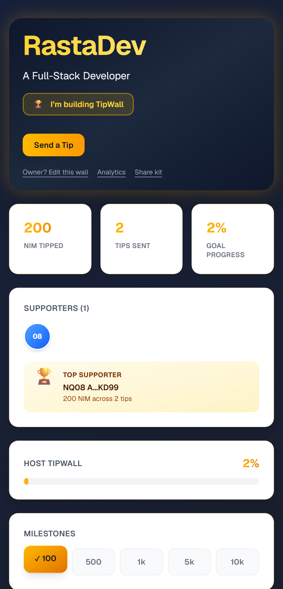

# TipWall

> Tip the creator, Not the platform.

| Field | Value |
| --- | --- |
| Category | Social |
| Pricing | Free |
| Team name | Adejoke |
| Team members | Adejoke |
| X account | adejoke_btc |
| Contact email | akinolaa769@gmail.com |
| GitHub login | @natureloved |
| Submitted at | 2026-07-12T19:32:51.491Z |

## Links

| Link | URL |
| --- | --- |
| Repo | [https://github.com/natureloved/TipWall](<https://github.com/natureloved/TipWall>) |
| Demo | [https://tipwall.vercel.app/](<https://tipwall.vercel.app/>) |
| Video | [https://youtube.com/shorts/HRj58B8pa5A](<https://youtube.com/shorts/HRj58B8pa5A>) |

## Description

A tipping wall for creators where supporters tip NIM straight to your wallet, no platform, no fees, no sign-up.

## Builder story

I kept seeing the same pattern, someone posts a genuinely helpful thread, an open-source tool, a tutorial and the replies fill with "this saved me hours, how can I support you?" And the honest answer is always awkward. Patreon wants a subscription and takes a cut. Buy Me a Coffee needs Stripe, which doesn't even work in many countries including for a lot of creators here in Africa. Dropping a raw wallet address into a bio feels cold, and nobody wants to be the first to send to a void.

TipWall is my answer: every creator gets a wall with one link where support is instant, direct, and visible. Supporters tip NIM straight to the creator's wallet through Nimiq Pay and TipWall never holds a cent. But the part I cared most about is that support shouldn't be a private transaction, it should be social proof. Tips land on a live feed with messages and reasons, supporters get recognition, milestones unlock with confetti. Gratitude becomes momentum.

The hardest problem was the person who wants to tip but doesn't have Nimiq Pay yet. Most crypto apps lose them at "install a wallet first." TipWall saves their tip intent and hands them a non-custodial claim link, so a moment of generosity survives the onboarding gap and every recovered supporter is a new Nimiq user.

## Thumbnail

## Screenshots

---

_Generated from the submission form. `submission.yaml` in this folder is the machine-readable source of truth._
