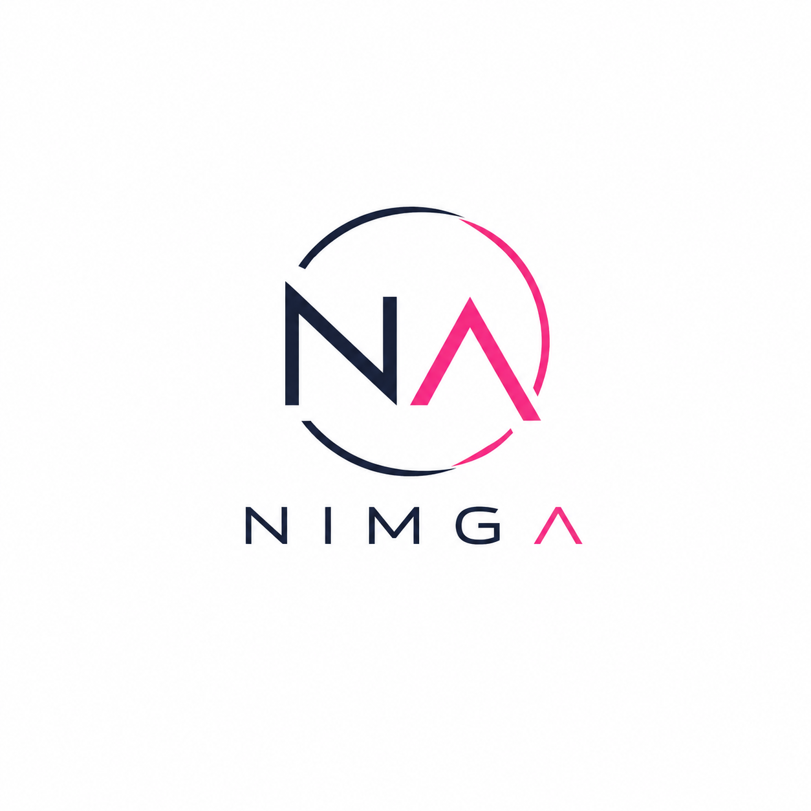
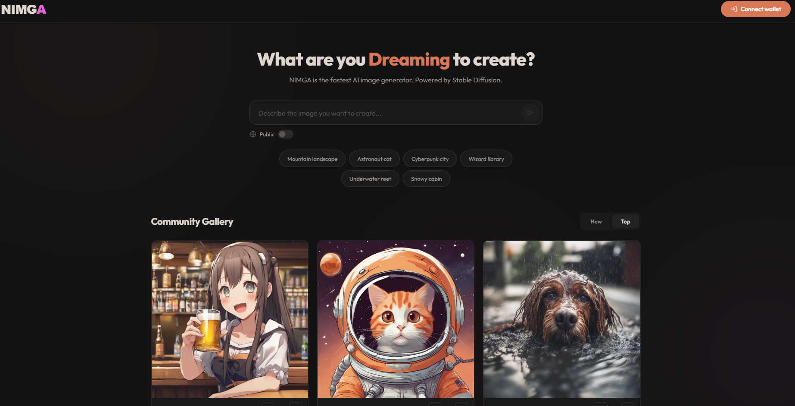
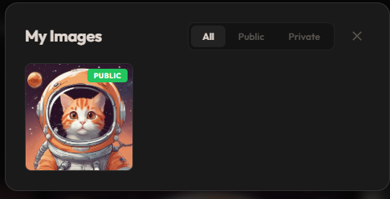
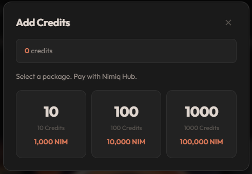

# nimga

> Turn your dreams into images with your Nimiq wallet.

| Field | Value |
| --- | --- |
| Category | Creator tools |
| Pricing | Free |
| Team name | _Not provided — optional_ |
| Team members | _Not provided — optional_ |
| X account | nimga_pics |
| Contact email | nazerbarkar@gmail.com |
| GitHub login | @nazerbarkar |
| Submitted at | 2026-07-24T13:33:40.439Z |

## Links

| Link | URL |
| --- | --- |
| Repo | [https://github.com/nazerbarkar/nimga](<https://github.com/nazerbarkar/nimga>) |
| Demo | [https://nimga.pics/](<https://nimga.pics/>) |
| Video | [https://youtu.be/GFFY2ADMD1g](<https://youtu.be/GFFY2ADMD1g>) |

## Description

NIMGA is an AI image generator that lets anyone create stunning images using just their Nimiq wallet. Connect, type a prompt, and get a beautiful AI-generated image in seconds — no emails, no passwords, no tracking.

## Builder story

I built NIMGA to prove that Nimiq can power real consumer apps beyond payments. In 72 hours, I created a full AI image generation platform using Nimiq Hub for wallet auth and on-chain payments, Cloudflare Workers AI for image generation, and a community gallery with voting. The entire frontend is built with vanilla JavaScript — no frameworks, no bloat. Every single user is a real Nimiq wallet, making this a true on-chain community experience.

## Thumbnail

## Screenshots

---

_Generated from the submission form. `submission.yaml` in this folder is the machine-readable source of truth._
