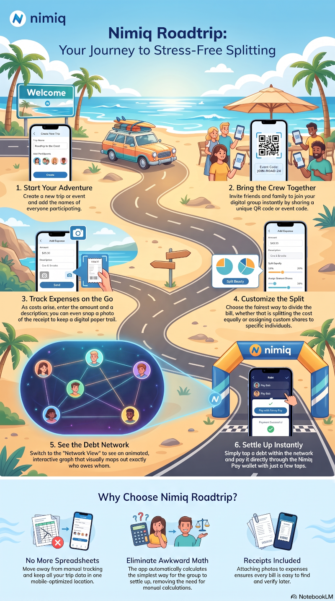
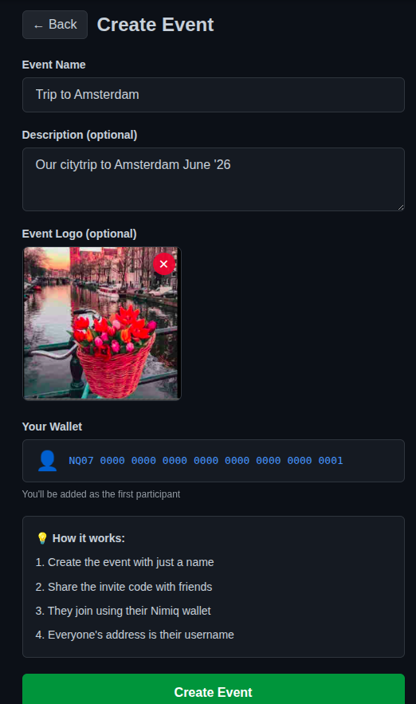
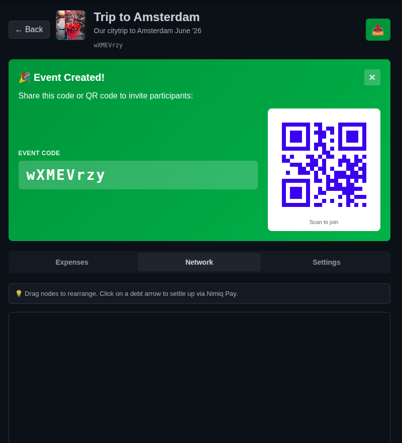
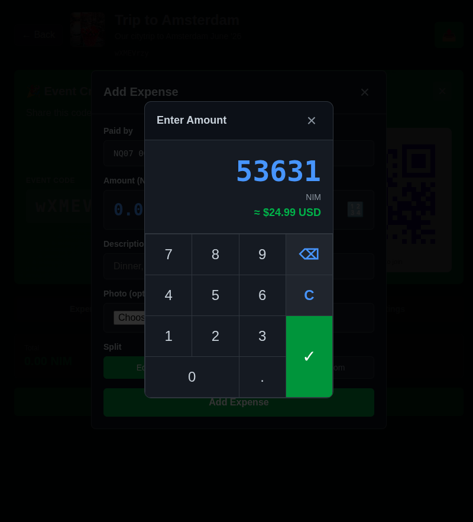
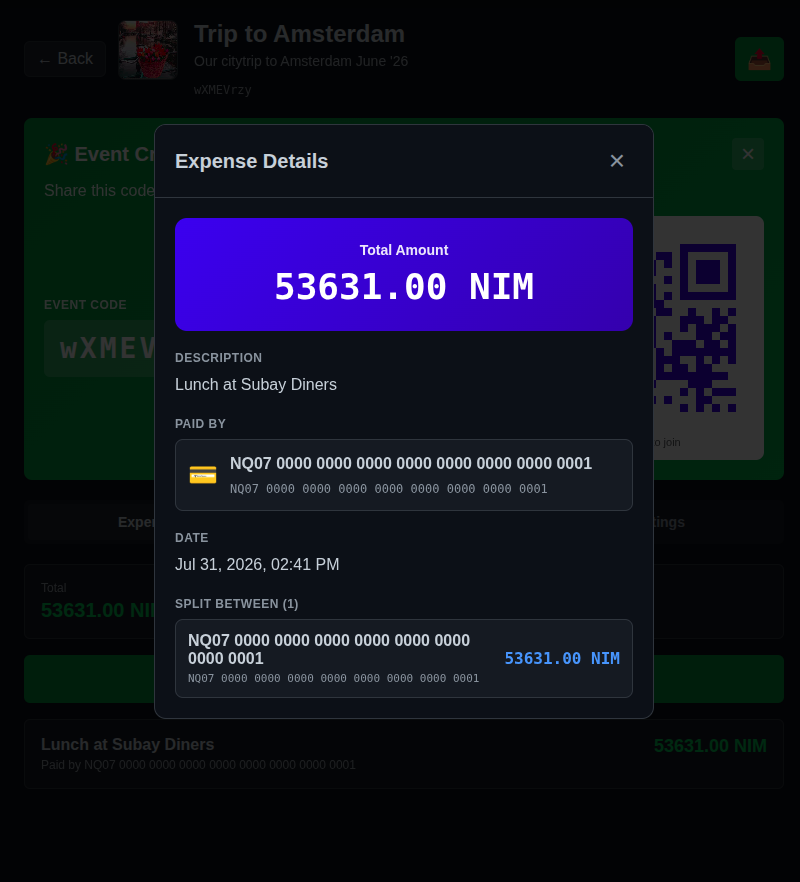
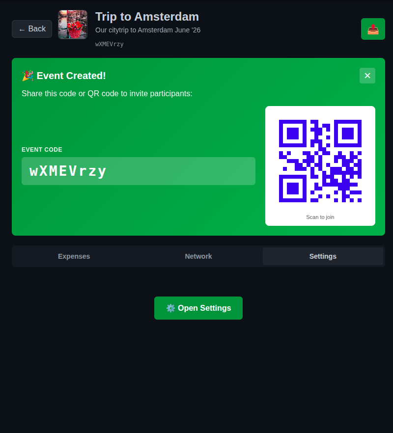

# NimiQ Roadtrip

> Easy expense-splitting among friends and family

| Field | Value |
| --- | --- |
| Category | Social |
| Pricing | Free |
| Team name | _Not provided — optional_ |
| Team members | _Not provided — optional_ |
| X account | _Not provided — optional_ |
| Contact email | rattadan@riseup.net |
| GitHub login | @rattadan |
| Submitted at | 2026-07-31T12:50:42.952Z |

## Links

| Link | URL |
| --- | --- |
| Repo | [https://github.com/rattadan/Nimiq_Roadtrip](<https://github.com/rattadan/Nimiq_Roadtrip>) |
| Demo | [https://github.com/rattadan/Nimiq_Roadtrip](<https://github.com/rattadan/Nimiq_Roadtrip>) |
| Video | [https://youtu.be/ZK6eBHrtxsI](<https://youtu.be/ZK6eBHrtxsI>) |

## Description

Nimiq Roadtrip is a Nimiq Pay Mini App built for groups. Create an event, invite the people who are chipping in, add expenses as they happen, and let the app figure out the fairest way for everyone to settle up. Payments can be made directly in NIM through the Nimiq Pay wallet.

## Builder story

_Not provided — optional_

## Thumbnail

## Screenshots

---

_Generated from the submission form. `submission.yaml` in this folder is the machine-readable source of truth._
