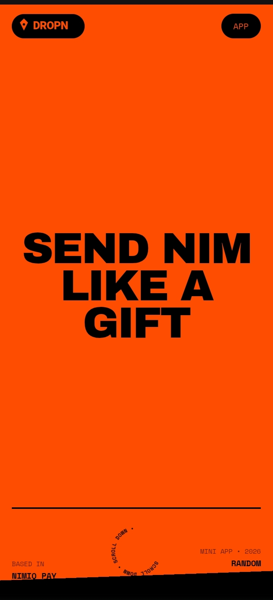
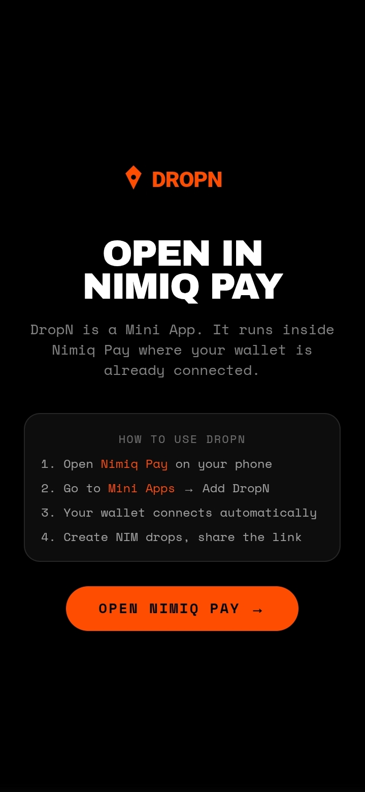
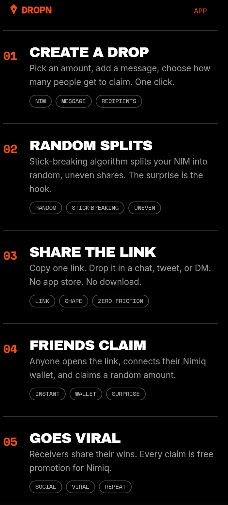

# Dropn

> Send NIM like a gift. Claim it like a surprise

| Field | Value |
| --- | --- |
| Category | Social |
| Pricing | Free |
| Team name | _Not provided — optional_ |
| Team members | _Not provided — optional_ |
| X account | https://x.com/KomariS18774 |
| Contact email | komasubheeksh@gmail.com |
| GitHub login | @subheeksh5599 |
| Submitted at | 2026-07-29T14:38:10.159Z |

## Links

| Link | URL |
| --- | --- |
| Repo | [https://github.com/subheeksh5599/dropn](<https://github.com/subheeksh5599/dropn>) |
| Demo | [https://dropn.vercel.app/](<https://dropn.vercel.app/>) |
| Video | [https://drive.google.com/drive/folders/10jombWJKHgaP5k8rhEjzdk01fHp9IOeR](<https://drive.google.com/drive/folders/10jombWJKHgaP5k8rhEjzdk01fHp9IOeR>) |

## Description

DropN creates random-payout NIM drops with one link. You set the total, the recipient count, and a message. The stick-breaking algorithm generates uneven random shares — some people get more, some get less. That's the fun. That's the virality. One link

## Builder story

_Not provided — optional_

## Thumbnail

## Screenshots

---

_Generated from the submission form. `submission.yaml` in this folder is the machine-readable source of truth._
