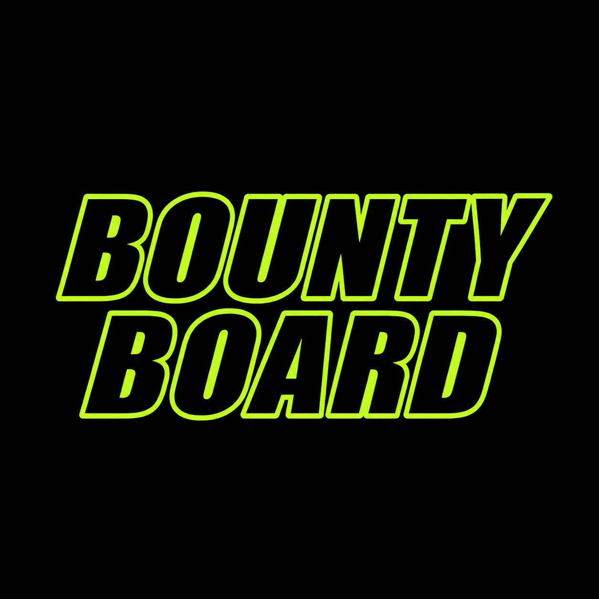
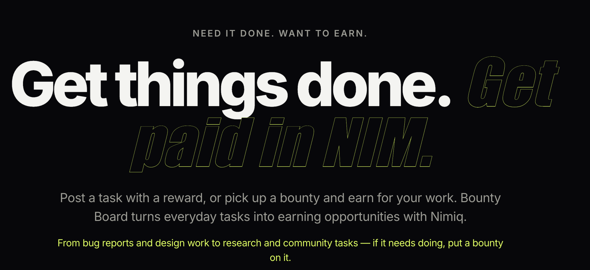
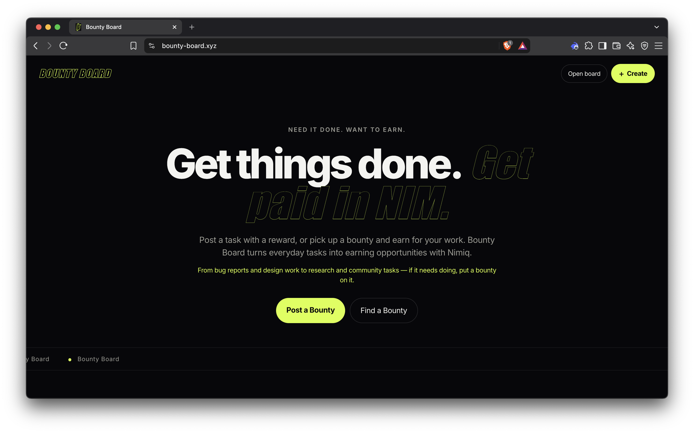
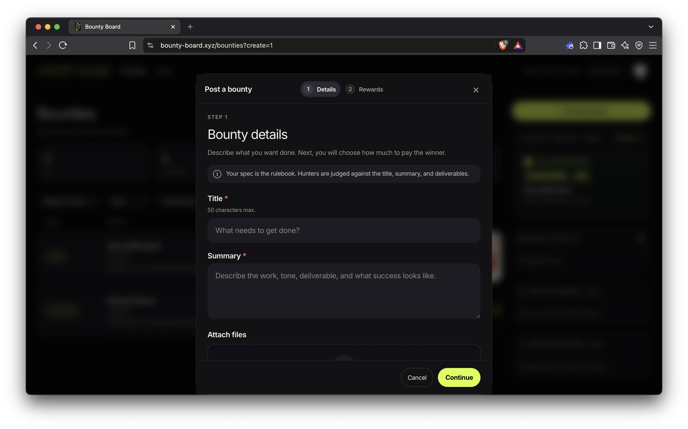
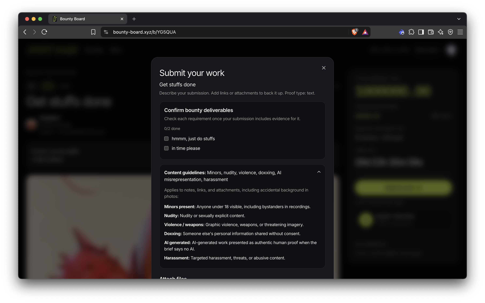
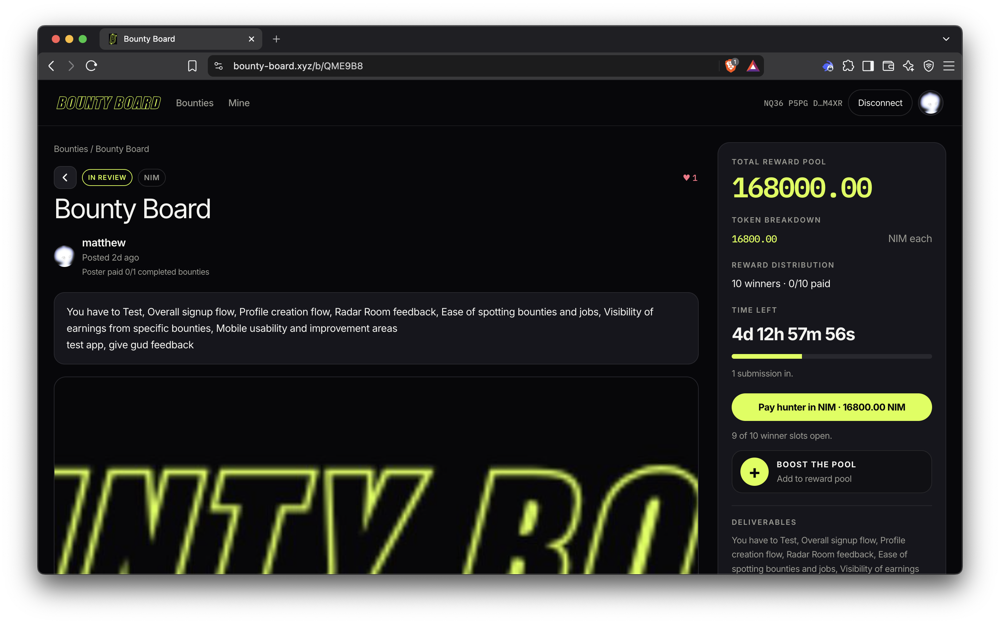

# BountyBoard

> Get things done. Get paid in NIM.

| Field | Value |
| --- | --- |
| Category | Earning |
| Pricing | Free |
| Team name | _Not provided — optional_ |
| Team members | _Not provided — optional_ |
| X account | mattdreams |
| Heard about it via | X |
| Contact email | societyhatesmatt@gmail.com |
| GitHub login | @0andadream |
| Submitted at | 2026-09-12T05:10:26.245Z |

## Links

| Link | URL |
| --- | --- |
| Repo | [https://github.com/0andadream/Bounty-Board](<https://github.com/0andadream/Bounty-Board>) |
| Demo | [https://bounty-board.xyz/](<https://bounty-board.xyz/>) |
| Video | [https://youtu.be/c0JHg3cYtkA](<https://youtu.be/c0JHg3cYtkA>) |
| Skool post | [https://www.skool.com/miniappscompetition/bounty-board?p=09518b78](<https://www.skool.com/miniappscompetition/bounty-board?p=09518b78>) |
| Social post | [https://x.com/mattdreams/status/2097967519143252251](<https://x.com/mattdreams/status/2097967519143252251>) |

## Description

Bounty Board turns small tasks into open earning opportunities. Post what you need done with a NIM reward, or find a bounty, complete the task and get paid directly through Nimiq.

## Builder story

_Not provided — optional_

## Thumbnail

## Screenshots

---

_Generated from the submission form. `submission.yaml` in this folder is the machine-readable source of truth._
