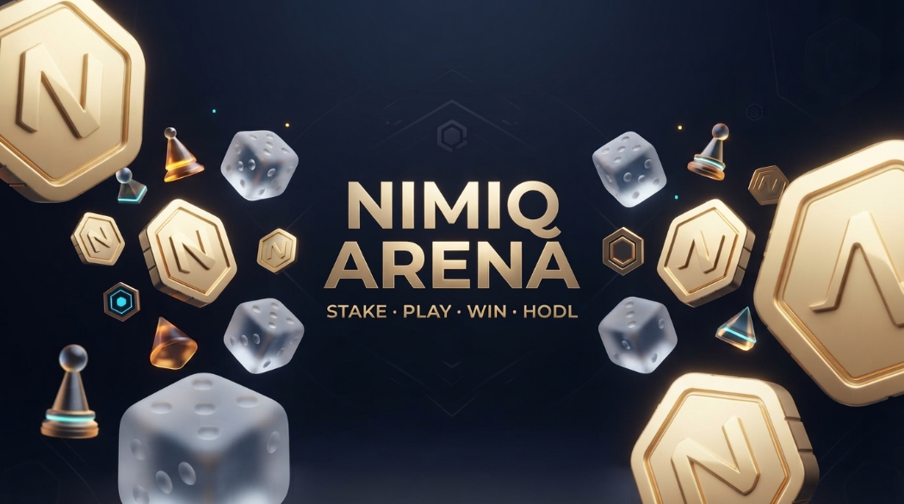
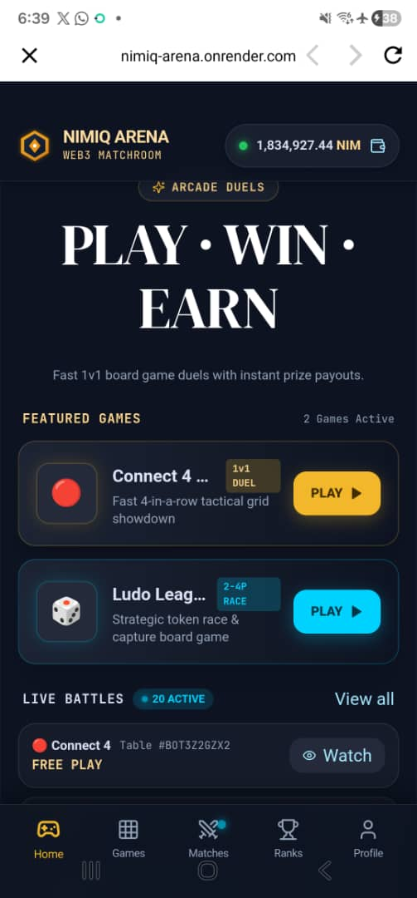
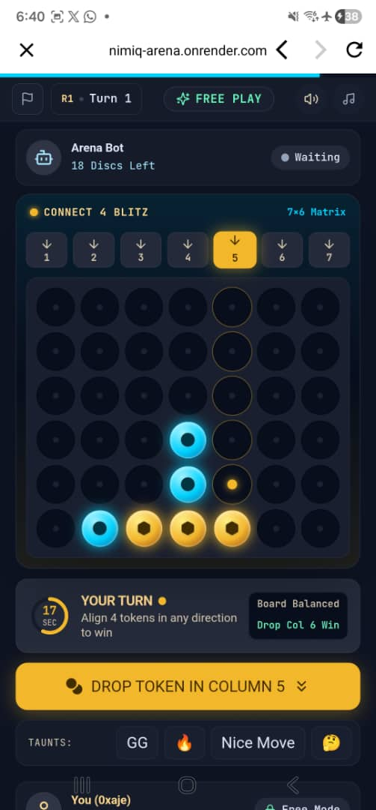
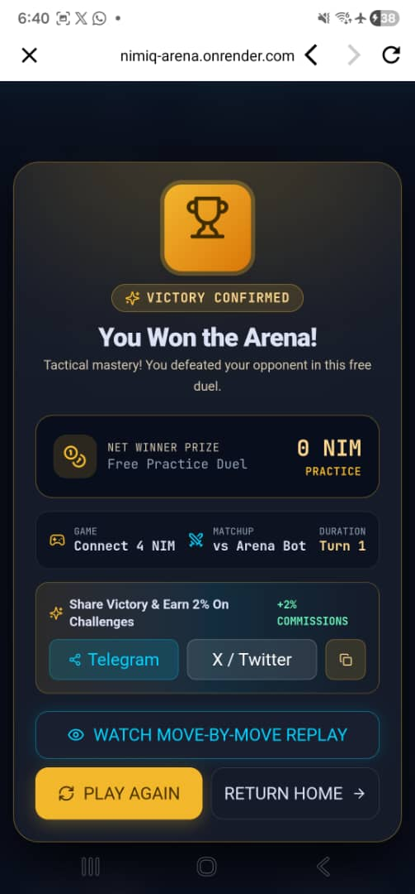
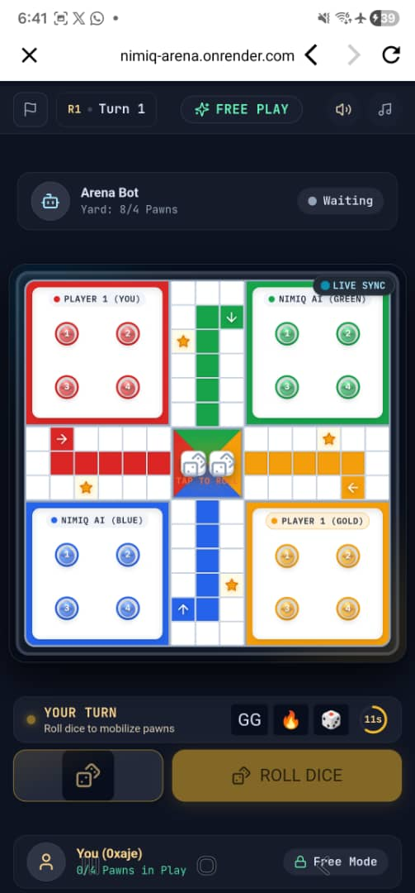
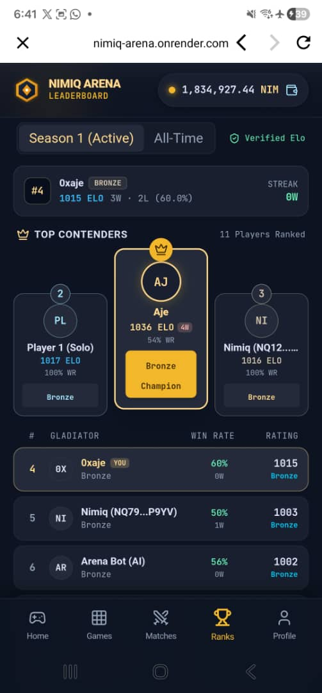

# Nimiq Arena

> Real Board Game Duels. Instant On-Chain Pots.

| Field | Value |
| --- | --- |
| Category | Games |
| Pricing | Free |
| Team name | iNexora |
| Team members | AJE OLUWASEUN, AJE SUCCESS |
| X account | 0xaje_ |
| Heard about it via | X ,https://x.com/Nimiqarena/status/2100655659624628571 |
| Contact email | ajeseun11@gmail.com |
| GitHub login | @0xaje |
| Submitted at | 2026-09-17T18:40:01.768Z |

## Links

| Link | URL |
| --- | --- |
| Repo | [https://github.com/0xaje/NimiqArena](<https://github.com/0xaje/NimiqArena>) |
| Demo | [https://nimiq-arena.onrender.com](<https://nimiq-arena.onrender.com>) |
| Video | [https://youtu.be/peqDkKHCVoA](<https://youtu.be/peqDkKHCVoA>) |
| Skool post | [https://www.skool.com/miniappscompetition/nimiq-arena?p=c484cc41](<https://www.skool.com/miniappscompetition/nimiq-arena?p=c484cc41>) |
| Social post | _Not provided — optional_ |

## Description

Nimiq Arena turns classic tabletop games like Ludo and Connect 4 into high-energy, micro-stakes peer-to-peer duels. Players stake NIM into smart escrows, compete in real time, and winners receive instant on-chain payouts in under a second.

## Builder story

**Builder Story**

Built Nimiq Arena from the ground up to make competitive gaming feel native to Nimiq Pay combining real gameplay, NIM wagering, matchmaking, and match replay in one Mini App.

## Thumbnail

## Screenshots

---

_Generated from the submission form. `submission.yaml` in this folder is the machine-readable source of truth._
