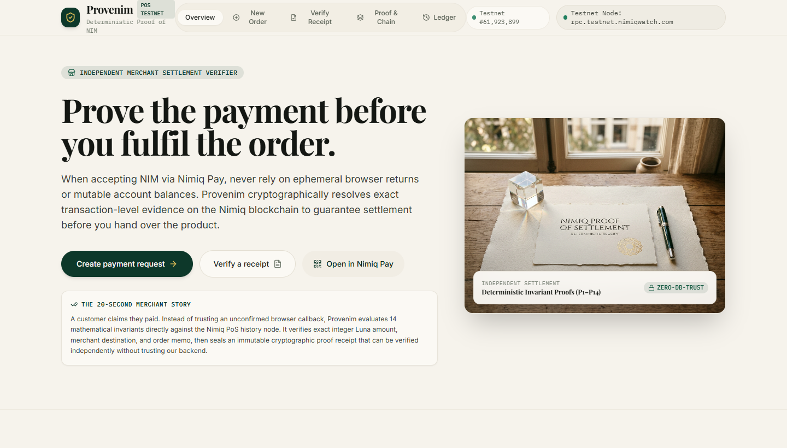

# PROVENIM

> Before a merchant fulfils an order, Provenim proves the NIM payment that is supposed to pay for it.

| Field | Value |
| --- | --- |
| Category | On-chain services |
| Pricing | Free |
| Team name | Team Kinno (Solo Build) |
| Team members | Solo |
| X account | 0xkiddok |
| Heard about it via | X |
| Contact email | ojilerekingsley@gmail.com |
| GitHub login | @0xkinno |
| Submitted at | 2026-09-18T21:14:59.894Z |

## Links

| Link | URL |
| --- | --- |
| Repo | [https://github.com/0xkinno/provenim](<https://github.com/0xkinno/provenim>) |
| Demo | [https://provenim.vercel.app](<https://provenim.vercel.app>) |
| Video | [https://youtu.be/CwLLKG9MeBs?si=7F9FYxDbp4-uBoS0](<https://youtu.be/CwLLKG9MeBs?si=7F9FYxDbp4-uBoS0>) |
| Skool post | [https://www.skool.com/miniappscompetition/provenim?p=65105c24](<https://www.skool.com/miniappscompetition/provenim?p=65105c24>) |
| Social post | [https://x.com/0xkiddok/status/2101056260128772188](<https://x.com/0xkiddok/status/2101056260128772188>) |

## Description

Provenim verifies NIM payments against real Nimiq Testnet evidence, binding each payment to its intended transaction and producing tamper-evident receipts that anyone can independently verify.

## Builder story

Building Provenim started with a question: what should “paid” actually mean?

Most payment experiences stop at a wallet callback, a database flag, or a transaction appearing somewhere in account history. For a merchant, however, the real question is much simpler and more consequential: can I safely fulfil this order?

I built Provenim by starting from Nimiq’s infrastructure rather than from a generic payments UI. The discovery was that payment attribution can span different transaction and account representations, making a naive “I found a payment” check insufficient.

So Provenim turns payment into a verifiable claim.

## Thumbnail

## Screenshots

---

_Generated from the submission form. `submission.yaml` in this folder is the machine-readable source of truth._
