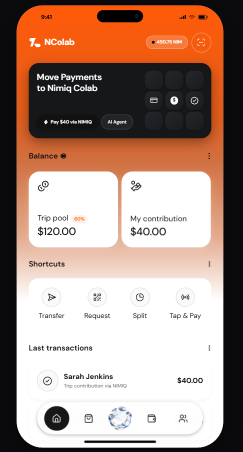
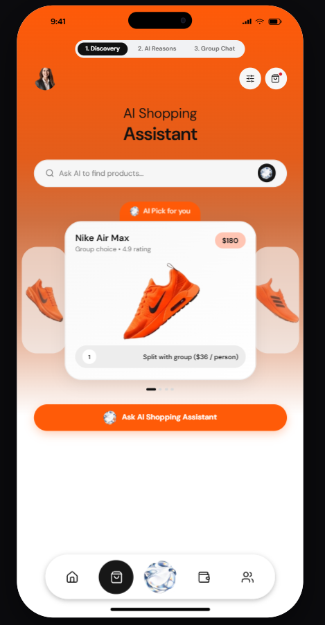
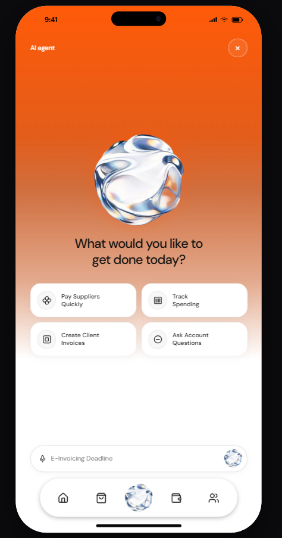
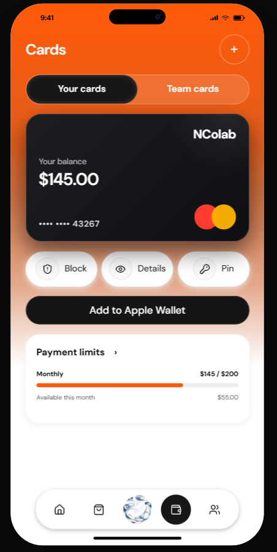
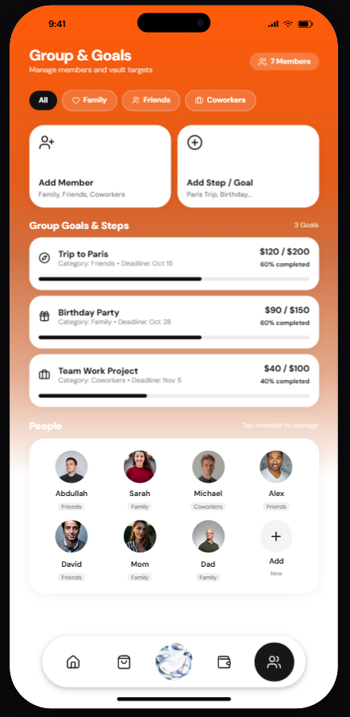

# NColab (Nimiq Colab)

> Autonomous AI-powered group vaults and instant shared payments on Nimiq.

| Field | Value |
| --- | --- |
| Category | Social |
| Pricing | Freemium |
| Team name | Colab |
| Team members | _Not provided — optional_ |
| X account | aqih0 |
| Heard about it via | X platform |
| Contact email | abdullahbalfaqih0@gmail.com |
| GitHub login | @AbdullahBalfaqih |
| Submitted at | 2026-09-18T23:17:27.658Z |

## Links

| Link | URL |
| --- | --- |
| Repo | [https://github.com/AbdullahBalfaqih/NIMIQ-Colab](<https://github.com/AbdullahBalfaqih/NIMIQ-Colab>) |
| Demo | [https://nimiq-colab.vercel.app/](<https://nimiq-colab.vercel.app/>) |
| Video | [https://youtu.be/e0nVBUlWPUc?si=Tb-ov01k_mJdKOml](<https://youtu.be/e0nVBUlWPUc?si=Tb-ov01k_mJdKOml>) |
| Skool post | _Not provided — optional_ |
| Social post | [https://x.com/aqih0/status/2101083776205963452?s=46&t=vnKjXgcVlKTxS7TXudn4Yg](<https://x.com/aqih0/status/2101083776205963452?s=46&t=vnKjXgcVlKTxS7TXudn4Yg>) |

## Description

An intelligent group treasury and expense-splitting mini app for friends, trips, and teams—powered by autonomous AI agents and instant, low-fee Nimiq payments.

## Builder story

Managing shared group finances has always been a painful experience filled with awkward payment reminders, messy spreadsheets, and friction-heavy bank wires. While crypto promised borderless, instant money, most Web3 wallets were built strictly for individual custody, making multi-party pooling expensive and complex.

## Thumbnail

## Screenshots

---

_Generated from the submission form. `submission.yaml` in this folder is the machine-readable source of truth._
