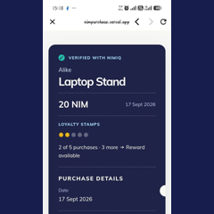
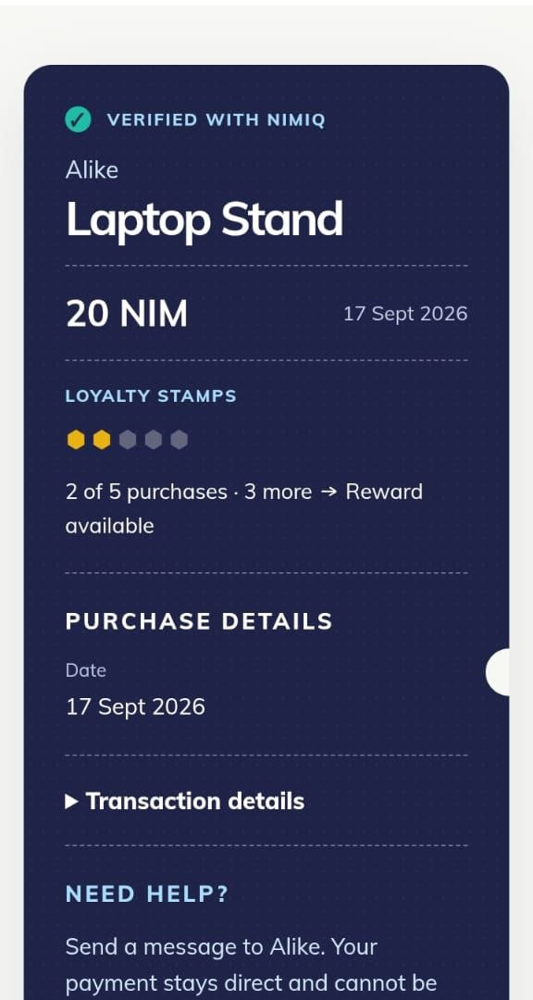
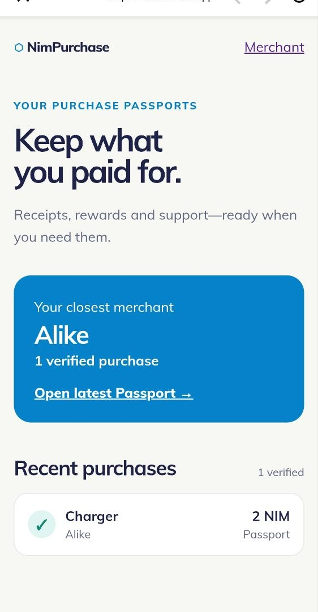
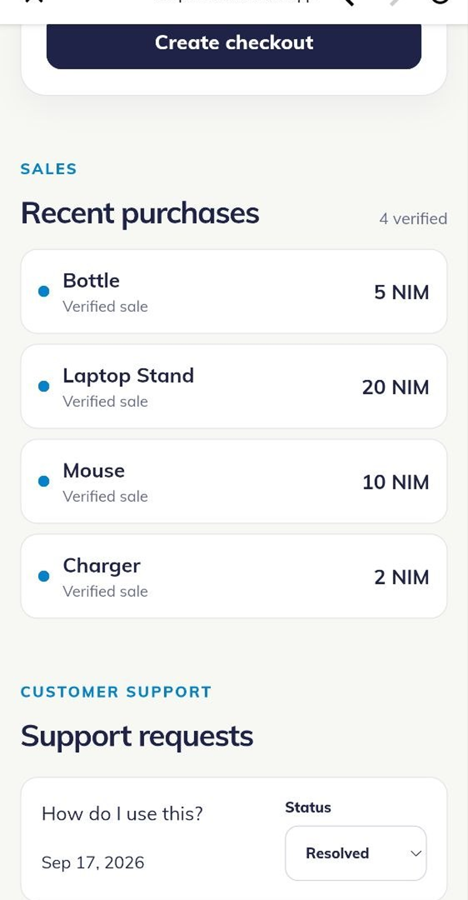

# NimPurchase

> Pay once. You’re already a regular.

| Field | Value |
| --- | --- |
| Category | Shopping & deals |
| Pricing | Free |
| Team name | _Not provided — optional_ |
| Team members | _Not provided — optional_ |
| X account | IamAlikeX |
| Heard about it via | X |
| Contact email | hammedoye10@gmail.com |
| GitHub login | @Alike001 |
| Submitted at | 2026-09-18T12:25:23.543Z |

## Links

| Link | URL |
| --- | --- |
| Repo | [https://github.com/Alike001/nimpurchase](<https://github.com/Alike001/nimpurchase>) |
| Demo | [https://nimpurchase.vercel.app](<https://nimpurchase.vercel.app>) |
| Video | [https://youtube.com/shorts/l-AAUjv7BeA](<https://youtube.com/shorts/l-AAUjv7BeA>) |
| Skool post | _Not provided — optional_ |
| Social post | [https://x.com/IamAlikeX/status/2100920494304223657?s=20](<https://x.com/IamAlikeX/status/2100920494304223657?s=20>) |

## Description

NimPurchase turns a direct NIM payment into a verified Purchase Passport with receipt details, loyalty progress, and merchant support. Merchants receive NIM directly; customers need no merchant-specific account.

## Builder story

Merchant payments usually end at the transfer. I wanted to make a NIM payment useful after checkout without turning it into a custodial payment platform or a generic
loyalty app. NimPurchase lets a merchant create a checkout, receive NIM directly, and give the customer a verified Purchase Passport containing their receipt, loyalty progress, and a route back to merchant support.

Nimiq is essential: the customer approves a real direct NIM transfer in Nimiq Pay, and NimPurchase independently verifies the transaction before activating the Passport. The app never holds customer funds, private keys, or seed phrases.

## Thumbnail

## Screenshots

---

_Generated from the submission form. `submission.yaml` in this folder is the machine-readable source of truth._
