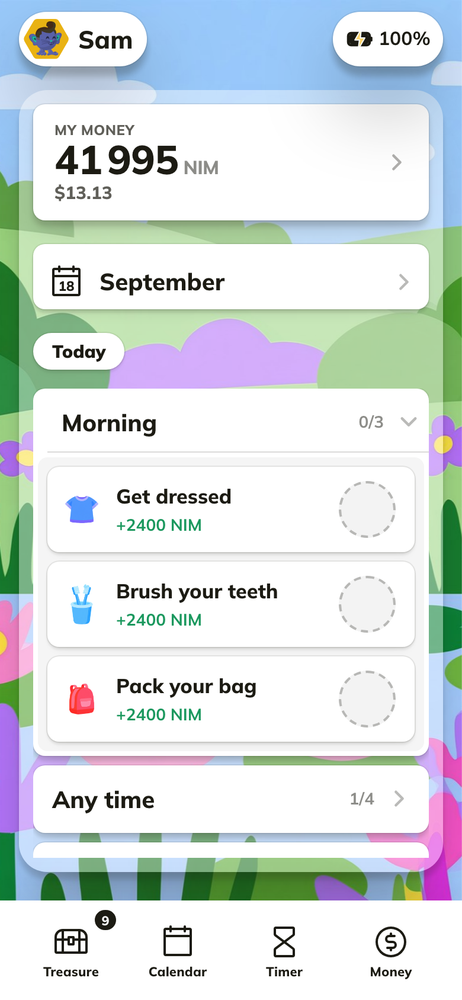
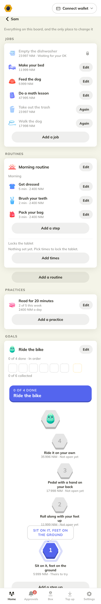
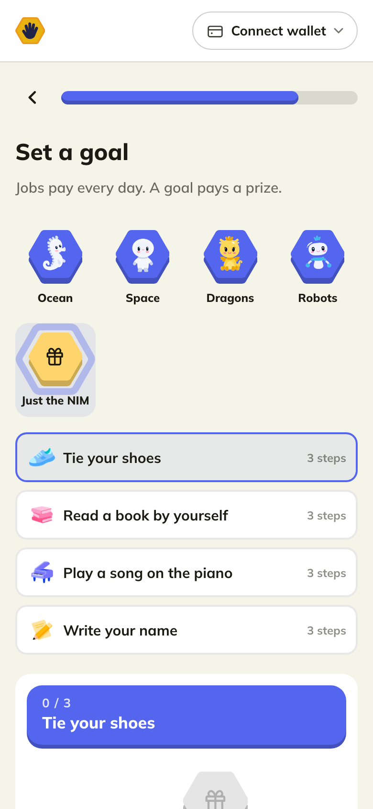
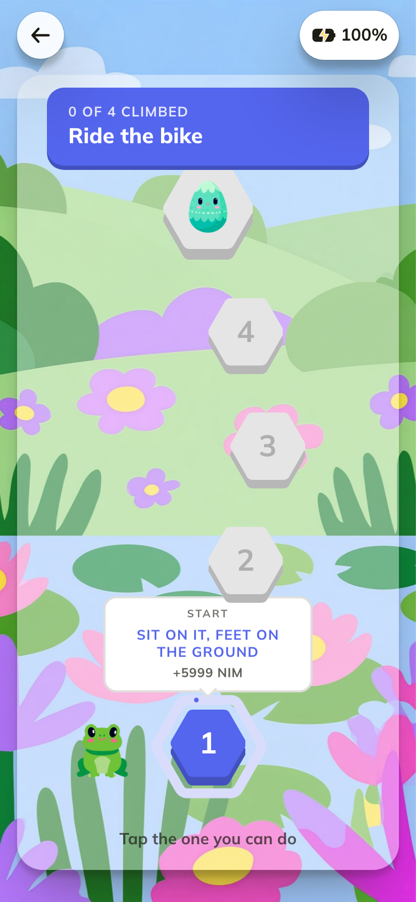
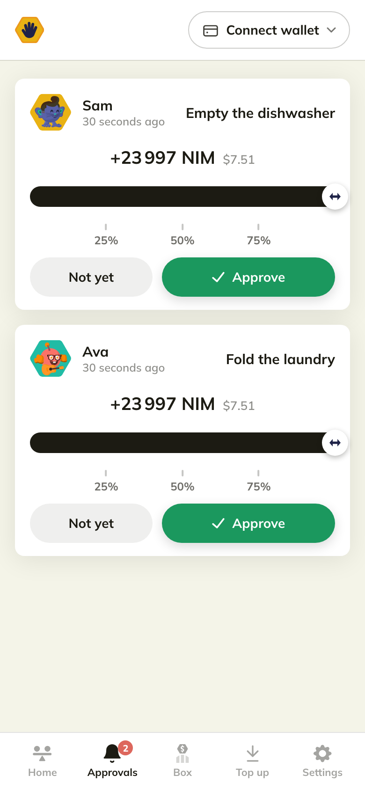

# NIMIQ.kids

> Your house, running its own mini economy

| Field | Value |
| --- | --- |
| Category | Productivity |
| Pricing | Free |
| Team name | _Not provided — optional_ |
| Team members | _Not provided — optional_ |
| X account | andjroo111 |
| Heard about it via | Nimiq Community |
| Contact email | andjroo111@gmail.com |
| GitHub login | @Andjroo111 |
| Submitted at | 2026-09-18T23:52:33.789Z |

## Links

| Link | URL |
| --- | --- |
| Repo | [https://github.com/Andjroo111/nimiq-kids](<https://github.com/Andjroo111/nimiq-kids>) |
| Demo | [https://nimiq.kids/](<https://nimiq.kids/>) |
| Video | [https://youtu.be/Aobwj-1cBdk](<https://youtu.be/Aobwj-1cBdk>) |
| Skool post | [https://www.skool.com/miniappscompetition/nimiqkids-your-house-running-its-own-mini-economy](<https://www.skool.com/miniappscompetition/nimiqkids-your-house-running-its-own-mini-economy>) |
| Social post | [https://x.com/andjroo111/status/2101096046390861912?s=46](<https://x.com/andjroo111/status/2101096046390861912?s=46>) |

## Description

Parents price the jobs, kids do them, one approval sends real NIM to an account the kid owns. The kid spends it back on screen time and treats, so the family's money stays in the family. Five languages. Use any URL or try it in the Nimiq Pay app today!

## Builder story

I built this for my own house. I have small kids, and I want them to earn their own screen time and manage it. So I built my house its own mini economy.

The reason was consistency. Chores got done some days and not others. This gets us working together toward a common goal: they do the jobs, they get rewarded, they get what they want, and the money circles back to the family. A circular economy.

Jobs pay every day. Goals are separate: we set one together, it becomes a path of steps, and the prize waits at the top. It stops being a chore and starts being a game.

Tested all month on two tablets with my own kids. Five languages. Use any URL or try it in the Nimiq Pay app today.

## Thumbnail

## Screenshots

---

_Generated from the submission form. `submission.yaml` in this folder is the machine-readable source of truth._
