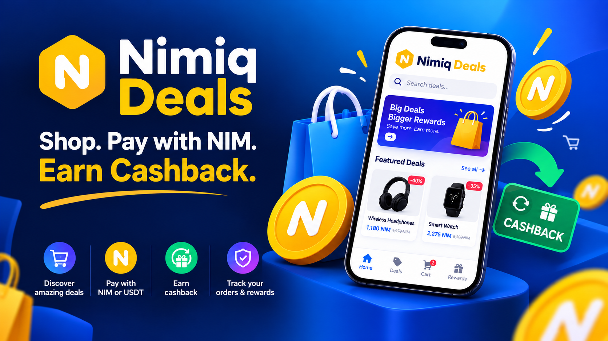
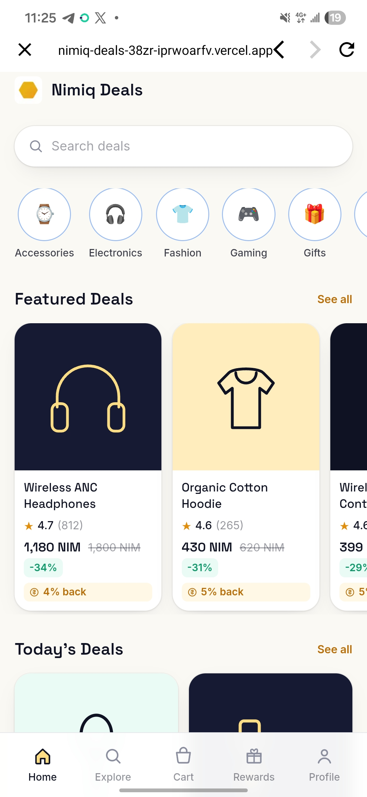
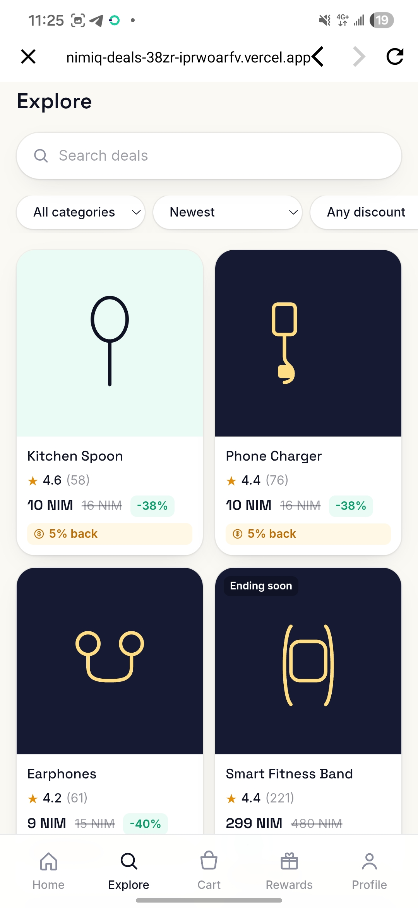
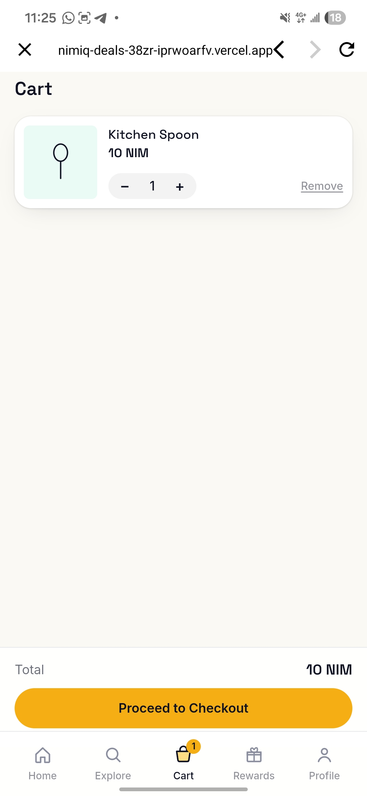
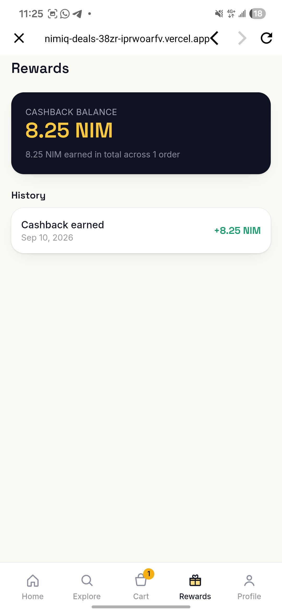
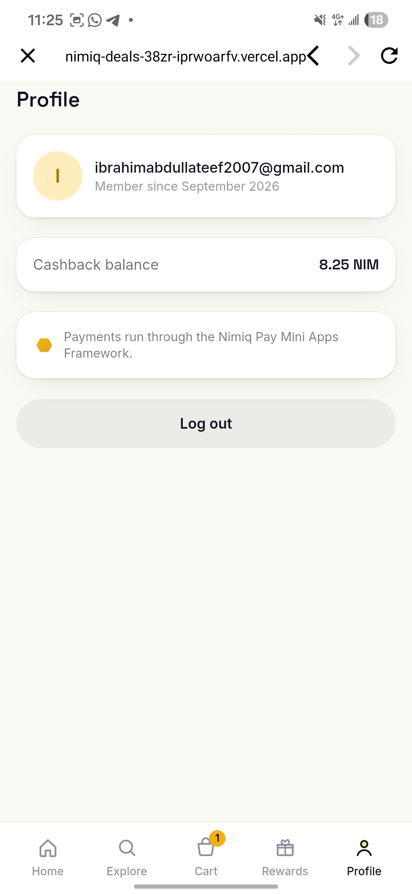

# Nimiq deals

> Discover discounted products and pay with NIM through Nimiq Pay.

| Field | Value |
| --- | --- |
| Category | Shopping & deals |
| Pricing | Free |
| Team name | Toshiro smart |
| Team members | Toshiro |
| X account | https://x.com/aremu_ibrah1m |
| Heard about it via | I saw the hackathon announcement on a hackathon platform, so I decided to hop in and build something. |
| Contact email | ibrahimabdullateef2007@gmail.com |
| GitHub login | @Aremuibrahim2222 |
| Submitted at | 2026-09-14T19:37:40.388Z |

## Links

| Link | URL |
| --- | --- |
| Repo | [https://github.com/Aremuibrahim2222/Nimiq-deals.git](<https://github.com/Aremuibrahim2222/Nimiq-deals.git>) |
| Demo | [https://nimiq-deals-38zr-iprwoarfv.vercel.app](<https://nimiq-deals-38zr-iprwoarfv.vercel.app>) |
| Video | [https://x.com/aremu_ibrah1m/status/2099447450687729823](<https://x.com/aremu_ibrah1m/status/2099447450687729823>) |
| Skool post | [https://www.skool.com/miniappscompetition/building-nimiq-deals?p=92356961](<https://www.skool.com/miniappscompetition/building-nimiq-deals?p=92356961>) |
| Social post | [https://x.com/aremu_ibrah1m/status/2099447450687729823](<https://x.com/aremu_ibrah1m/status/2099447450687729823>) |

## Description

Nimiq Deals is a mobile first shopping marketplace where you browse discounted products, pay with NIM through Nimiq Pay, and earn cashback on every order. Built for anyone who wants crypto payments to feel as easy as everyday shopping.

## Builder story

Builder Story

I built Nimiq Deals because I wanted to explore a simple question: how can crypto become something people actually use in everyday life, instead of just something they hold?

While exploring the Nimiq Mini Apps ecosystem, I saw an opportunity to combine shopping with Nimiq Pay. Nimiq Deals lets users discover discounted products, pay with NIM or USDT, and earn cashback from their purchases.

The problem I’m trying to solve is the gap between owning crypto and actually spending it in a practical way. Shopping is something people already understand, so I wanted to create a familiar experience while making Nimiq payments useful in a real world context.

I kept the idea intentionally simple:
find a deal → pay with Nimiq → earn cashback → come back for another deal.

As a solo builder, I also wanted Nimiq Deals to be a practical demonstration of what can be built with Nimiq Pay Mini Apps and how crypto payments can fit naturally into everyday experiences.

## Thumbnail

## Screenshots

---

_Generated from the submission form. `submission.yaml` in this folder is the machine-readable source of truth._
