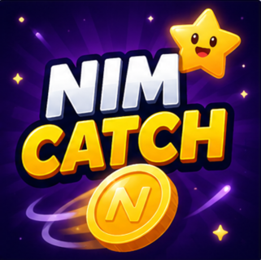
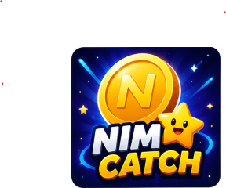
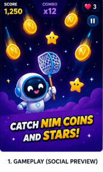
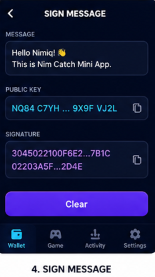
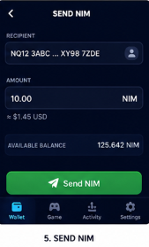

# NimCatch

> Catch NIM. Build combos. Beat your high score

| Field | Value |
| --- | --- |
| Category | Games |
| Pricing | Free |
| Team name | Arief Labs |
| Team members | Solo Builder |
| X account | fauzi5121998 |
| Heard about it via | Nimiq Community |
| Contact email | rapariezie@gmail.com |
| GitHub login | @Arief0299 |
| Submitted at | 2026-09-13T15:24:56.053Z |

## Links

| Link | URL |
| --- | --- |
| Repo | [https://github.com/Arief0299/my-mini-app](<https://github.com/Arief0299/my-mini-app>) |
| Demo | [https://my-mini-app-gules.vercel.app/](<https://my-mini-app-gules.vercel.app/>) |
| Video | [https://youtube.com/shorts/_ViTpfsdUaM?si=95zybhgrvaISiJrD](<https://youtube.com/shorts/_ViTpfsdUaM?si=95zybhgrvaISiJrD>) |
| Skool post | [https://www.skool.com/miniappscompetition/i-built-nimcatch-for-the-nimiq-mini-apps-competition?p=a709298e](<https://www.skool.com/miniappscompetition/i-built-nimcatch-for-the-nimiq-mini-apps-competition?p=a709298e>) |
| Social post | [https://x.com/fauzi5121998/status/2099155599535845820?s=20](<https://x.com/fauzi5121998/status/2099155599535845820?s=20>) |

## Description

NimCatch is a fast, lightweight Nimiq mini-game where players catch falling NIM coins, build combos, increase their score, and compete against their high score. Built as a simple, mobile-friendly experience for the Nimiq Mini Apps ecosystem.

## Builder story

I built NimCatch as a simple experiment to explore what a fun and lightweight game could look like inside the Nimiq Mini Apps ecosystem.

The idea was to turn NIM into something interactive rather than only something users see as a balance or payment asset. I wanted the first version to be easy to understand: open the app, start playing, catch the falling coins, build combos, and try to beat your high score.

I built the app from scratch and focused on keeping the experience fast, simple, and mobile-friendly. NimCatch is also a starting point for exploring future gameplay mechanics, rewards, and deeper integration with the Nimiq ecosystem.

## Thumbnail

## Screenshots

---

_Generated from the submission form. `submission.yaml` in this folder is the machine-readable source of truth._
