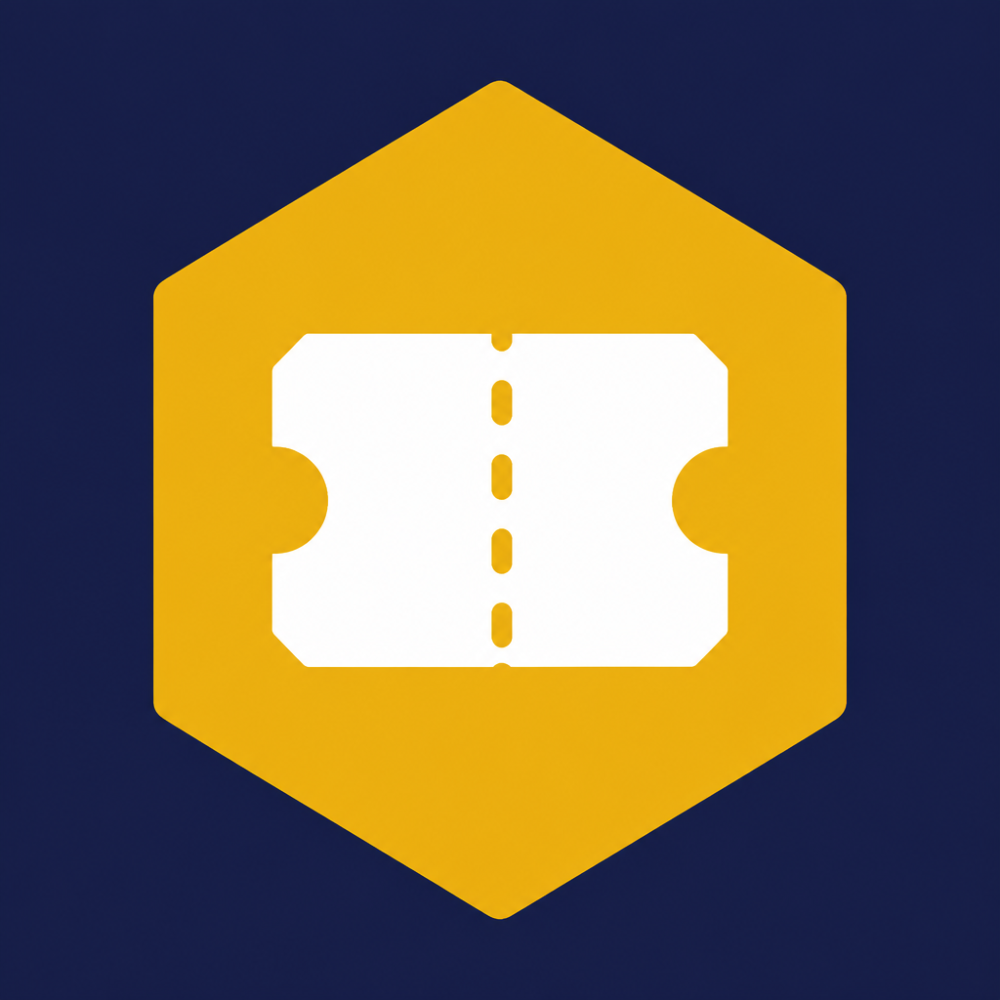
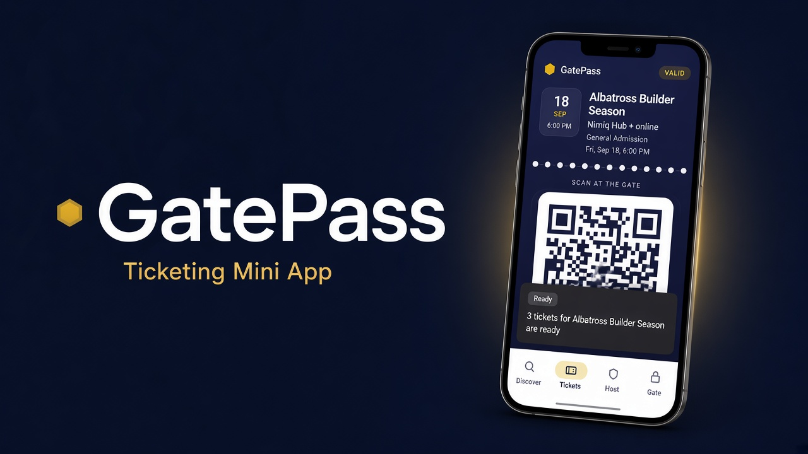
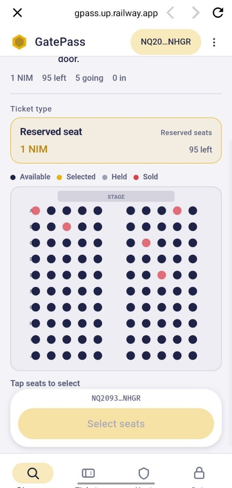
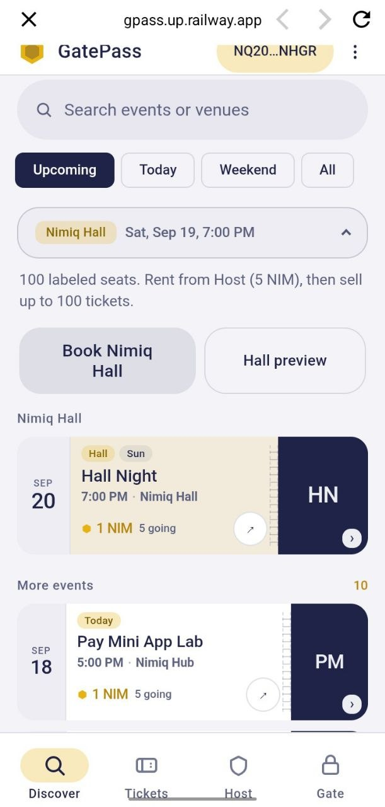
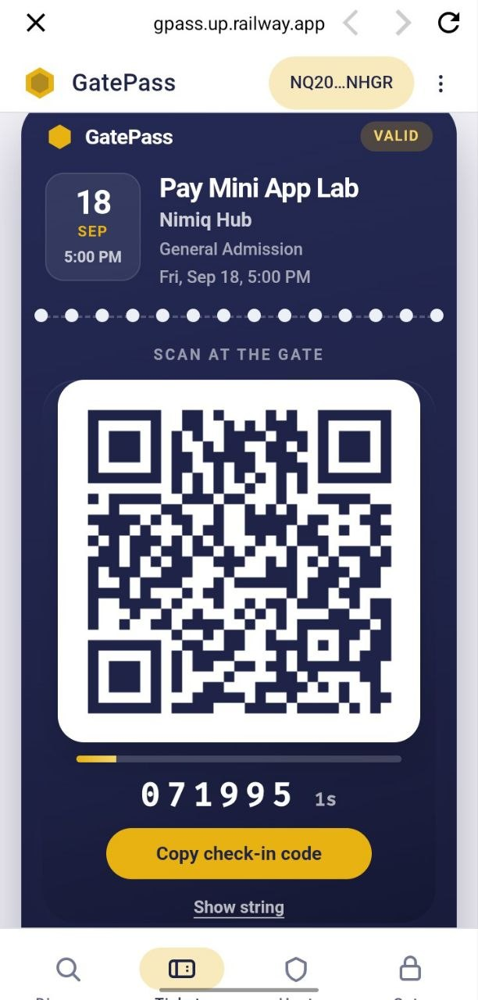
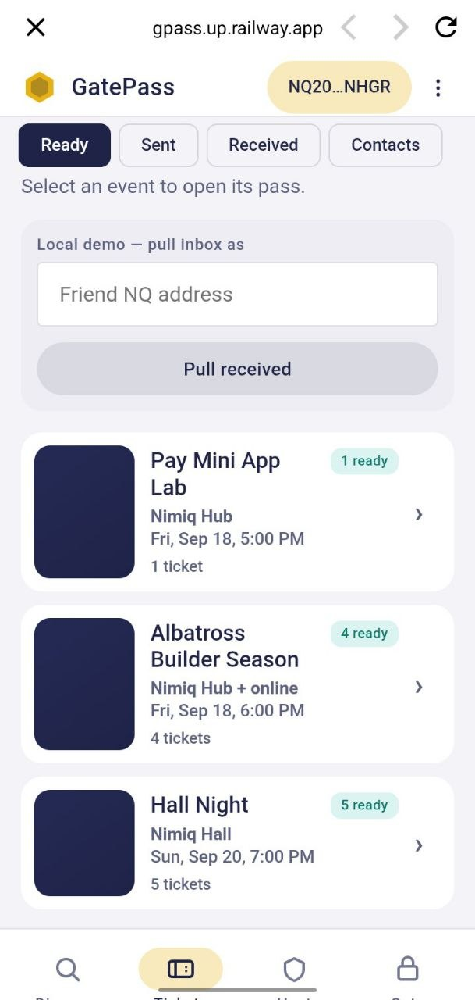
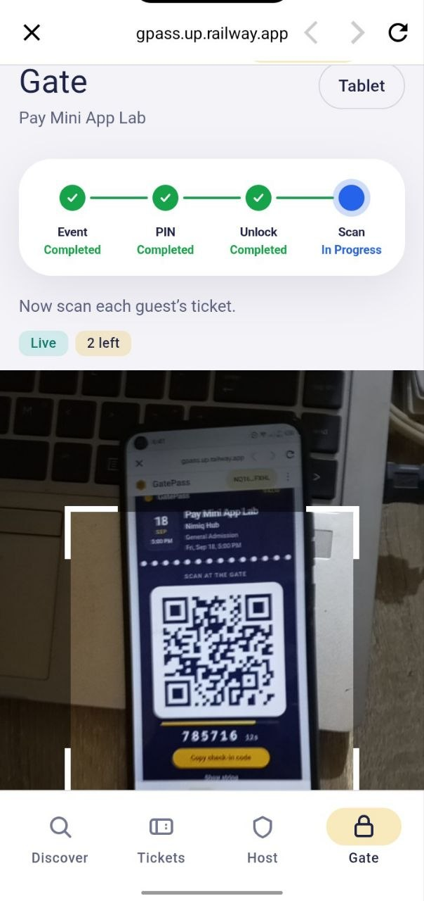

# GatePass

> All-in-one event ticketing in Nimiq Pay.

| Field | Value |
| --- | --- |
| Category | Lifestyle |
| Pricing | Free |
| Team name | _Not provided — optional_ |
| Team members | _Not provided — optional_ |
| X account | chrisgold__ |
| Heard about it via | X |
| Contact email | chrisgoldog@gmail.com |
| GitHub login | @AshThunder |
| Submitted at | 2026-09-18T19:22:55.934Z |

## Links

| Link | URL |
| --- | --- |
| Repo | [https://github.com/AshThunder/gatepass](<https://github.com/AshThunder/gatepass>) |
| Demo | [https://gpass.up.railway.app/](<https://gpass.up.railway.app/>) |
| Video | [https://youtu.be/4rG6wxgVtOE](<https://youtu.be/4rG6wxgVtOE>) |
| Skool post | [https://www.skool.com/miniappscompetition/gatepass-event-ticketing-mini-app-for-nimiq-pay](<https://www.skool.com/miniappscompetition/gatepass-event-ticketing-mini-app-for-nimiq-pay>) |
| Social post | [https://x.com/ChrisGold__/status/2101022395637100996?s=20](<https://x.com/ChrisGold__/status/2101022395637100996?s=20>) |

## Description

GatePass is a ticketing Mini App for hosts and guests. Create events, buy tickets with NIM, check people in at the door, and rent Nimiq Hall — all inside Nimiq Pay.

## Builder story

I wanted event ticketing to live where the wallet already is. Hosts should create an event, take payment, and check people in without a stack of other tools. Guests should pay with NIM and show a ticket that still works at the door.

GatePass is that in one Mini App: host, buy, check in, and rent Nimiq Hall. Built for Nimiq Pay so keys stay in Pay and the desk is not split across five apps.

## Thumbnail

## Screenshots

---

_Generated from the submission form. `submission.yaml` in this folder is the machine-readable source of truth._
