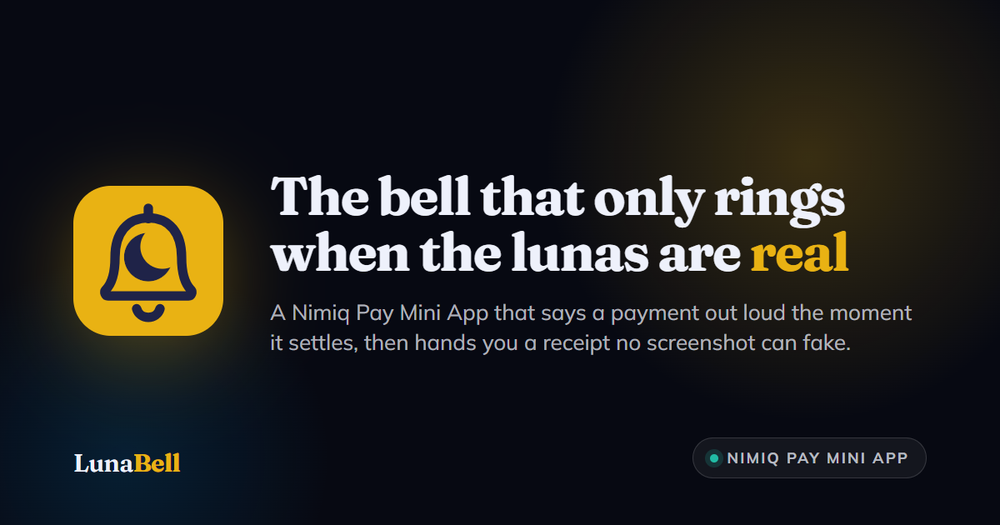
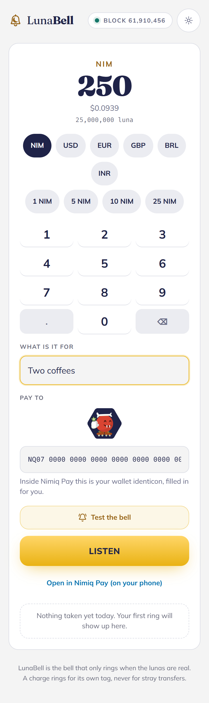
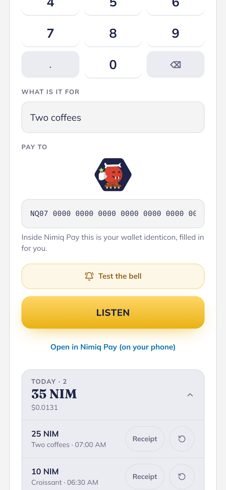
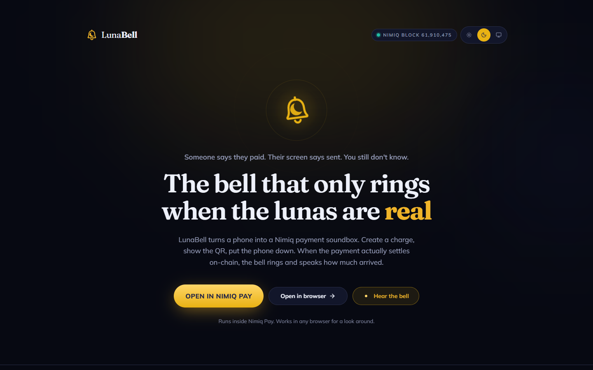

# LunaBell

> The bell that only rings when the lunas are real.

| Field | Value |
| --- | --- |
| Category | Food & dining |
| Pricing | Free |
| Team name | _Not provided — optional_ |
| Team members | _Not provided — optional_ |
| X account | AustinChris_ |
| Heard about it via | Nimiq community |
| Contact email | austinchrisiwu@gmail.com |
| GitHub login | @AustinChris1 |
| Submitted at | 2026-09-18T07:23:54.843Z |

## Links

| Link | URL |
| --- | --- |
| Repo | [https://github.com/AustinChris1/LunaBell](<https://github.com/AustinChris1/LunaBell>) |
| Demo | [https://lunabell.vercel.app/](<https://lunabell.vercel.app/>) |
| Video | [https://youtu.be/xuG7c3hYP-Y?si=1ijXpVwn7Mz4a3ZA](<https://youtu.be/xuG7c3hYP-Y?si=1ijXpVwn7Mz4a3ZA>) |
| Skool post | _Not provided — optional_ |
| Social post | [https://x.com/AustinChris_/status/2100847957901824205](<https://x.com/AustinChris_/status/2100847957901824205>) |

## Description

Someone says they paid. Their screen says sent. You still don't know if it arrived. LunaBell is a Nimiq payment soundbox: show the QR, put the phone down. The bell rings only when the money is on-chain, then a receipt re-reads it.

## Builder story

Someone says they paid. Their screen says sent. You still don't know if the money arrived.

That is the oldest in-person crypto trick there is, and it is not a crypto-only trick. A customer flashes a "payment successful" screen, walks off with the goods, and nothing ever hits the till. India answered it with hardware. Paytm and PhonePe have deployed over nine million soundboxes whose only job is to announce a verified payment out loud, so the seller never has to look at a screen or trust a customer's phone. Merchants quoted by Rest of World in April 2023 named fake or doctored receipts as the reason they bought one.

LunaBell is that device as free software, inside Nimiq Pay.

I wanted a Mini App that uses Nimiq the way a merchant would actually use a wallet: name an amount, show a QR, put the phone down, and trust a sound more than a screenshot. Not another invoice form. Not another split. A phone that rings only when the lunas are real.

A charge is one object: amount, memo, nonce, and the block height it was made at. It lives entirely in its own link. There is no LunaBell account, no LunaBell wallet, and no LunaBell database. The payer sends with sendBasicTransactionWithData carrying an LB: tag. LunaBell matches the recipient, the exact luna amount, the tag, and the block window, and rings only then. A dust transfer, an untagged payment, or a replay of an older transaction stays silent. The tests in the repo assert each of those cases. isConsensusEstablished gates the announcement so nothing is spoken while the wallet is out of sync.

The receipt is a link, not a picture. Every time anyone opens it, it fetches the transaction again, so its confirmation count is higher than last time. That is the whole argument against a screenshot, made visible.

I am honest about the limit. The Mini App interface does not currently expose transaction watching or lookup, so LunaBell reads the public Nimiq chain through RPC and does not claim to be a light client. The claim is simpler: when the bell rings, the payment matched on-chain.

It is not only for a counter. A freelancer, a roommate, a group organiser, anyone who has ever been told "I sent it" gets the same two things: a sound they can trust, and a receipt they can forward.

Everything else is in service of that loop: a day's takings with a spoken total, one tap repeat, five languages that follow the wallet's own setting, light and dark, installable to a home screen, and a handoff URL any other Mini App can call to open a prefilled charge.

NIM native. MIT. Built to be trusted with your hands full.

## Thumbnail

## Screenshots

---

_Generated from the submission form. `submission.yaml` in this folder is the machine-readable source of truth._
