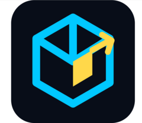
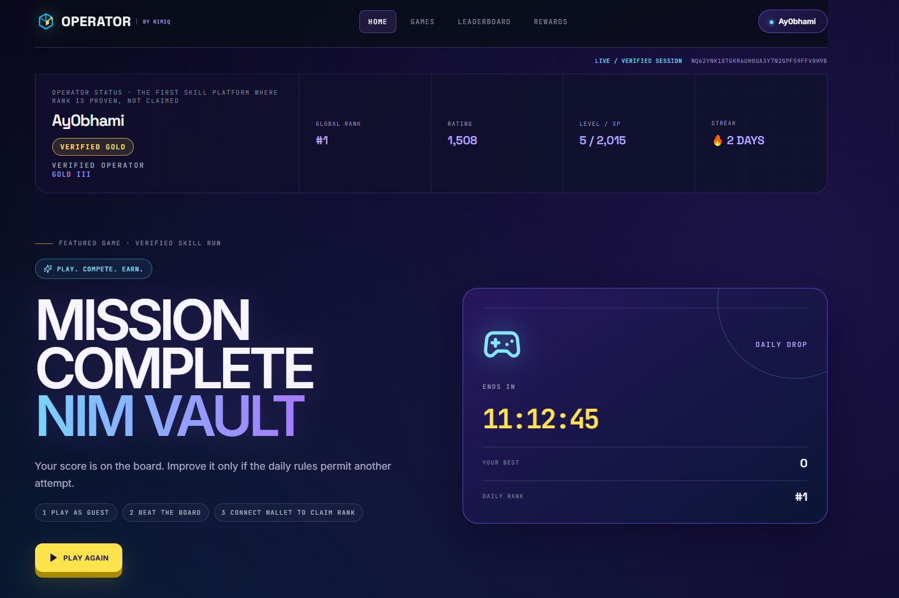
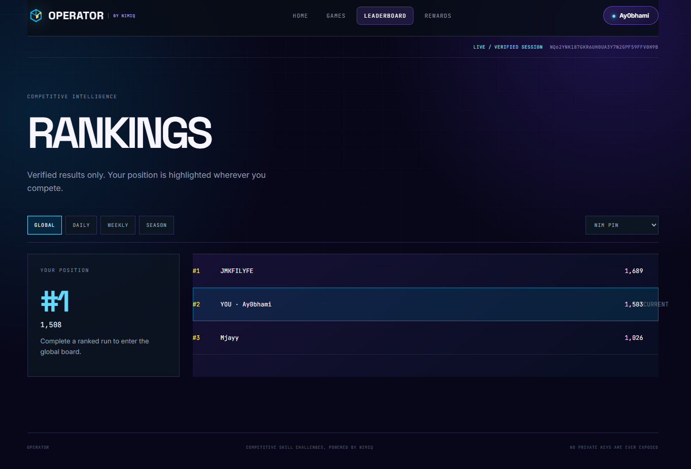
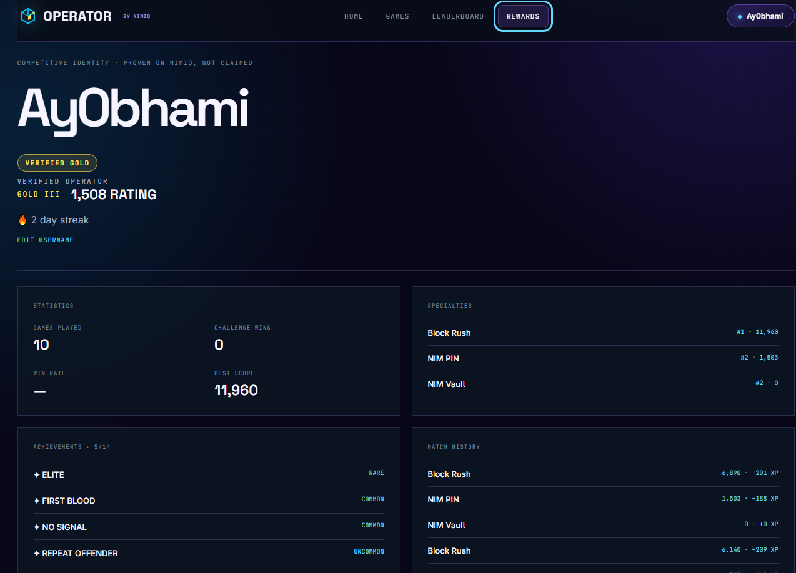
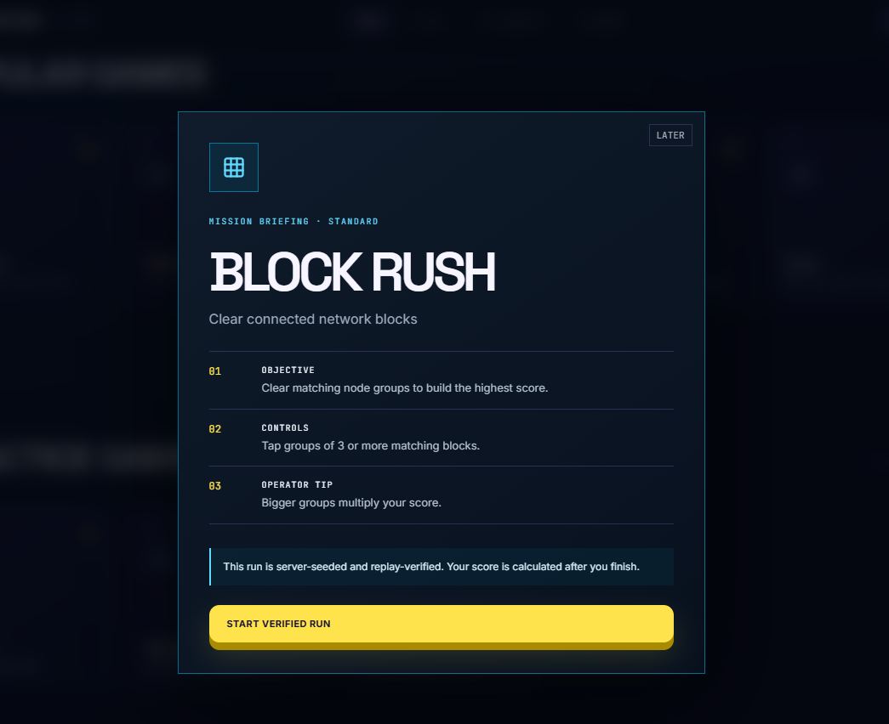

# OPERATOR

> Don't just play. Prove it.

| Field | Value |
| --- | --- |
| Category | Games |
| Pricing | Freemium |
| Team name | OPERATOR |
| Team members | _Not provided — optional_ |
| X account | Letsmakeit0 |
| Heard about it via | on X |
| Contact email | ABASSABDULMOJEED@GMAIL.COM |
| GitHub login | @Ay0bhamii |
| Submitted at | 2026-09-10T12:59:13.978Z |

## Links

| Link | URL |
| --- | --- |
| Repo | [https://github.com/Ay0bhamii/Operator](<https://github.com/Ay0bhamii/Operator>) |
| Demo | [https://operator-nimiq.vercel.app](<https://operator-nimiq.vercel.app>) |
| Video | [https://www.loom.com/share/2426596c304041b895baf4f5743f348c](<https://www.loom.com/share/2426596c304041b895baf4f5743f348c>) |
| Skool post | [https://www.skool.com/miniappscompetition/the-operator?p=720b5196](<https://www.skool.com/miniappscompetition/the-operator?p=720b5196>) |
| Social post | [https://x.com/Letsmakeit0/status/2097813218089382129?s=20](<https://x.com/Letsmakeit0/status/2097813218089382129?s=20>) |

## Description

OPERATOR is a competitive skill platform powered by Nimiq where scores are cryptographically authenticated and server-verified. Players practice as guests or connect a Nimiq wallet for ranked runs on fast memory, timing, sequence, and precision challenges.

## Builder story

Most Web3 skill games and leaderboards still trust the client. Players can easily cheat by modifying scores or replaying runs, which destroys competition and rewards.I built OPERATOR because I wanted skill challenges where the score is actually proven — not just claimed.  Nimiq gives every player a portable cryptographic identity without passwords or seed phrases in the app. The server issues a unique seed and run ID, the player only sends input events, and the server replays everything to calculate a verified score.  The result is simple: don’t just play. Prove it

## Thumbnail

## Screenshots

---

_Generated from the submission form. `submission.yaml` in this folder is the machine-readable source of truth._
