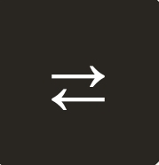
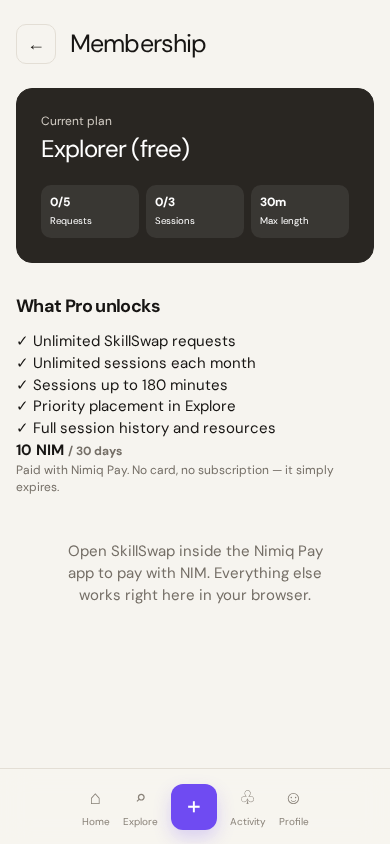
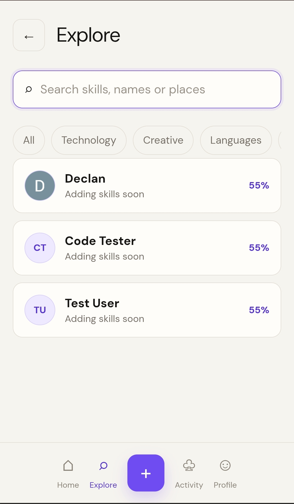
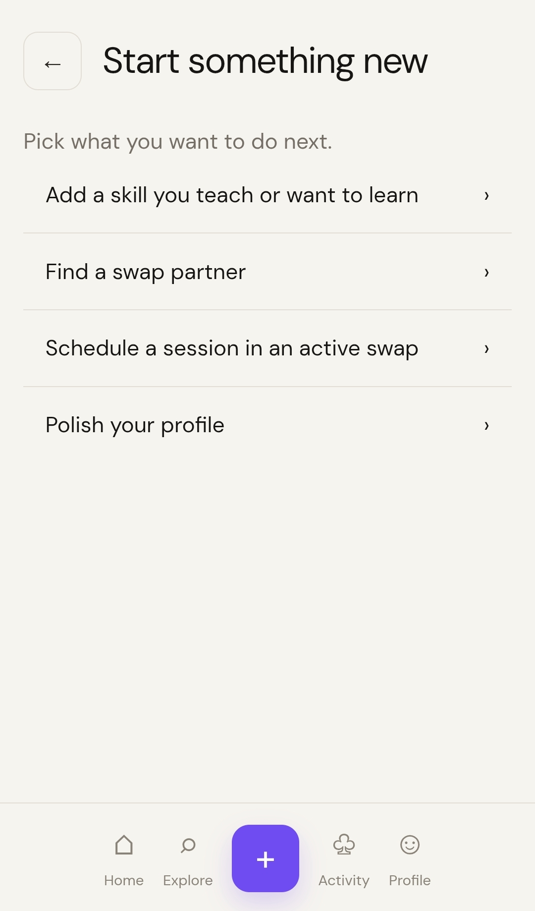
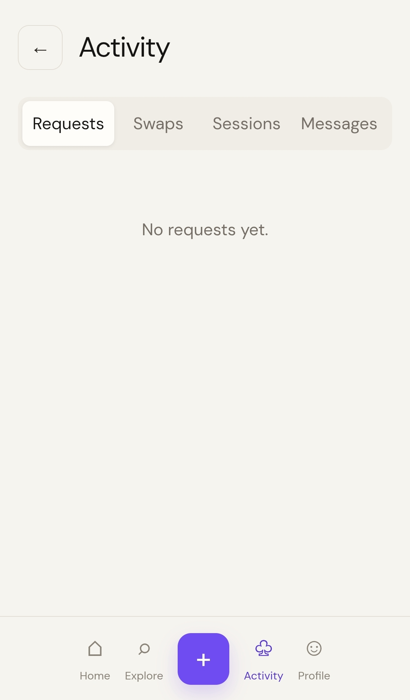
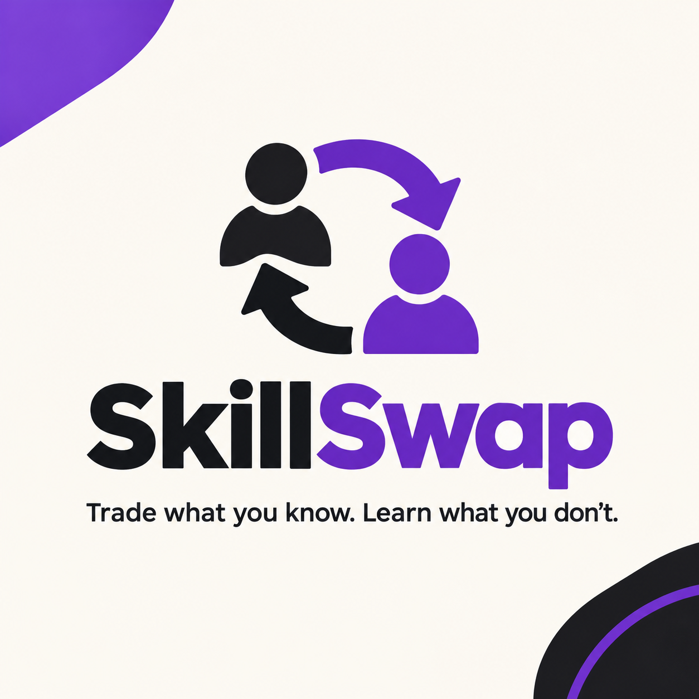

# Skillswap

> Trade what you know. Learn what you don't.

| Field | Value |
| --- | --- |
| Category | Productivity |
| Pricing | Freemium |
| Team name | _Not provided — optional_ |
| Team members | _Not provided — optional_ |
| X account | _Not provided — optional_ |
| Heard about it via | Nimiq community |
| Contact email | ayomideabiodun.com2009@gmail.com |
| GitHub login | @Ayomide-fc |
| Submitted at | 2026-09-17T15:23:58.304Z |

## Links

| Link | URL |
| --- | --- |
| Repo | [https://github.com/Ayomide-fc/nimble-skill-flow.git](<https://github.com/Ayomide-fc/nimble-skill-flow.git>) |
| Demo | [https://nimble-skill-flow.vercel.app/](<https://nimble-skill-flow.vercel.app/>) |
| Video | [https://www.mediafire.com/file/3ora9110muwcfdi/VID_20260917_161800.mp4/file](<https://www.mediafire.com/file/3ora9110muwcfdi/VID_20260917_161800.mp4/file>) |
| Skool post | _Not provided — optional_ |
| Social post | _Not provided — optional_ |

## Description

SkillSwap connects people who want to learn skills with people who can teach them, allowing users to exchange knowledge through matched skill swaps, messaging, and live sessions. It’s built for students, creators, professionals, and anyone who wants to learn something new.

## Builder story

I was inspired by how much knowledge people have that often goes unused. I wanted to create a simple way for people to connect with others who want to learn what they know, while they learn something they need in return turning skill-sharing into a mutual exchange rather than a one-way transaction.

## Thumbnail

## Screenshots

---

_Generated from the submission form. `submission.yaml` in this folder is the machine-readable source of truth._
