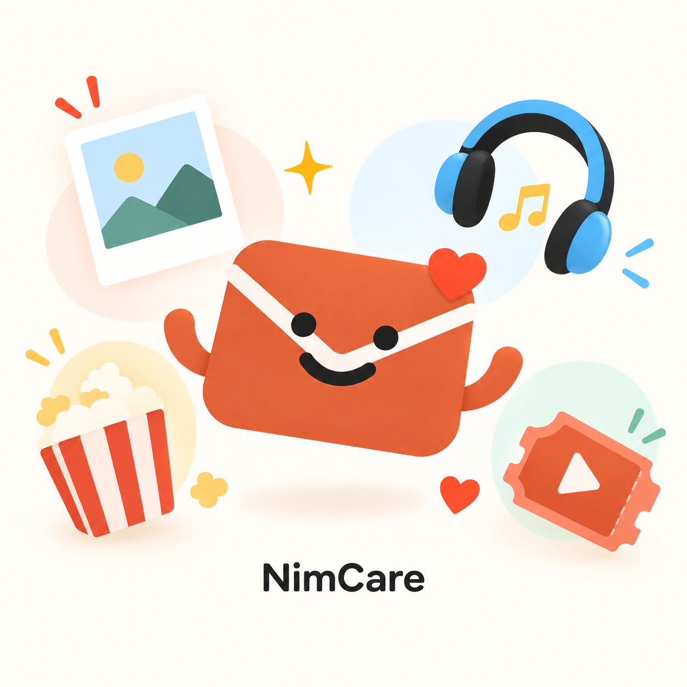
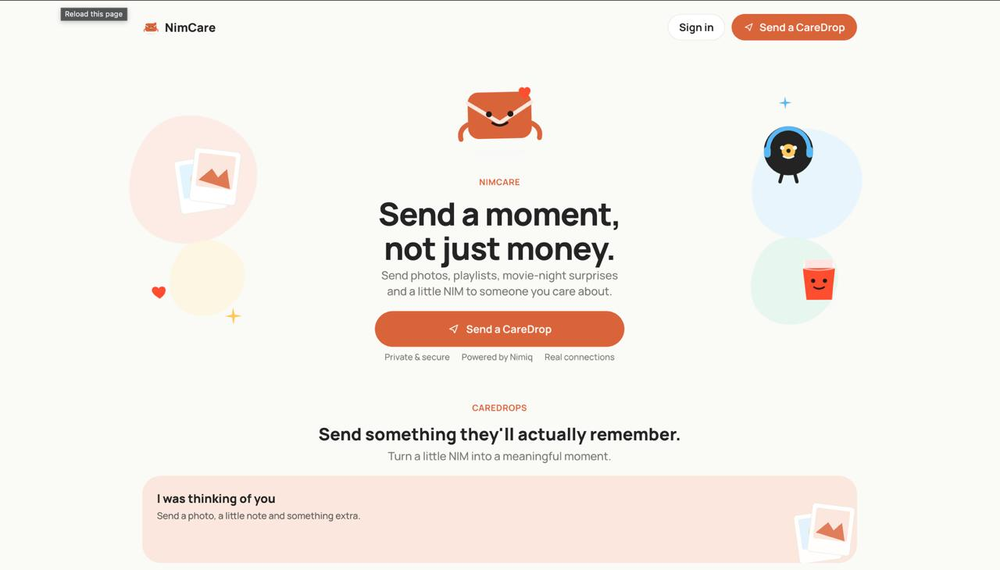
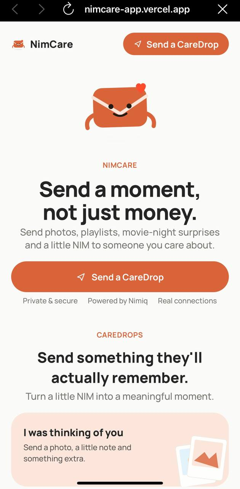
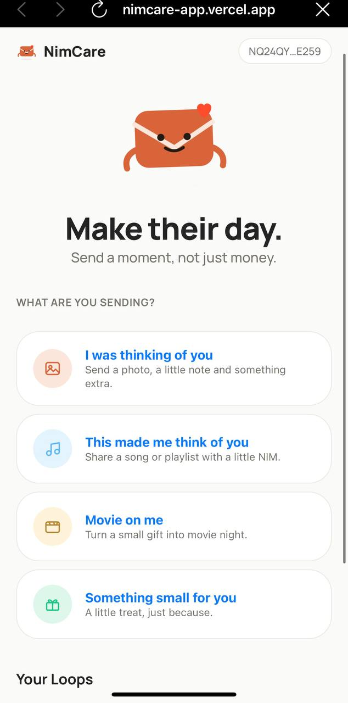

# NimCare

> Send a moment, not just money.

| Field | Value |
| --- | --- |
| Category | Social |
| Pricing | Free |
| Team name | Benita |
| Team members | _Not provided — optional_ |
| X account | 0x_beni_ |
| Heard about it via | Twitter |
| Contact email | 0xbeni123@gmail.com |
| GitHub login | @Benita2001 |
| Submitted at | 2026-09-18T23:41:35.240Z |

## Links

| Link | URL |
| --- | --- |
| Repo | [https://github.com/Benita2001/NimCare](<https://github.com/Benita2001/NimCare>) |
| Demo | [https://nimcare-app.vercel.app/](<https://nimcare-app.vercel.app/>) |
| Video | [https://youtu.be/GR5fsD2Co-Q?si=sLL4w5Svs6A08fD6](<https://youtu.be/GR5fsD2Co-Q?si=sLL4w5Svs6A08fD6>) |
| Skool post | [https://www.skool.com/miniappscompetition/i-built-nimcare-for-nimiq-mini-apps-competition?p=1c494c1c](<https://www.skool.com/miniappscompetition/i-built-nimcare-for-nimiq-mini-apps-competition?p=1c494c1c>) |
| Social post | [https://x.com/0x_beni_/status/2101091046381801901?s=20](<https://x.com/0x_beni_/status/2101091046381801901?s=20>) |

## Description

NimCare lets you send digital surprises photos, playlists, movie-night moments alongside NIM gifts to someone you care about. Each CareDrop becomes part of a private shared Loop between you.

## Builder story

I built NimCare around a simple idea sending someone money can be useful but it rarely feels personal.

I wanted to make digital payments feel more like a real gesture between people, so NimCare turns NIM into a CareDrop a private surprise that can include a photo, playlist, movie-night moment, a note and a small NIM gift.

The goal was to remove the usual “crypto transaction” feeling and make the experience feel human first. Instead of just seeing that someone sent you funds you open a moment they created for you.

NimCare is built around that emotional layer send something meaningful, let the recipient respond and gradually build a shared Loop of moments between two wallets.

## Thumbnail

## Screenshots

---

_Generated from the submission form. `submission.yaml` in this folder is the machine-readable source of truth._
