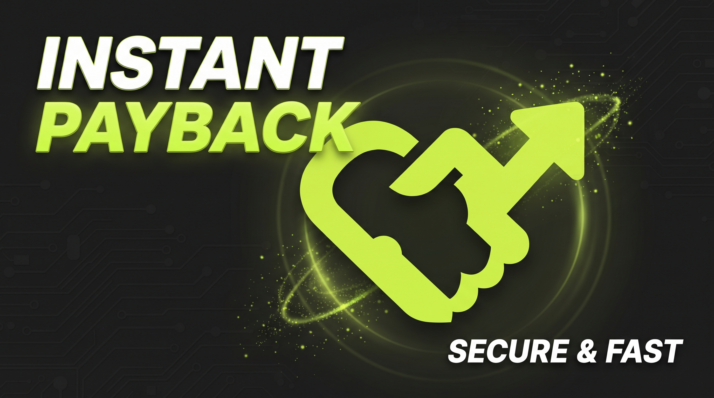
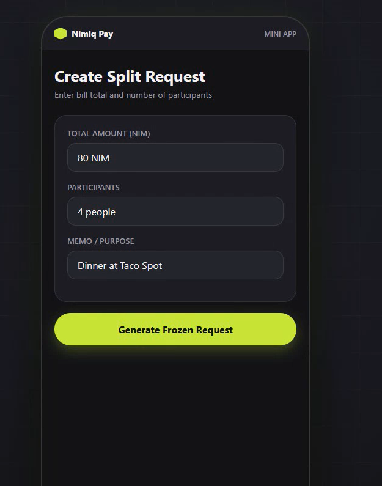
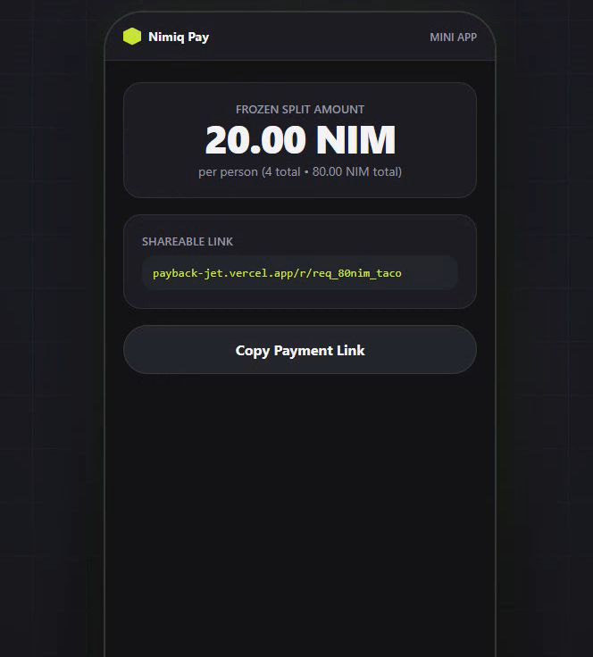
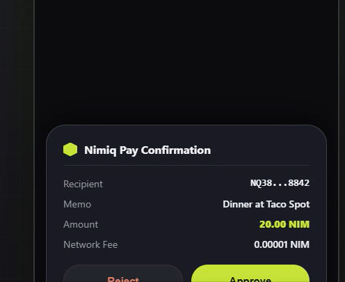
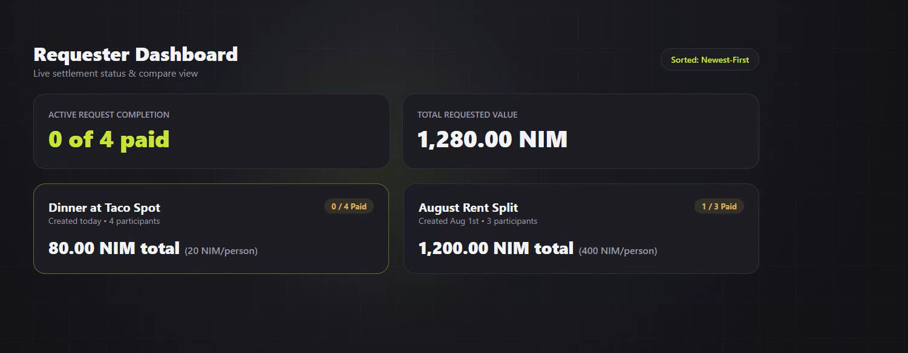

# Payback

> The end of "I'll send it later."

| Field | Value |
| --- | --- |
| Category | Social |
| Pricing | Free |
| Team name | _Not provided — optional_ |
| Team members | _Not provided — optional_ |
| X account | bholdguy |
| Heard about it via | X |
| Contact email | bholdguyyy161@gmail.com |
| GitHub login | @Bholdguy |
| Submitted at | 2026-09-18T16:24:10.691Z |

## Links

| Link | URL |
| --- | --- |
| Repo | [https://github.com/Bholdguy/payback](<https://github.com/Bholdguy/payback>) |
| Demo | [https://payback-jet.vercel.app](<https://payback-jet.vercel.app>) |
| Video | [https://youtu.be/wsanlWfhuhk?si=5cmKgtEXYdSTWnG7](<https://youtu.be/wsanlWfhuhk?si=5cmKgtEXYdSTWnG7>) |
| Skool post | _Not provided — optional_ |
| Social post | [https://x.com/bholdguy/status/2100984026018234831](<https://x.com/bholdguy/status/2100984026018234831>) |

## Description

Payback turns a shared cost, a dinner bill, a rent split, an informal debt, into one payment request that settles with a single native wallet approval inside Nimiq Pay. No separate app, no account, no chasing friends for money they promised to send.

## Builder story

I've split bills with roommates and friends more times than I can count, and it's always the same pattern: someone fronts the money, everyone agrees to pay their share, and then it just... doesn't happen. Not because anyone's dishonest, just because paying means leaving whatever app you're already in, remembering to do it, and someone else remembering to check.

Before building anything, I dug into what people actually complain about, not what I assumed the problem was. Threads across r/venmo, r/roommates, and r/AmItheAsshole all pointed at the same thing: the tracking tools exist, but nothing actually closes the loop. You can log who owes what all day; it doesn't move a single coin.

Payback collapses the request and the payment into one step. A requester generates a frozen, split request and shares one link. Each person taps Pay and approves inside Nimiq Pay's native wallet dialog, no separate app, no manual "did they actually send it" guessing. The requester's dashboard only ever shows "paid" once a payment is genuinely confirmed on-chain, not a self-reported checkbox.

Being fully transparent: I ran out of runway to get a funded wallet in time to record a fully confirmed on-chain payment before submitting. Everything up to that final step is built and tested on a real device, request creation, the native approval dialog appearing, retry and failure handling, and the confirmation logic verified against Nimiq's live RPC. The one thing I couldn't finish in time was funding a wallet to record that last click. I'd rather say that plainly than fake it.

## Thumbnail

## Screenshots

---

_Generated from the submission form. `submission.yaml` in this folder is the machine-readable source of truth._
