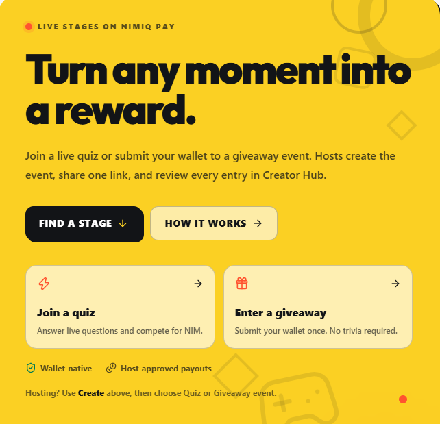
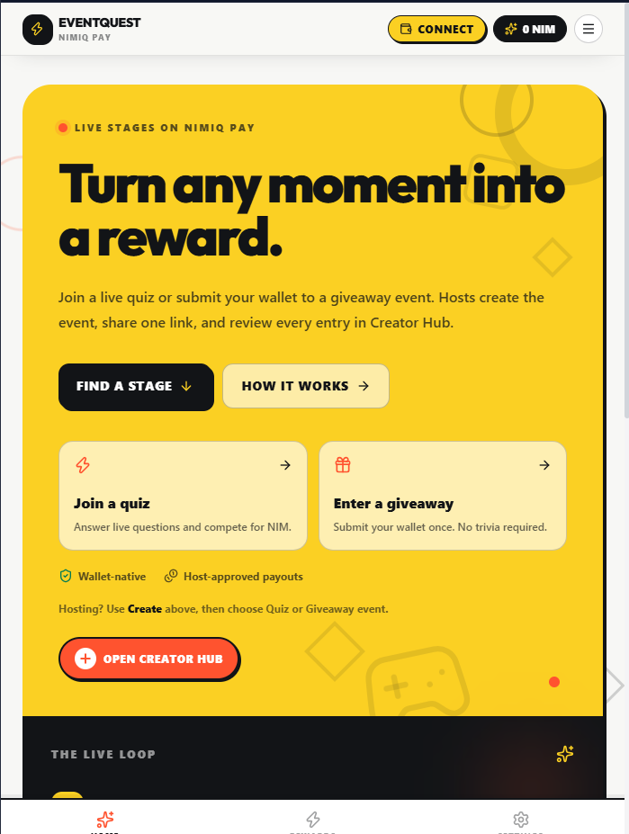
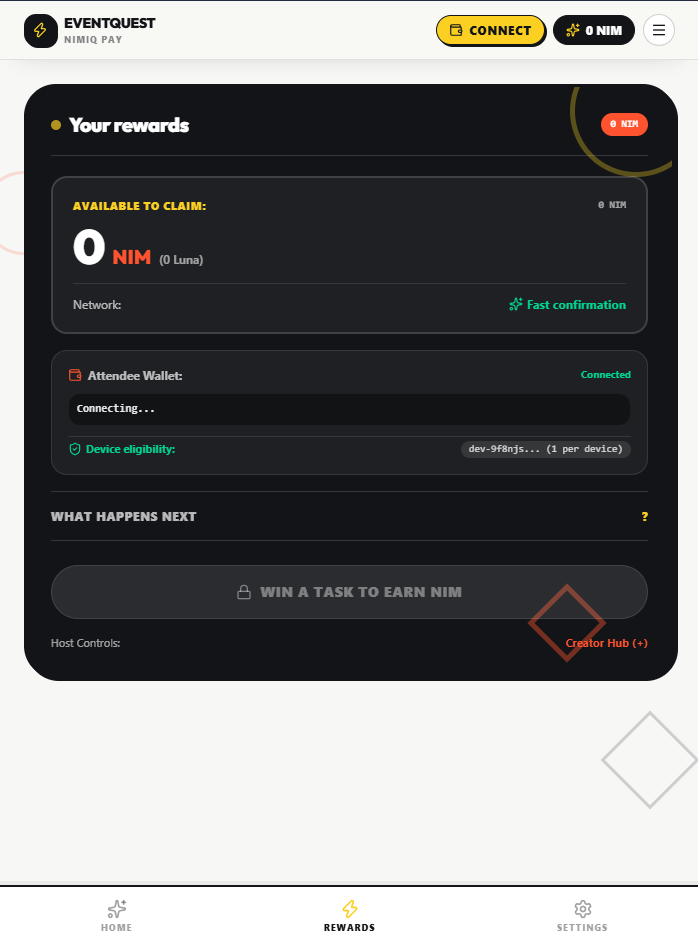
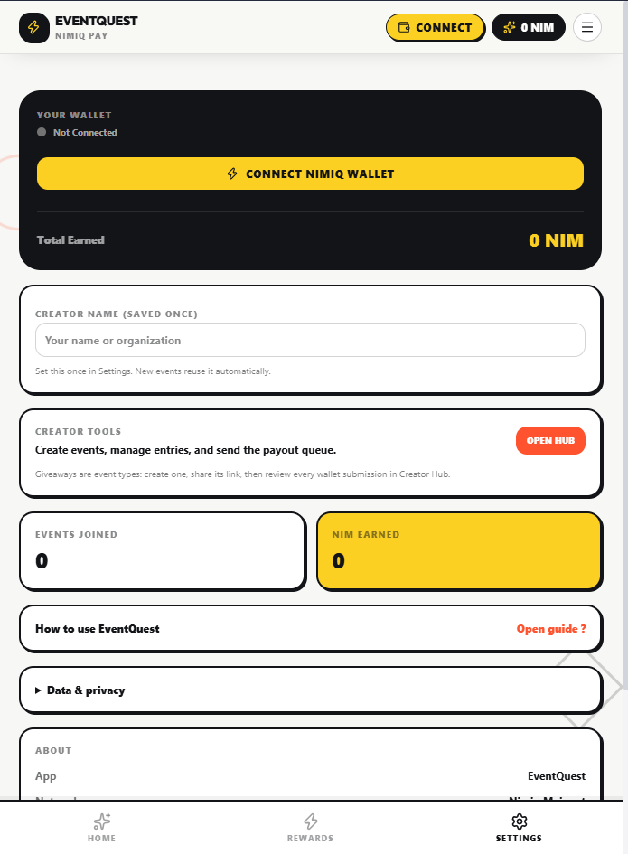

# EventQuest

> Turn live events into instant NIM rewards.

| Field | Value |
| --- | --- |
| Category | Creator tools |
| Pricing | Free |
| Team name | _Not provided — optional_ |
| Team members | _Not provided — optional_ |
| X account | jasonbisimjang |
| Heard about it via | _Not provided — optional_ |
| Contact email | jangjason27@gmail.com |
| GitHub login | @BisimJang |
| Submitted at | 2026-09-18T18:58:48.233Z |

## Links

| Link | URL |
| --- | --- |
| Repo | [https://github.com/BisimJang/task-master](<https://github.com/BisimJang/task-master>) |
| Demo | [https://task-master-kemomnytg-jasons-projects-618823f0.vercel.app/](<https://task-master-kemomnytg-jasons-projects-618823f0.vercel.app/>) |
| Video | [https://youtube.com/shorts/qKwd9BpRGnM?feature=share](<https://youtube.com/shorts/qKwd9BpRGnM?feature=share>) |
| Skool post | _Not provided — optional_ |
| Social post | [https://x.com/jasonbisimjang/status/2101022487647539457?s=20](<https://x.com/jasonbisimjang/status/2101022487647539457?s=20>) |

## Description

EventQuest helps hosts create live quizzes and wallet giveaways, share them by link or QR code, and manage creator-approved NIM reward payouts through Nimiq Pay.

## Builder story

EventQuest turns live events into interactive reward moments. Hosts can create quizzes or wallet giveaways, share them through links or QR codes, and manage NIM rewards directly through Nimiq Pay. I focused on making the creator workflow transparent: giveaway entries are visible, payouts are queued, and each wallet transaction is approved by the creator rather than hidden behind a custodial backend.

## Thumbnail

## Screenshots

---

_Generated from the submission form. `submission.yaml` in this folder is the machine-readable source of truth._
