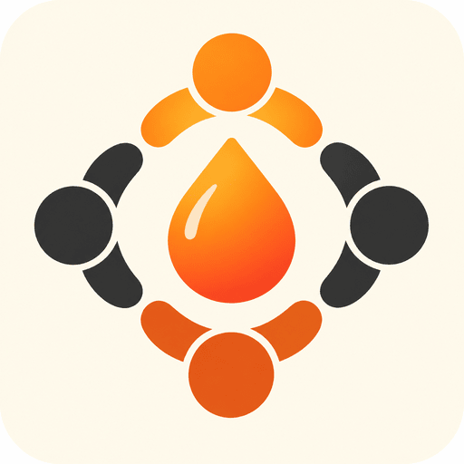
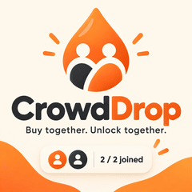
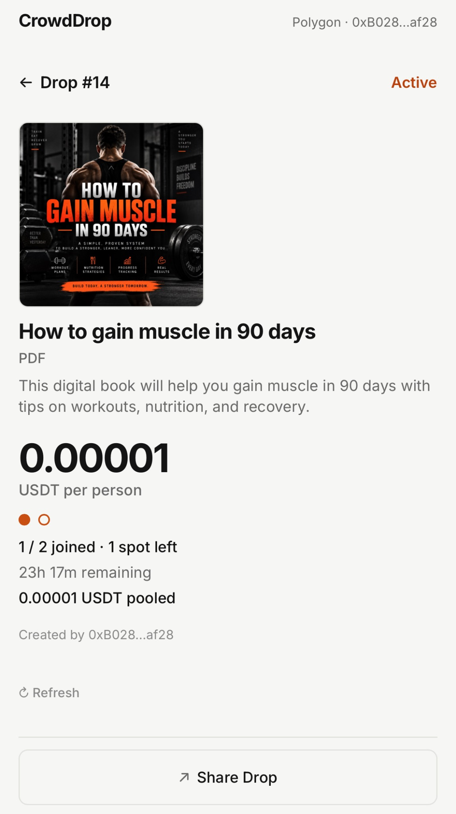
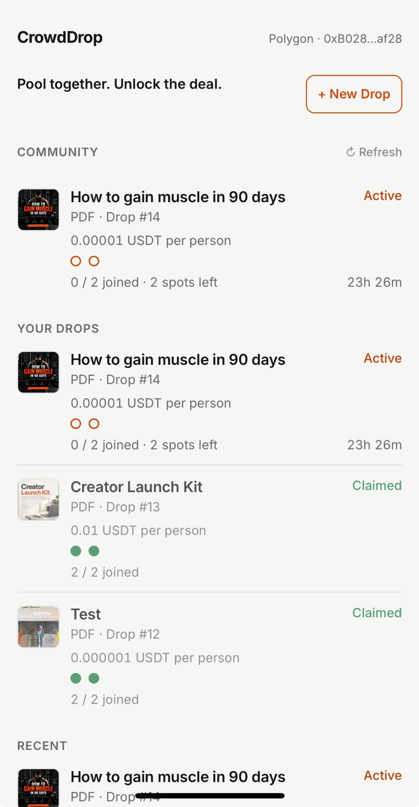
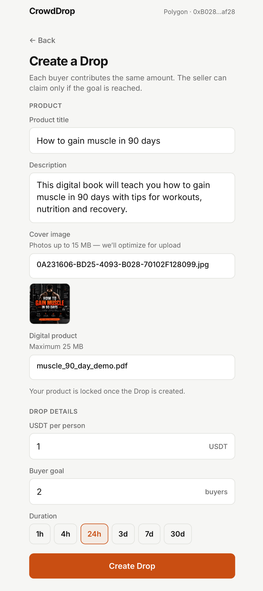
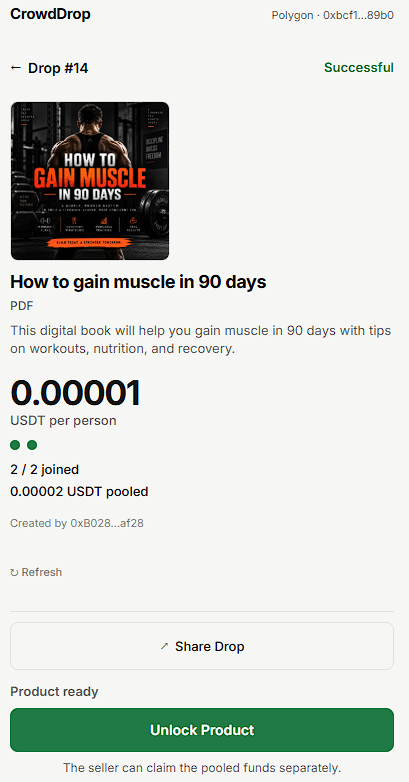
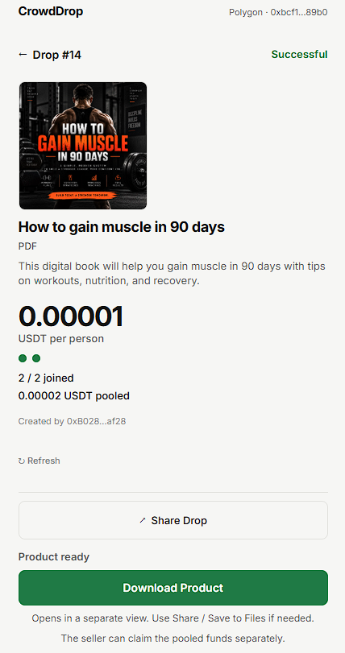

# CrowdDrop

> Buy together. Pay less. Unlock when the crowd joins.

| Field | Value |
| --- | --- |
| Category | Marketplaces |
| Pricing | Free |
| Team name | _Not provided — optional_ |
| Team members | _Not provided — optional_ |
| X account | BWBlit |
| Heard about it via | X |
| Contact email | Bryanblitman@gmail.com |
| GitHub login | @Blittyyy |
| Submitted at | 2026-09-18T21:04:59.131Z |

## Links

| Link | URL |
| --- | --- |
| Repo | [https://github.com/Blittyyy/CrowdDrop.git](<https://github.com/Blittyyy/CrowdDrop.git>) |
| Demo | [https://www.usecrowddrop.xyz/](<https://www.usecrowddrop.xyz/>) |
| Video | [https://youtu.be/wvaFZ811hwI](<https://youtu.be/wvaFZ811hwI>) |
| Skool post | [https://www.skool.com/miniappscompetition/built-crowddrop-for-the-nimiq-mini-apps-competition?p=53ed0170](<https://www.skool.com/miniappscompetition/built-crowddrop-for-the-nimiq-mini-apps-competition?p=53ed0170>) |
| Social post | [https://x.com/BWBlit/status/2101042390114902508?s=20](<https://x.com/BWBlit/status/2101042390114902508?s=20>) |

## Description

CrowdDrop is a group-buy marketplace for digital products. Sellers set a price per buyer and a minimum buyer goal; once the goal is reached, participants unlock the product and the seller can claim the pooled USDT.

## Builder story

_Not provided — optional_

## Thumbnail

## Screenshots

---

_Generated from the submission form. `submission.yaml` in this folder is the machine-readable source of truth._
