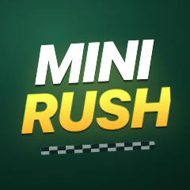
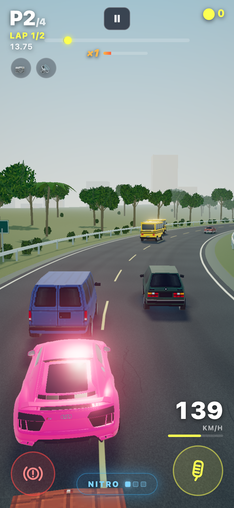
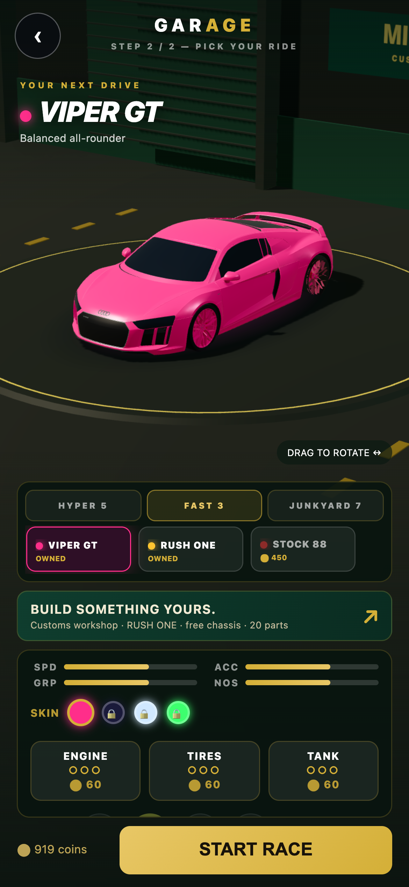
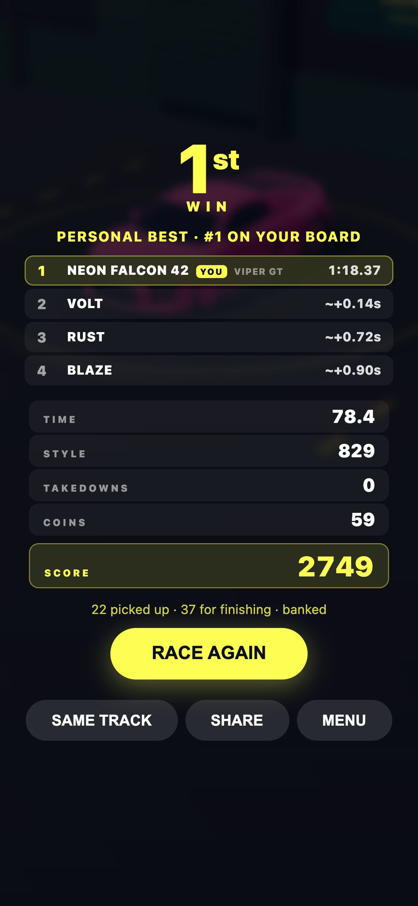
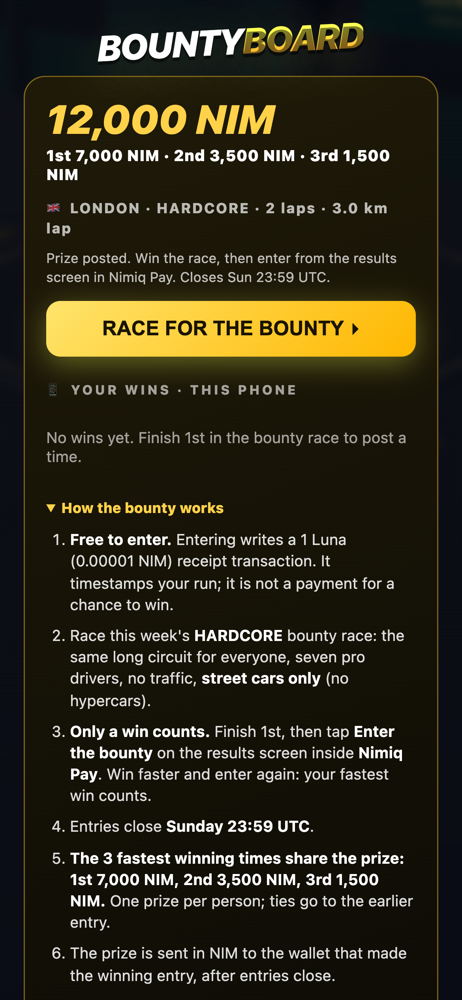
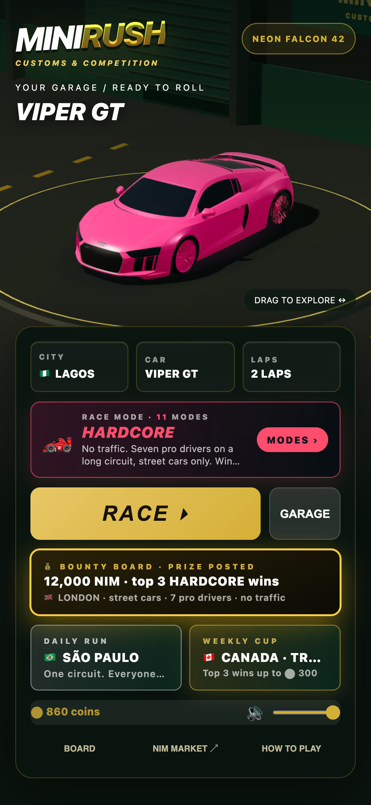

# MiniRush

> Arcade street racing in Nimiq Pay, with real NIM on the line.

| Field | Value |
| --- | --- |
| Category | Games |
| Pricing | Freemium |
| Team name | Calbridge |
| Team members | Grace, Grace |
| X account | Real_sweetone |
| Heard about it via | A friend |
| Contact email | Petersoncaleb275@gmail.com |
| GitHub login | @Calebux |
| Submitted at | 2026-09-11T11:54:57.345Z |

## Links

| Link | URL |
| --- | --- |
| Repo | [https://github.com/Calebux/Mini-Rush](<https://github.com/Calebux/Mini-Rush>) |
| Demo | [https://minirush.site](<https://minirush.site>) |
| Video | [https://youtu.be/IpopeQEQQpw](<https://youtu.be/IpopeQEQQpw>) |
| Skool post | [https://www.skool.com/miniappscompetition/minirush-a-3d-arcade-racer-built-for-nimiq-pay](<https://www.skool.com/miniappscompetition/minirush-a-3d-arcade-racer-built-for-nimiq-pay>) |
| Social post | [https://x.com/CalAgentkit/status/2098364061284970908](<https://x.com/CalAgentkit/status/2098364061284970908>) |

## Description

MiniRush is a free 3D arcade racer that runs inside Nimiq Pay: 10 race modes across 19 world cities, from Grand Prix to a police chase where the cops box you in. It's for anyone with a phone and five minutes. Buy hypercars with NIM, build your own car, and write your best runs to

## Builder story

_Not provided — optional_

## Thumbnail

## Screenshots

---

_Generated from the submission form. `submission.yaml` in this folder is the machine-readable source of truth._
