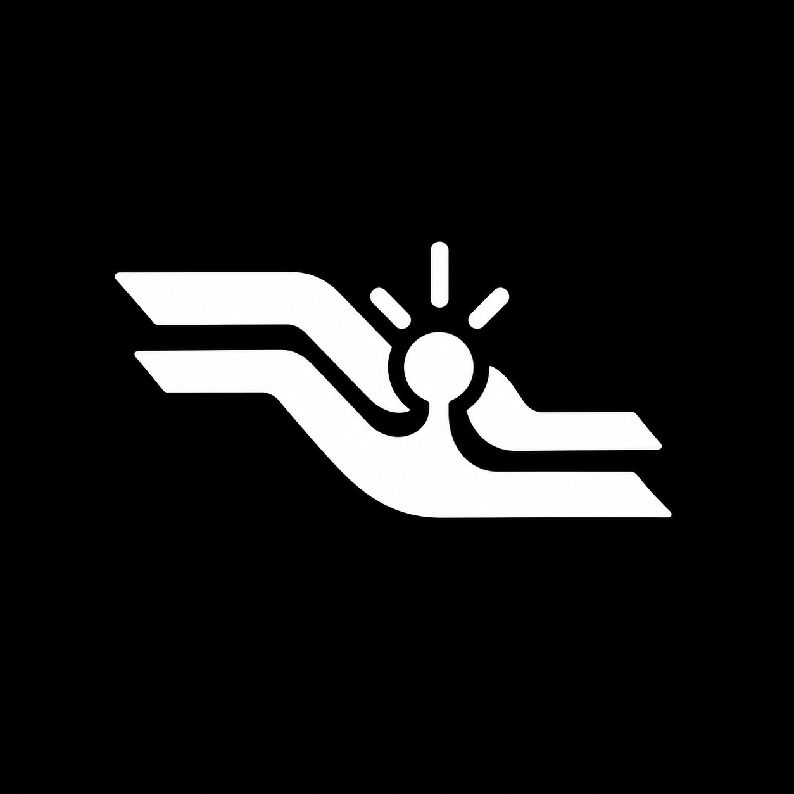
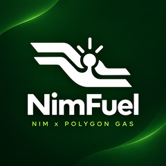
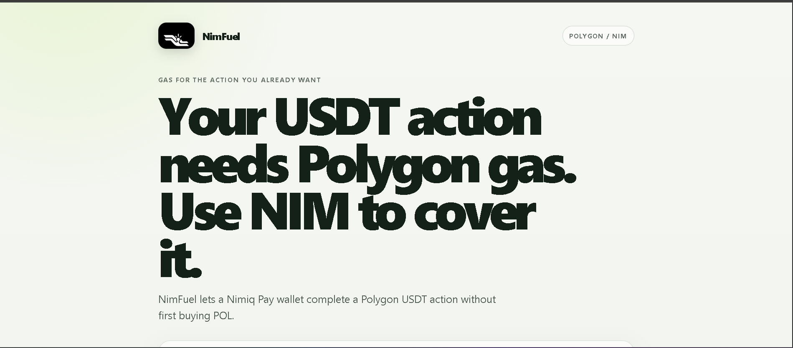
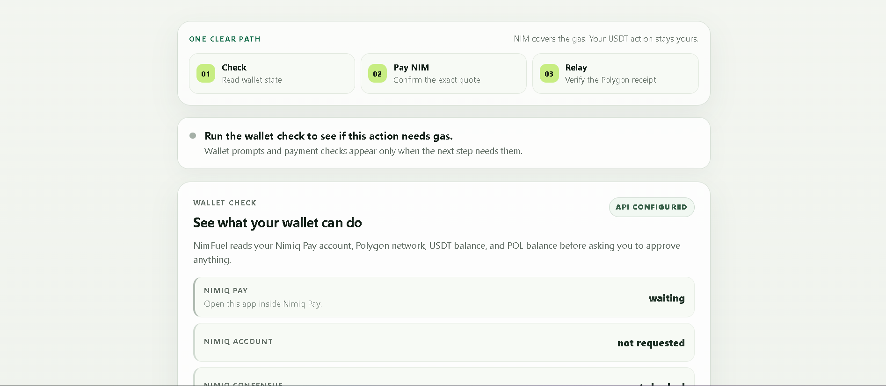
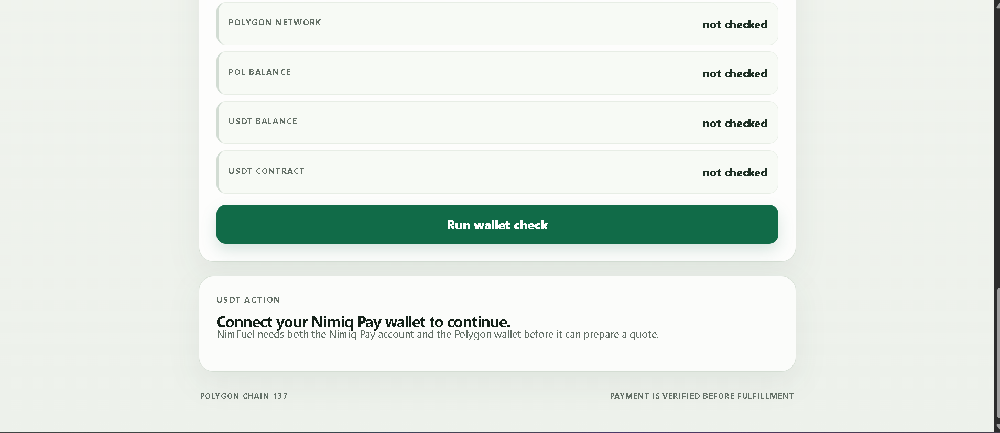

# NimFuel

> Use NIM to cover Polygon gas for USDT

| Field | Value |
| --- | --- |
| Category | On-chain services |
| Pricing | Free |
| Team name | N\\A |
| Team members | N\\A |
| X account | Zephyr_cryt |
| Heard about it via | twitter |
| Contact email | adepojutomiwa9@gmail.com |
| GitHub login | @CryptoZephyr |
| Submitted at | 2026-09-17T23:57:25.482Z |

## Links

| Link | URL |
| --- | --- |
| Repo | [https://github.com/CryptoZephyr/NimFuel](<https://github.com/CryptoZephyr/NimFuel>) |
| Demo | [https://nimfuel-app.onrender.com/](<https://nimfuel-app.onrender.com/>) |
| Video | [https://youtu.be/2L5OR3LHh_U](<https://youtu.be/2L5OR3LHh_U>) |
| Skool post | _Not provided — optional_ |
| Social post | [https://x.com/Zephyr_cryt/status/2100733676560527805](<https://x.com/Zephyr_cryt/status/2100733676560527805>) |

## Description

NimFuel helps Nimiq Pay users complete Polygon USDT actions when their wallet has USDT but lacks POL for gas. It calculates the required NIM payment, verifies it, relays the signed action, and confirms the Polygon receipt

## Builder story

I built NimFuel around a simple onboarding problem: a wallet can hold the asset it wants to use and still be blocked by a missing gas token. NimFuel lets users keep control of their USDT authorization while a paid and verified NIM order covers the Polygon gas step

## Thumbnail

## Screenshots

---

_Generated from the submission form. `submission.yaml` in this folder is the machine-readable source of truth._
