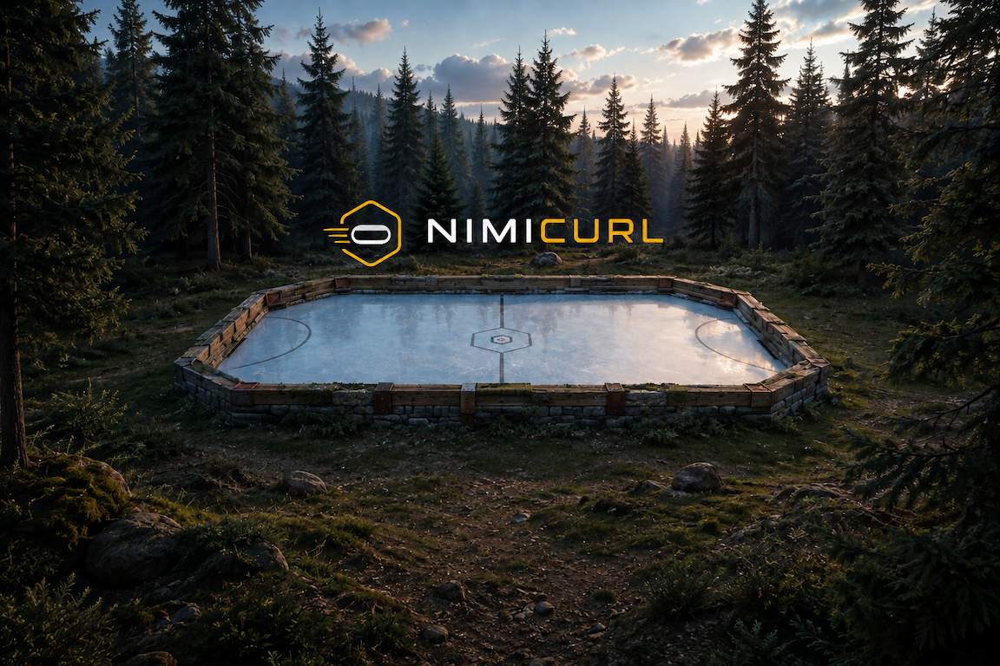
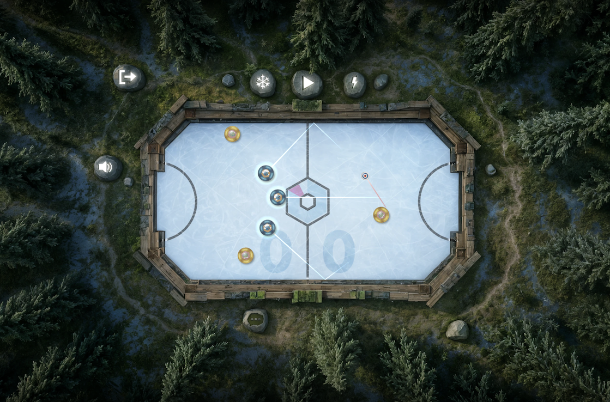
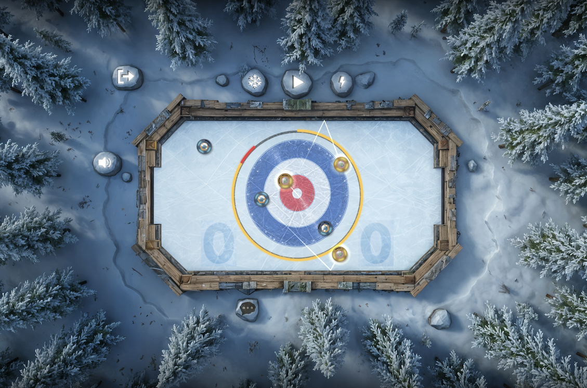
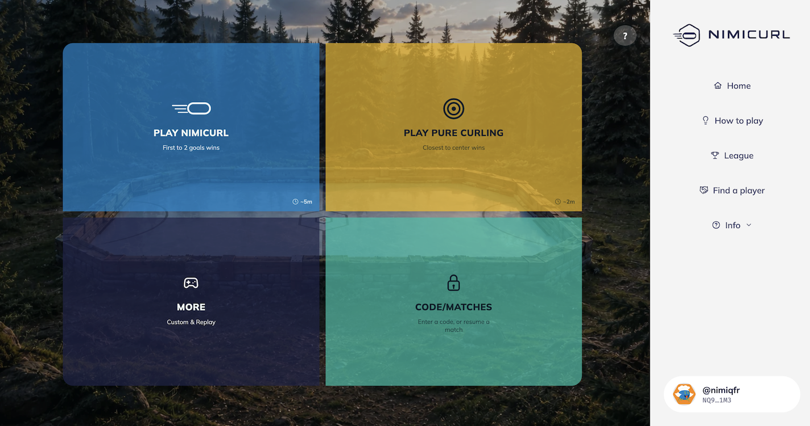

# Nimicurl

> Play with Anyone. Anytime. Anywhere.

| Field | Value |
| --- | --- |
| Category | Games |
| Pricing | Free |
| Team name | _Not provided — optional_ |
| Team members | _Not provided — optional_ |
| X account | NimiqF |
| Heard about it via | Nimiq Community |
| Contact email | nimiqfr@gmail.com |
| GitHub login | @Danyx11 |
| Submitted at | 2026-09-17T22:37:58.803Z |

## Links

| Link | URL |
| --- | --- |
| Repo | [https://github.com/Danyx11/NIM-Ball](<https://github.com/Danyx11/NIM-Ball>) |
| Demo | [https://www.nimicurl.com](<https://www.nimicurl.com>) |
| Video | [https://youtu.be/BtchrFu_mMg](<https://youtu.be/BtchrFu_mMg>) |
| Skool post | [https://www.skool.com/miniappscompetition/from-an-idea-to-nimicurl](<https://www.skool.com/miniappscompetition/from-an-idea-to-nimicurl>) |
| Social post | [https://x.com/NimiqF/status/2100710793813647394?s=20](<https://x.com/NimiqF/status/2100710793813647394?s=20>) |

## Description

NimiCurl is a fun, accessible multiplayer game inspired by curling, built to play with friends or anyone, anytime, anywhere. Invite someone to play, share a code, take your shot — and turn every match into an opportunity to bring new people into the Nimiq ecosystem.

## Builder story

At first, I simply wanted to recreate a feeling I loved from classic physics-based games: intuitive mechanics, three stones per team, and the simple goal of aiming, pushing, blocking and scoring in your opponent’s goal.

Then I started thinking: what if this kind of simple, instantly playable game could also be a way to bring people into the Nimiq ecosystem?

No crypto tutorial. No technical explanation. Just something fun that makes you want to play — and then come back.

There was just one problem: I’m not a developer.

So I got a Claude subscription, invested a lot of time and patience, threw in my best ideas, and started building.

Step by step, through countless iterations, bugs, fixes and experiments, NimiCurl was born.

It started as a simple idea to recreate a familiar game feeling. It became an attempt to build a small, accessible gateway into Nimiq — something you can discover through a friend, play with anyone, and hopefully keep coming back to.

## Thumbnail

## Screenshots

---

_Generated from the submission form. `submission.yaml` in this folder is the machine-readable source of truth._
