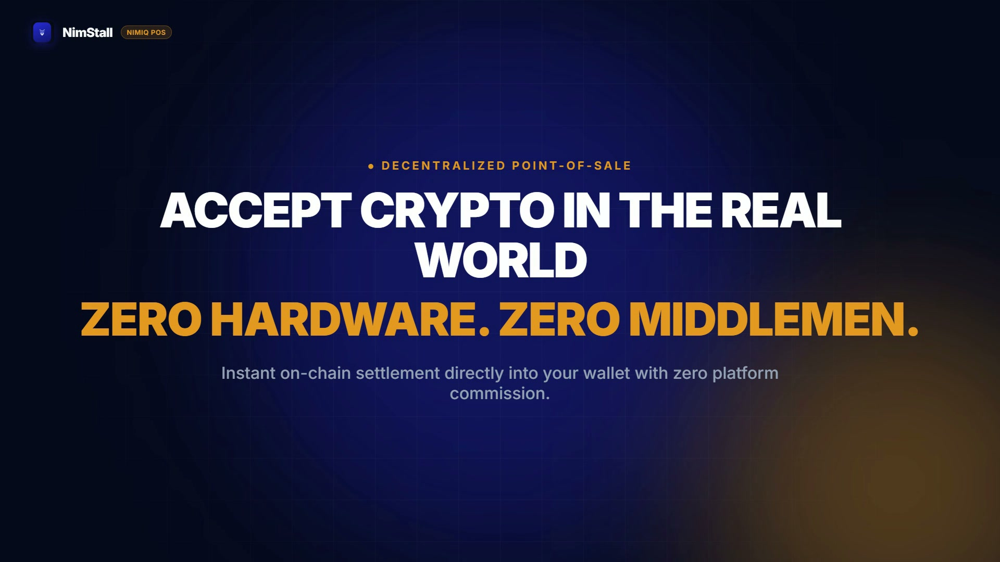
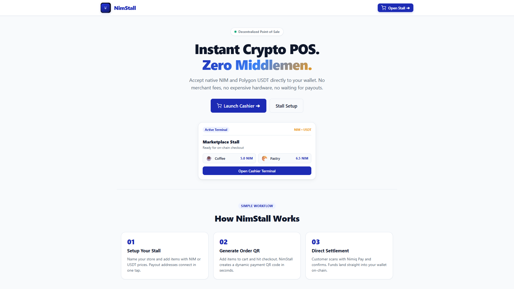
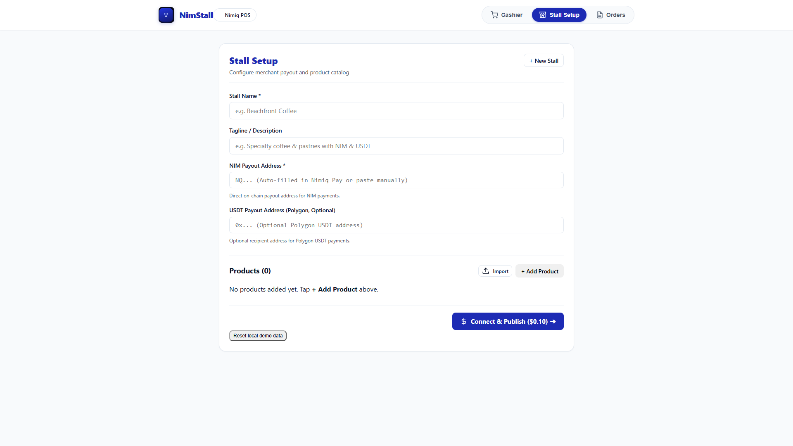
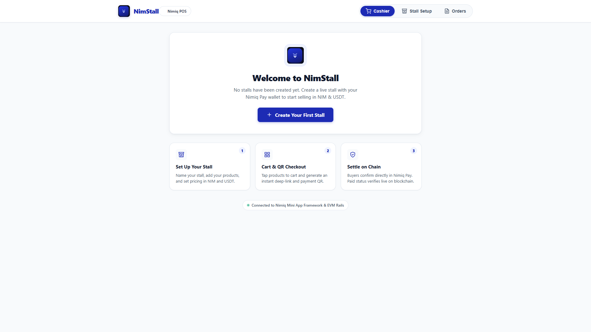
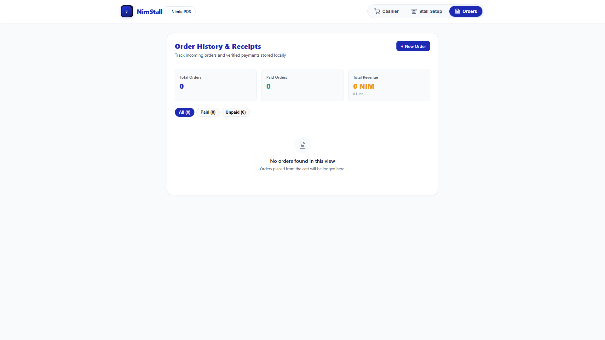
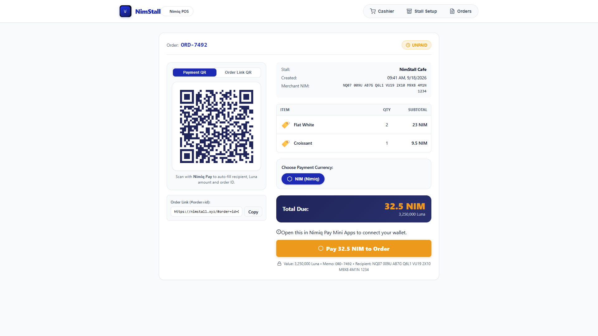

# NimStall

> Decentralized Point-of-Sale for Nimiq Pay with zero hardware and instant settlement

| Field | Value |
| --- | --- |
| Category | Marketplaces |
| Pricing | Free |
| Team name | _Not provided — optional_ |
| Team members | _Not provided — optional_ |
| X account | Datweb3guy |
| Heard about it via | X |
| Contact email | princeabel2000@gmail.com |
| GitHub login | @Datwebguy |
| Submitted at | 2026-09-18T20:00:12.290Z |

## Links

| Link | URL |
| --- | --- |
| Repo | [https://github.com/Datwebguy/nimstall](<https://github.com/Datwebguy/nimstall>) |
| Demo | [https://nimstall.xyz](<https://nimstall.xyz>) |
| Video | [https://youtu.be/YVF4h_CO4aY](<https://youtu.be/YVF4h_CO4aY>) |
| Skool post | _Not provided — optional_ |
| Social post | [https://x.com/Datweb3guy/status/2101008056259649547](<https://x.com/Datweb3guy/status/2101008056259649547>) |

## Description

NimStall turns any smartphone, tablet, or browser into an instant crypto cash register for retail merchants. It enables zero-fee, non-custodial checkout using native NIM and Polygon USDT with live on-chain consensus verification.

## Builder story

The problem:

Small physical sellers, market vendors, pop up stalls, indie cafes, face an unfair dilemma with retail payments. Traditional card terminals:

Require expensive hardware leases
Lock merchants into monthly subscription fees
Take 3 to 5% off every small sale
Hold funds for days

Most existing crypto checkout tools don't help either. They're built for online webshops or force sellers into complex, custodial account systems.

The solution:

I built NimStall to solve this for the real world.

By leveraging Nimiq Pay, any smartphone, tablet, or browser tab becomes a functional cash register in 60 seconds, with zero upfront hardware costs and 0% platform commission.

The app:

Connects directly to the merchant's Nimiq wallet
Lets staff build carts on a touch optimized grid
Generates dynamic QR codes that carry order payloads straight to customer phones, with no intermediary cloud servers needed

What I'm most proud of:

The verification mechanism. The terminal never relies on client side assumptions. It embeds the order reference directly into the on chain transaction data payload and polls Nimiq network consensus to verify block inclusion before confirming the sale and issuing a digital receipt.

## Thumbnail

## Screenshots

---

_Generated from the submission form. `submission.yaml` in this folder is the machine-readable source of truth._
