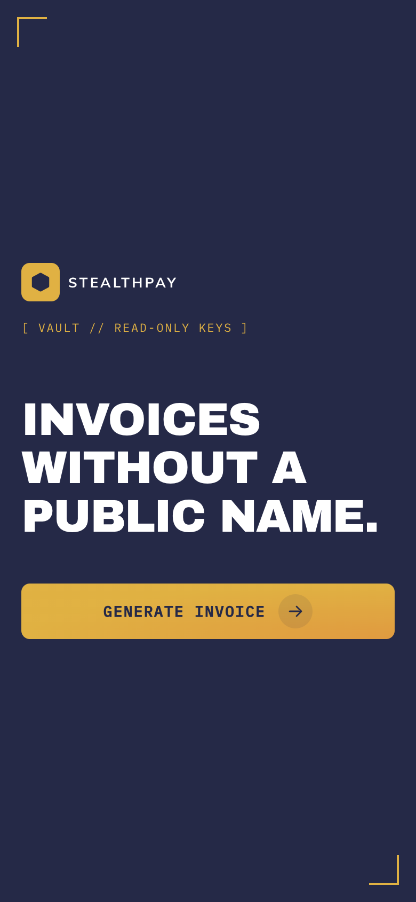
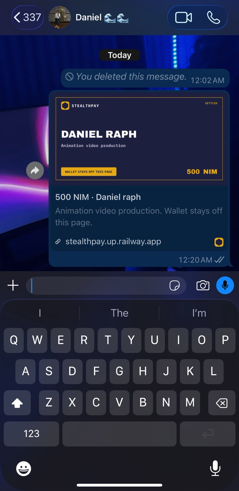
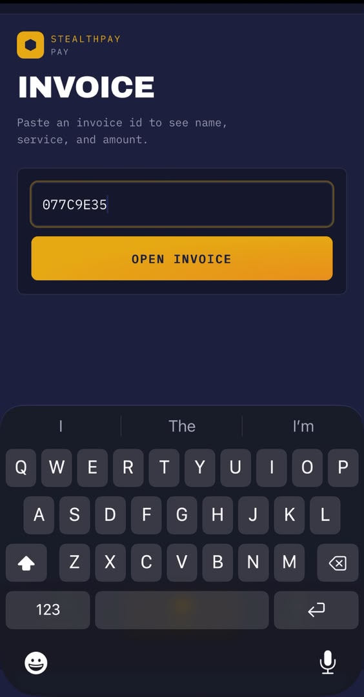
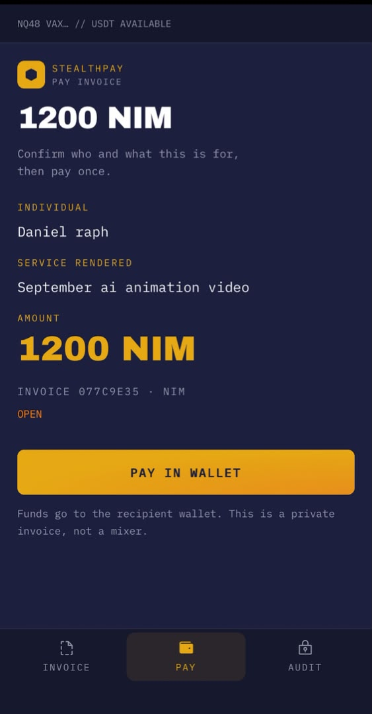
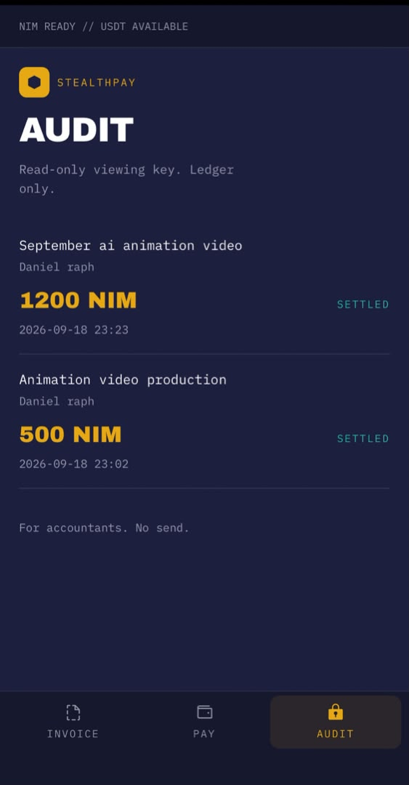

# StealthPay

> Invoices without a public name.

| Field | Value |
| --- | --- |
| Category | On-chain services |
| Pricing | Free |
| Team name | axisops-tech |
| Team members | _Not provided — optional_ |
| X account | StealthPay_nim |
| Heard about it via | I have been using Nimiq for a couple of months and kept seeing the ads in the app. A friend and I decided to enter. We shipped two mini apps: Payrun and StealthPay. |
| Contact email | pd3072894@gmail.com |
| GitHub login | @David-patrick-chuks-02 |
| Submitted at | 2026-09-18T23:53:24.688Z |

## Links

| Link | URL |
| --- | --- |
| Repo | [https://github.com/David-patrick-chuks-02/stealthpay](<https://github.com/David-patrick-chuks-02/stealthpay>) |
| Demo | [https://youtube.com/shorts/sN3oCPNiwl4](<https://youtube.com/shorts/sN3oCPNiwl4>) |
| Video | [https://youtube.com/shorts/sN3oCPNiwl4](<https://youtube.com/shorts/sN3oCPNiwl4>) |
| Skool post | _Not provided — optional_ |
| Social post | _Not provided — optional_ |

## Description

Private invoices for contractors. The client sees the name, the work, and the amount — not your wallet. Not a mixer.

## Builder story

I needed to invoice without putting a receiving wallet on a public page. Most “private pay” tools oversell anonymity. StealthPay is the opposite: the client sees who you are, the work, and the amount. The wallet stays off the invoice. Settlement is a normal NIM transfer. Private invoices, not a mixer.

## Thumbnail

## Screenshots

---

_Generated from the submission form. `submission.yaml` in this folder is the machine-readable source of truth._
