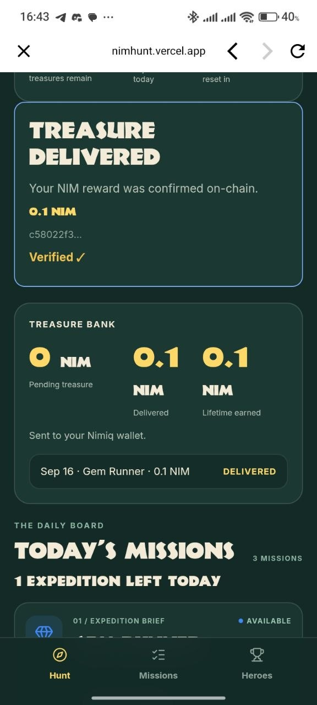
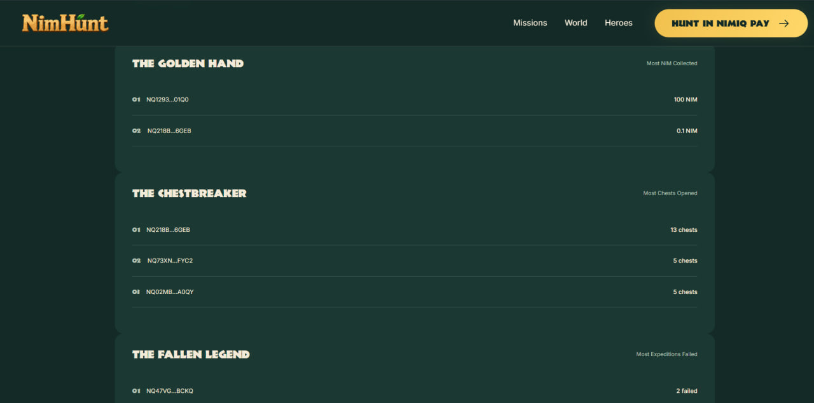
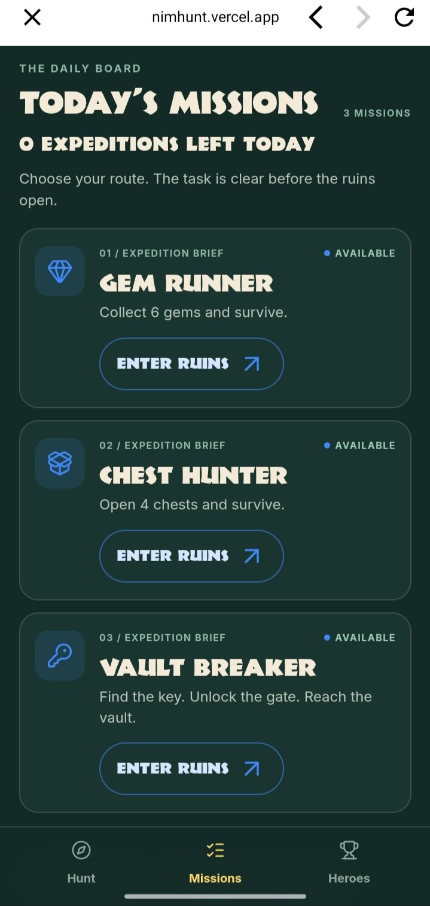
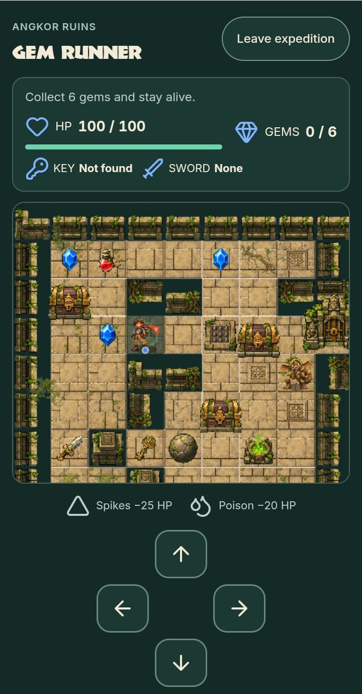
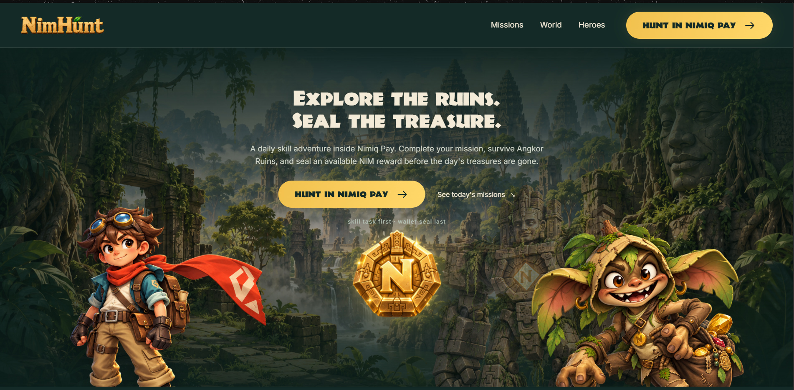

# NimHunt

> Explore. Survive. Seal.

| Field | Value |
| --- | --- |
| Category | Games |
| Pricing | Free |
| Team name | _Not provided — optional_ |
| Team members | _Not provided — optional_ |
| X account | devendyyy |
| Heard about it via | X |
| Contact email | devendurance@gmail.com |
| GitHub login | @Devendurance |
| Submitted at | 2026-09-18T22:43:50.297Z |

## Links

| Link | URL |
| --- | --- |
| Repo | [https://github.com/Devendurance/nimhunt](<https://github.com/Devendurance/nimhunt>) |
| Demo | [https://nimhunt.vercel.app](<https://nimhunt.vercel.app>) |
| Video | [https://x.com/devendyyy/status/2101074865834914180?s=20](<https://x.com/devendyyy/status/2101074865834914180?s=20>) |
| Skool post | _Not provided — optional_ |
| Social post | [https://docs.google.com/document/d/1YiHs_NtlcUUEig8HLFW2vnUw4YMnIREw6cPL2-APbCg/edit?usp=sharing](<https://docs.google.com/document/d/1YiHs_NtlcUUEig8HLFW2vnUw4YMnIREw6cPL2-APbCg/edit?usp=sharing>) |

## Description

NimHunt is a daily skill-based treasure adventure inside Nimiq Pay for casual players and Nimiq users. Choose one of three missions, explore Angkor Ruins, solve puzzles and survive hazards; successful runs are server-verified before your wallet can seal an available NIM reward.

## Builder story

Most wallets are transactional, you open them to send, receive, swap or check a balance, then leave. I wanted to test the opposite idea: could Nimiq Pay become somewhere people return to because it is fun?

That became NimHunt. Players get three daily expeditions, choose a visible skill mission, explore Angkor Ruins, solve puzzles and survive hazards. Nimiq is not bolted on: the wallet authorizes the expedition, the server independently replays the actions instead of trusting the browser, and another wallet signature seals an eligible NIM reward. Treasure Bank records secured and delivered rewards, while daily missions, streaks and the Hall of Heroes give players reasons to return.

I built it for existing Nimiq users, casual players and people who might enjoy the game before they ever need to think about the blockchain underneath it.

## Thumbnail

## Screenshots

---

_Generated from the submission form. `submission.yaml` in this folder is the machine-readable source of truth._
