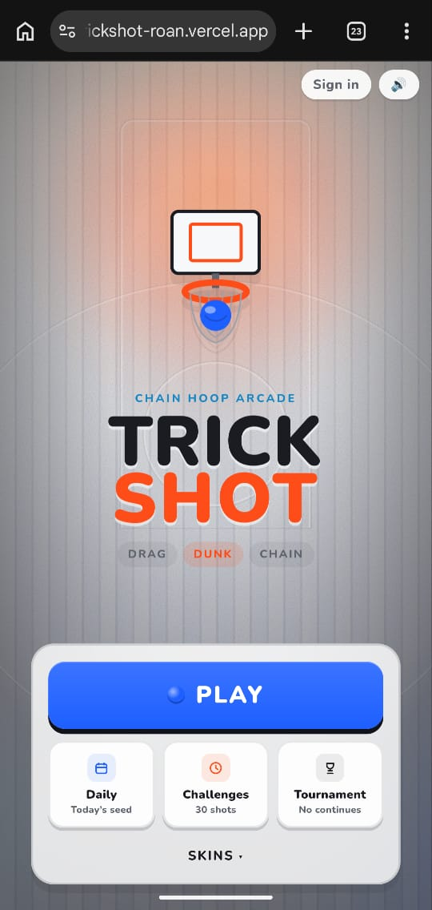
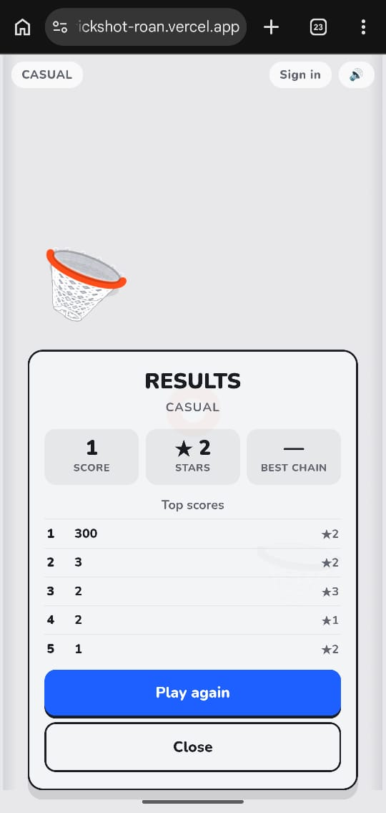
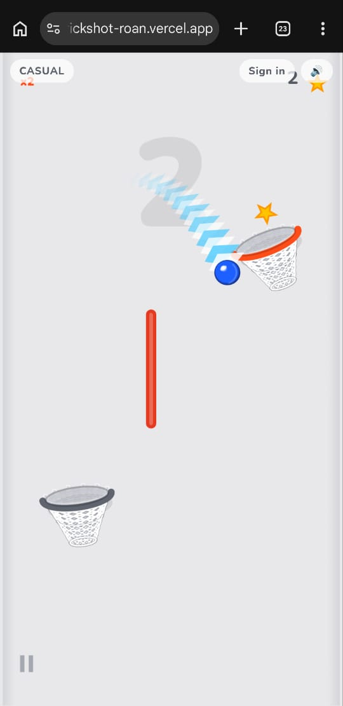
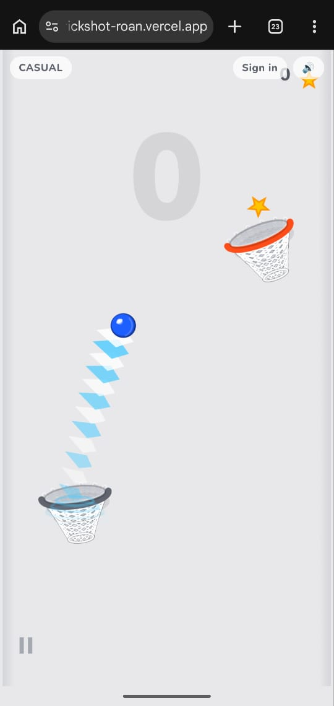
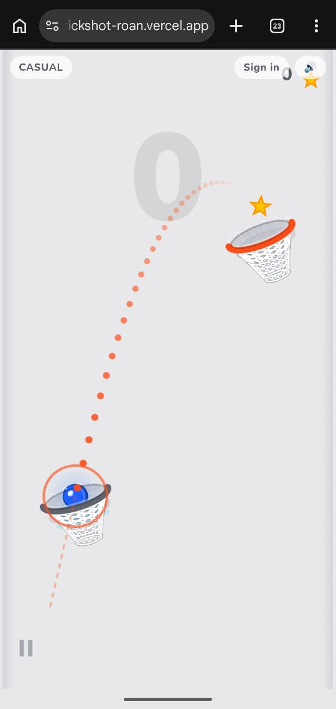

# Trickshot

> Drag, Dunk, Chain

| Field | Value |
| --- | --- |
| Category | Games |
| Pricing | Freemium |
| Team name | _Not provided — optional_ |
| Team members | _Not provided — optional_ |
| X account | _Not provided — optional_ |
| Heard about it via | _Not provided — optional_ |
| Contact email | isaacedoka02@gmail.com |
| GitHub login | @DokaIzk |
| Submitted at | 2026-09-18T14:06:20.741Z |

## Links

| Link | URL |
| --- | --- |
| Repo | [https://github.com/yinkscss/trickshot](<https://github.com/yinkscss/trickshot>) |
| Demo | [https://trickshot-roan.vercel.app/](<https://trickshot-roan.vercel.app/>) |
| Video | [https://www.loom.com/share/623775152f7b49a796f95f3eb639293c](<https://www.loom.com/share/623775152f7b49a796f95f3eb639293c>) |
| Skool post | _Not provided — optional_ |
| Social post | _Not provided — optional_ |

## Description

A precision chain-hoop arcade game on Celo — drag, release, chain the dunks. Monetized via powerups, pay-to-continue, season pass, and a 15% tournament rake. It is for everyone

## Builder story

_Not provided — optional_

## Thumbnail

## Screenshots

---

_Generated from the submission form. `submission.yaml` in this folder is the machine-readable source of truth._
