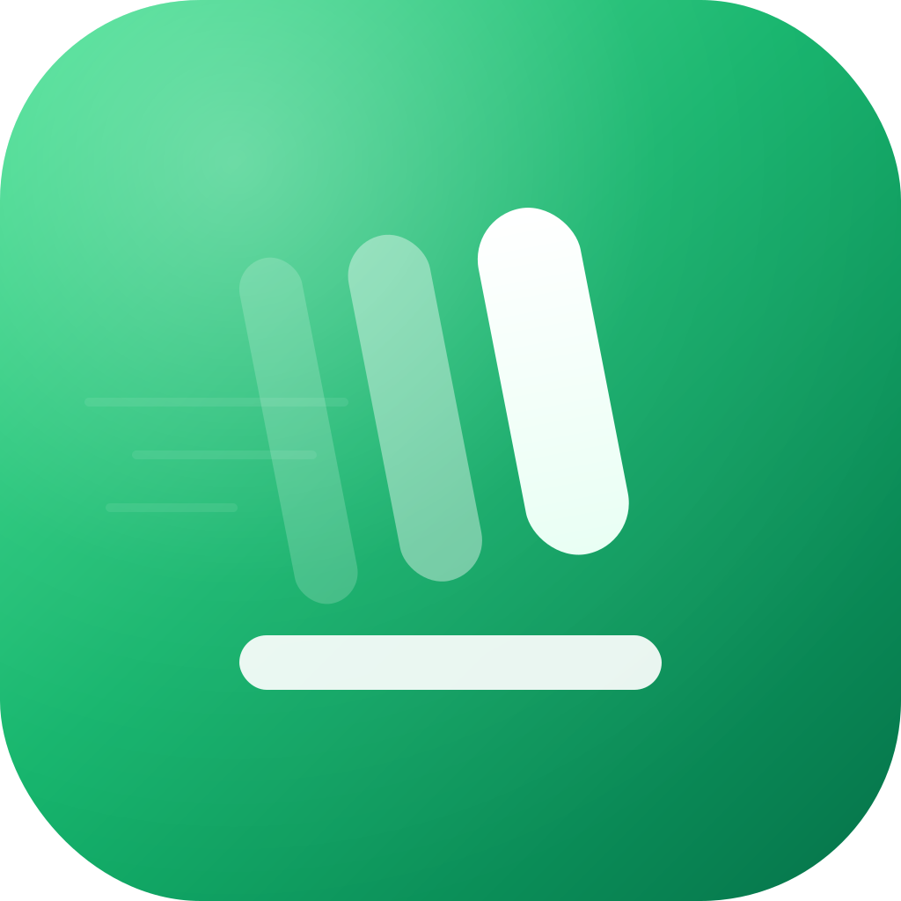
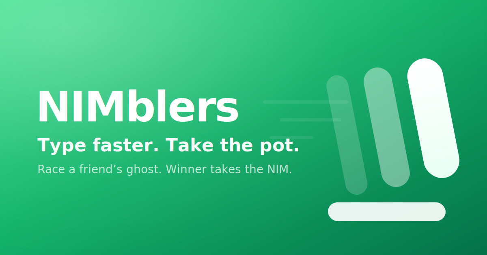
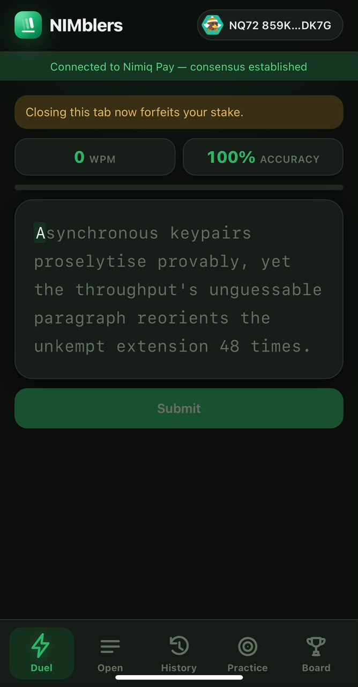
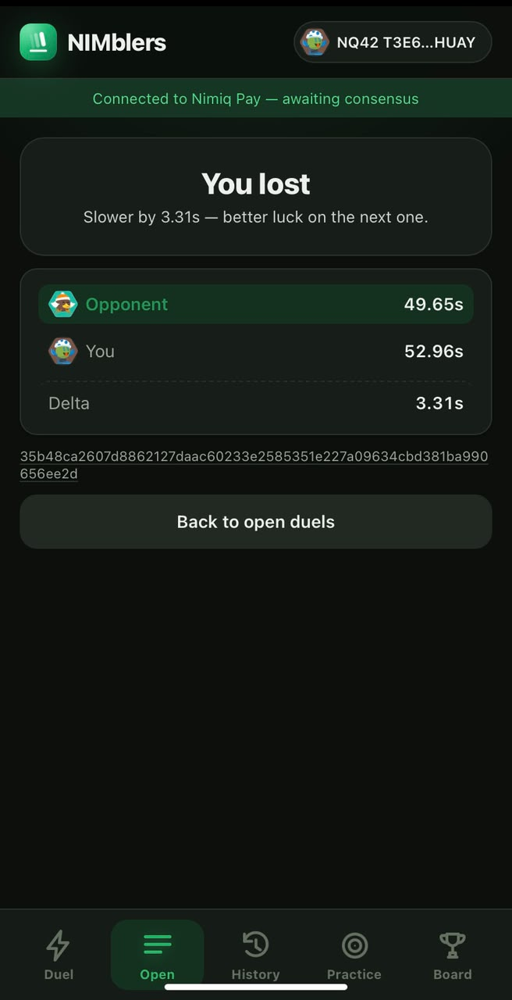
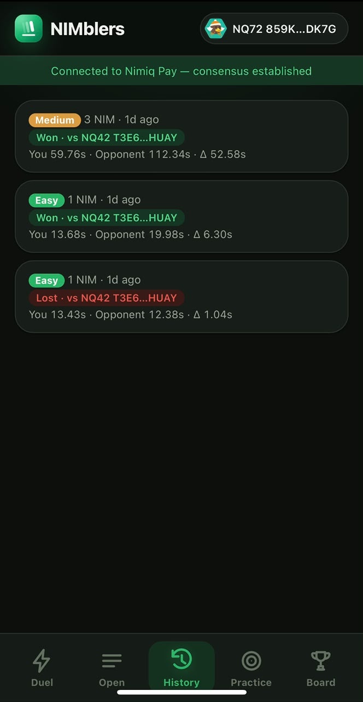
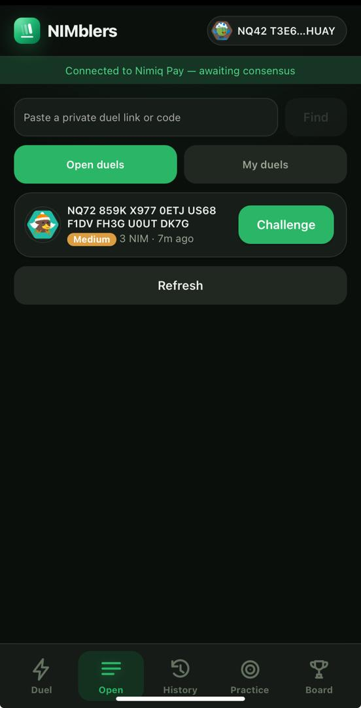

# NIMblers

> NIMblers — Type faster. Take the pot. Race a friend's ghost. Winner takes the NIM.

| Field | Value |
| --- | --- |
| Category | Games |
| Pricing | Free |
| Team name | Catalyst |
| Team members | _Not provided — optional_ |
| X account | catalyst_coders |
| Heard about it via | X |
| Contact email | etimpaul22@gmail.com |
| GitHub login | @ETIM-PAUL |
| Submitted at | 2026-09-18T22:11:50.203Z |

## Links

| Link | URL |
| --- | --- |
| Repo | [https://github.com/ETIM-PAUL/NIMblers](<https://github.com/ETIM-PAUL/NIMblers>) |
| Demo | [https://nimblers.onrender.com/](<https://nimblers.onrender.com/>) |
| Video | [https://www.youtube.com/watch?v=cZqKLp7ge8M](<https://www.youtube.com/watch?v=cZqKLp7ge8M>) |
| Skool post | [https://www.skool.com/miniappscompetition/nimble-a-1v1-speed-typing-duel-game](<https://www.skool.com/miniappscompetition/nimble-a-1v1-speed-typing-duel-game>) |
| Social post | [https://x.com/catalyst_coders/status/2100022311252312494](<https://x.com/catalyst_coders/status/2100022311252312494>) |

## Description

NIMblers is a Nimiq Pay Mini App where two players stake real NIM and race to type a paragraph — fastest wins the pot. Built for Nimiq Pay users who want a quick, real-stakes typing duel with friends or strangers.

## Builder story

Growing up, I used to play a typing game on my father's laptop, it was structured level by level, each one harder than the last, and the top level felt impossible at first. I kept coming back to it though, and after months and months of playing, I finally cleared the highest level. That's when the game changed for me, it stopped being about beating the levels and became about beating my own best time. There was this specific thrill in finishing before the timer ran out, and I'd stumble on words I'd never seen before and remember them just from typing them out. It stuck with me because it wasn't really about typing. It was focus, in a way nothing else at that age gave me.

That's the itch behind NIMblers. Most "focus" and "productivity" tools tell you to focus but give you nothing to actually engage with, no stakes, no opponent, no reason to stay locked in. NIMblers solves that by turning focus into a game: you're racing a real person, timing's server-verified so no one can fake it, and there's a small NIM stake to make it matter. It's the same thrill that pulled me in as a kid, grinding through levels, then chasing my own best time, just sharper now, with a real opponent and something on the line.

There is a practice mode, to practice before dipping your hands into the real duel. There are public (You can start or join as a challenger and each created duels is open to the public) and private duels (private duels is just a challenge between two friends on who types faster and is more focused with a stake involved).

Stake. Type. Win.

## Thumbnail

## Screenshots

---

_Generated from the submission form. `submission.yaml` in this folder is the machine-readable source of truth._
