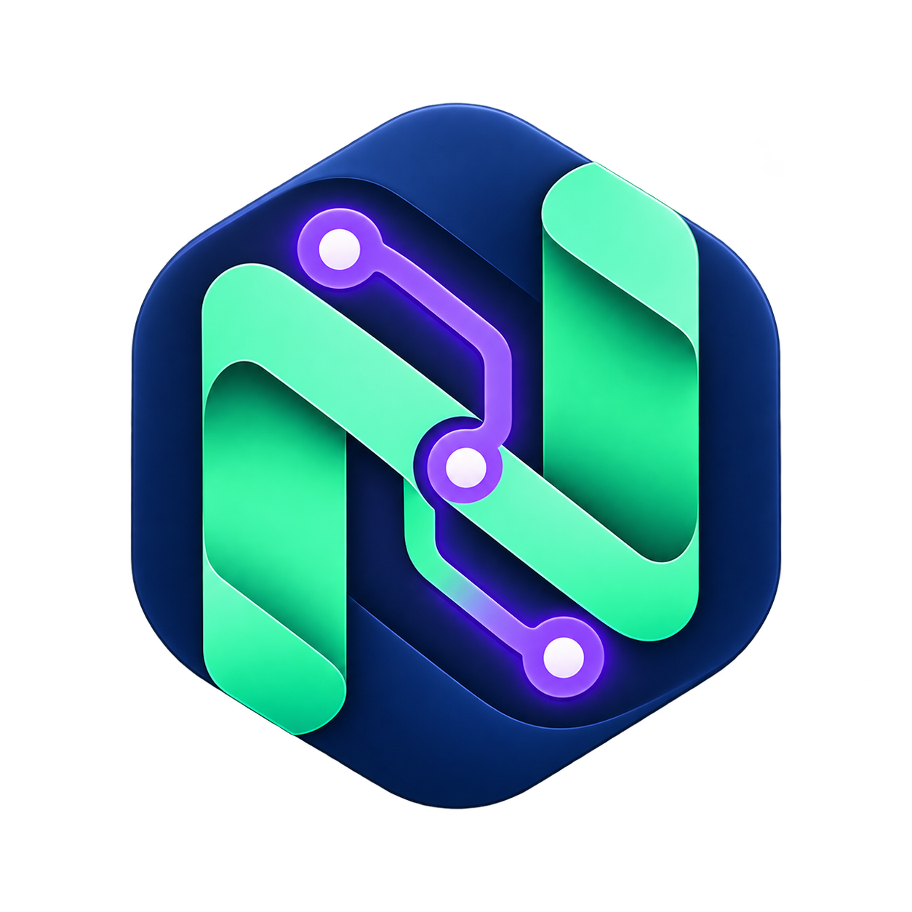
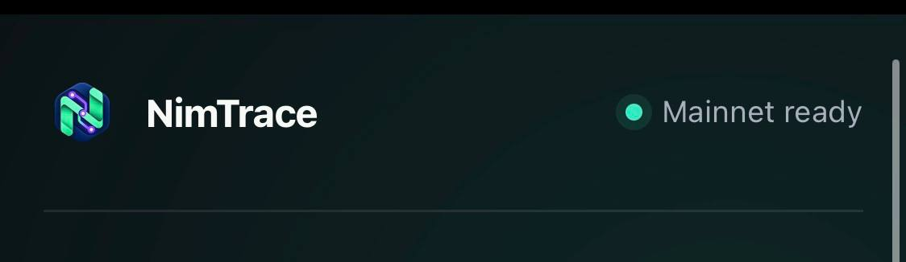
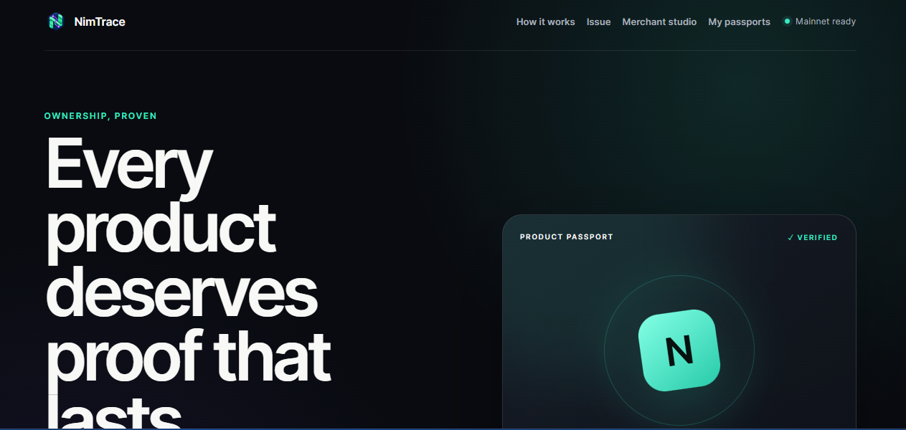
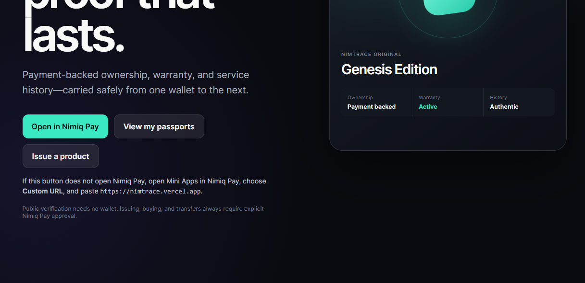
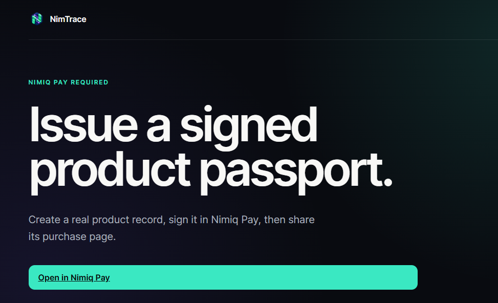
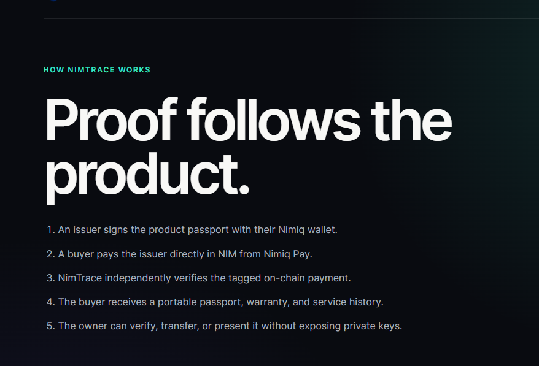
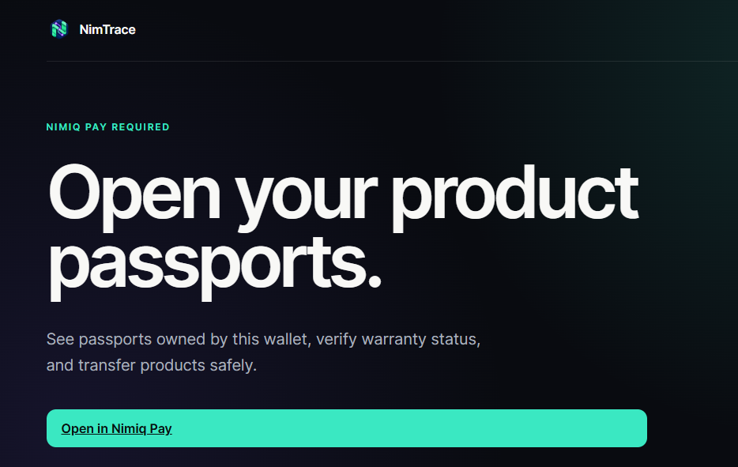

# NimTrace

> Payment-backed, transferable product ownership and warranty passports inside Nimiq Pay.

| Field | Value |
| --- | --- |
| Category | On-chain services |
| Pricing | Free |
| Team name | TechNova |
| Team members | Abdulmuiz Ademola Abdulkabir |
| X account | dems_thepenlord |
| Heard about it via | X |
| Contact email | abdulmuizademola9@gmail.com |
| GitHub login | @EcstaceeLOR |
| Submitted at | 2026-09-17T11:02:05.837Z |

## Links

| Link | URL |
| --- | --- |
| Repo | [https://github.com/EcstaceeLOR/NimTrace](<https://github.com/EcstaceeLOR/NimTrace>) |
| Demo | [https://nimtrace.vercel.app](<https://nimtrace.vercel.app>) |
| Video | [https://youtu.be/DstBuoHRK4Q?si=XVMLuf0p3HmvcUnr](<https://youtu.be/DstBuoHRK4Q?si=XVMLuf0p3HmvcUnr>) |
| Skool post | [https://www.skool.com/miniappscompetition/nimtrace?p=9c27ba8e](<https://www.skool.com/miniappscompetition/nimtrace?p=9c27ba8e>) |
| Social post | [https://x.com/dems_thepenlord/status/2100415439918526691?s=46](<https://x.com/dems_thepenlord/status/2100415439918526691?s=46>) |

## Description

NimTrace is a Nimiq Pay Mini App that turns a NIM purchase into a transferable, wallet-owned product and warranty passport.

## Builder story

I was motivated to build NimTrace because I believe every product deserves a proof that is verifiable, a proof that outlives the product itself.

## Thumbnail

## Screenshots

---

_Generated from the submission form. `submission.yaml` in this folder is the machine-readable source of truth._
