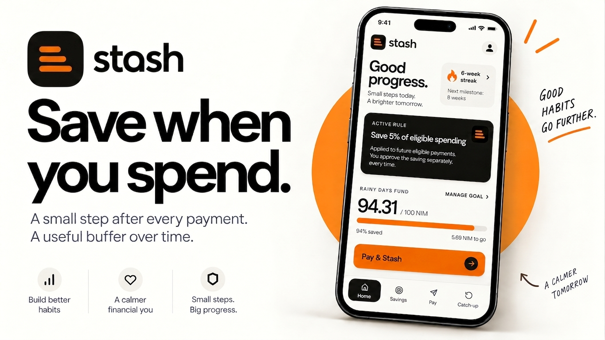
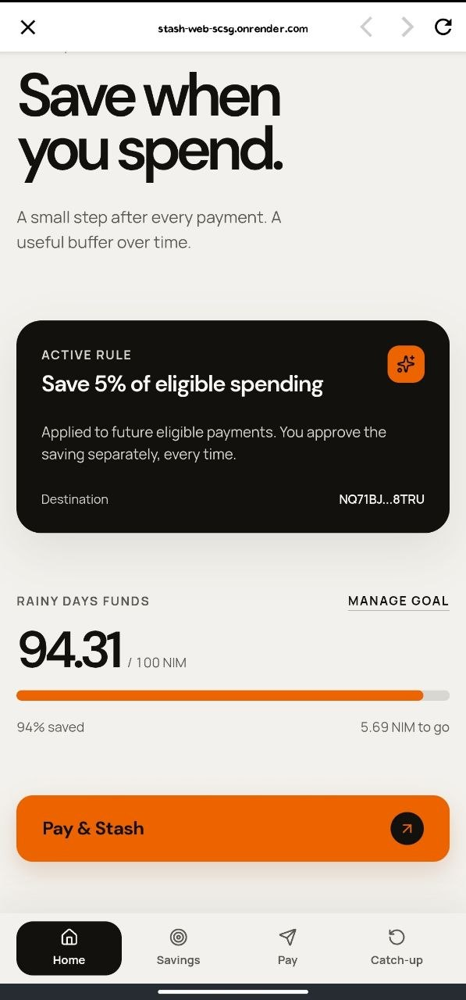
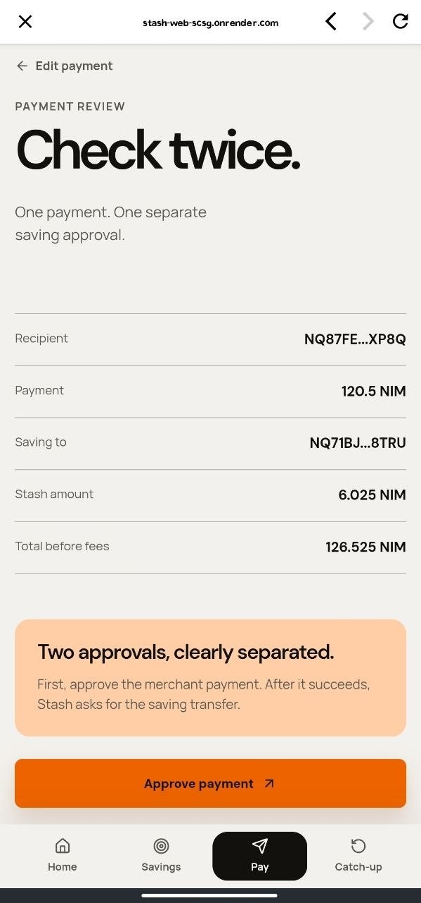
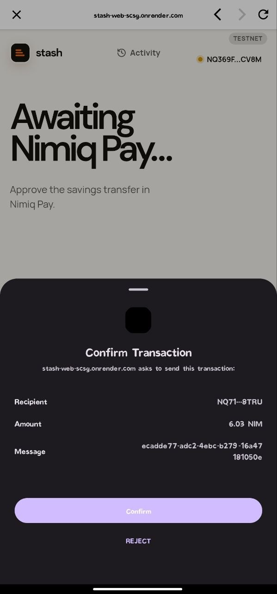
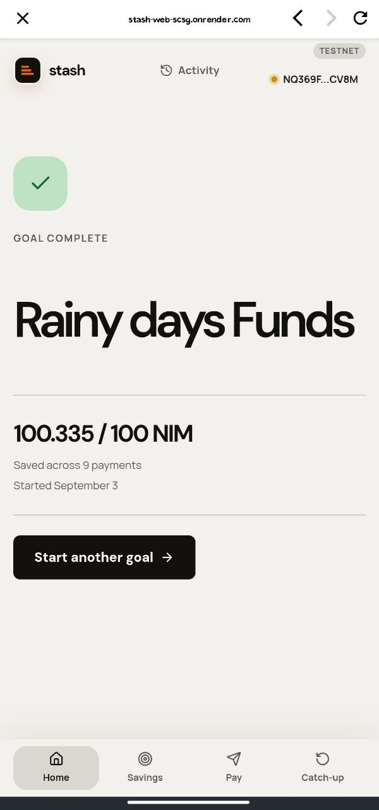
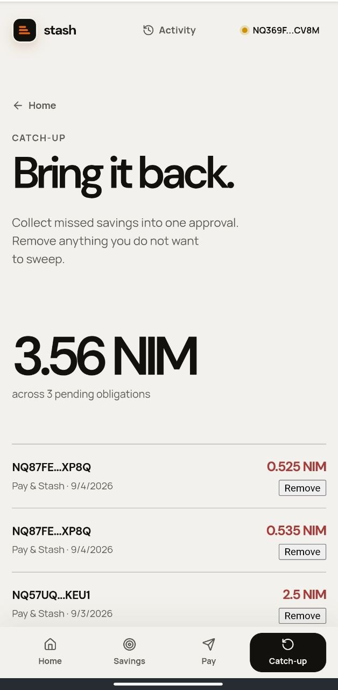

# Stash

> Save when you spend. Catch up when you miss.

| Field | Value |
| --- | --- |
| Category | Lifestyle |
| Pricing | Free |
| Team name | _Not provided — optional_ |
| Team members | _Not provided — optional_ |
| X account | Ceo_TheWebDev |
| Heard about it via | Through X |
| Contact email | ceothedev18@gmail.com |
| GitHub login | @Emmanuel-webDev |
| Submitted at | 2026-09-08T14:19:50.963Z |

## Links

| Link | URL |
| --- | --- |
| Repo | [https://github.com/Emmanuel-webDev/Pay-Stash-Nimiq-](<https://github.com/Emmanuel-webDev/Pay-Stash-Nimiq->) |
| Demo | [https://stash-web-scsg.onrender.com/](<https://stash-web-scsg.onrender.com/>) |
| Video | [https://youtube.com/shorts/lWMIXxbfHWE?feature=share](<https://youtube.com/shorts/lWMIXxbfHWE?feature=share>) |
| Skool post | _Not provided — optional_ |
| Social post | [https://x.com/Ceo_TheWebDev/status/2096916241638158485?s=20](<https://x.com/Ceo_TheWebDev/status/2096916241638158485?s=20>) |

## Description

Stash helps Nimiq users build a consistent savings habit by linking saving to everyday payments. Users create a savings goal and rule, then Pay & Stash guides them through paying someone and moving a small amount into a savings address they control. If they skip the savings step.

## Builder story

Stash was inspired by a simple problem: people often want to save, but saving is easy to postpone.

I wanted to make saving happen closer to the moment money is already moving. Instead of asking users to remember to transfer funds later, Stash connects saving to everyday NIM payments. You choose a goal and a rule, then Pay & Stash guides you through paying someone and saving a small amount in the same flow.

The second inspiration was what happens when people miss a saving opportunity. Most habit tools simply break the streak or leave the user feeling like they failed. Stash uses **Catch-up** instead. If the savings step is skipped, the amount is remembered and can be cleared later.

That led to the core idea:

**Save when you spend. Catch up when you miss.**

I also wanted Stash to feel motivating without becoming a game about spending more, so streaks, milestones, and rewards are tied to **saving consistency**, not purchase volume.

The result is a non-custodial Nimiq Pay Mini App built around one goal: make saving a repeatable habit instead of something users have to remember to do.

## Thumbnail

## Screenshots

---

_Generated from the submission form. `submission.yaml` in this folder is the machine-readable source of truth._
