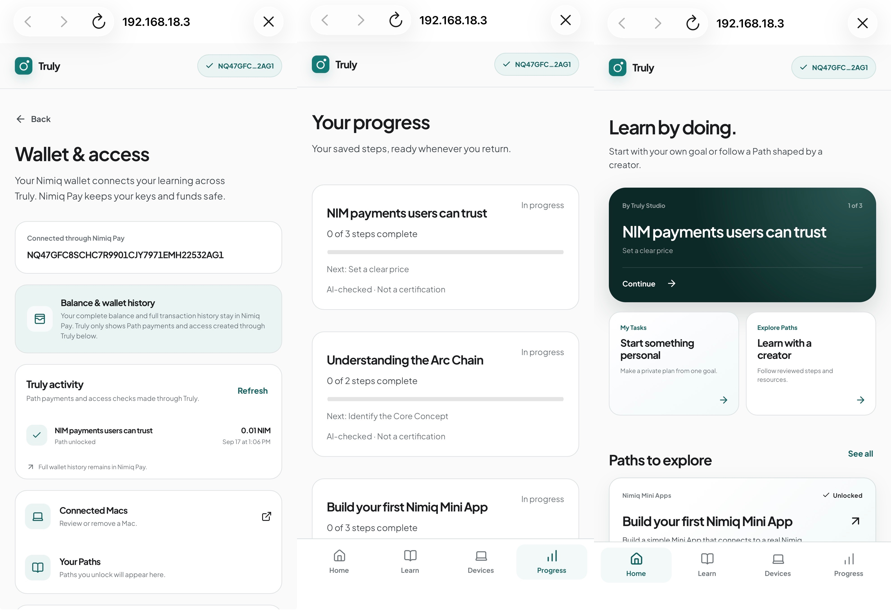
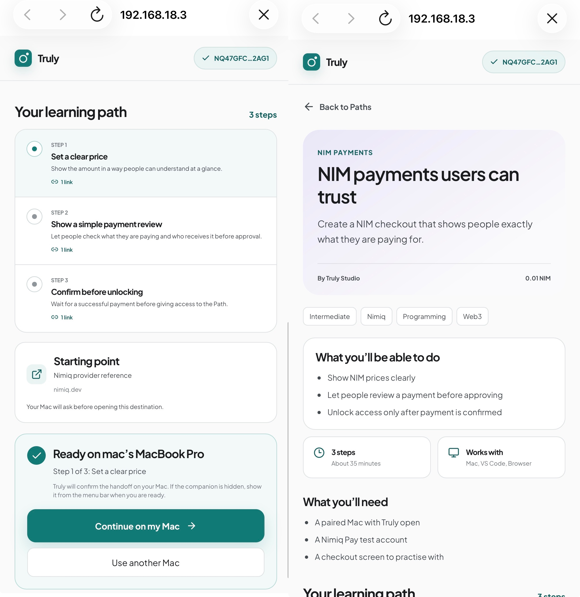
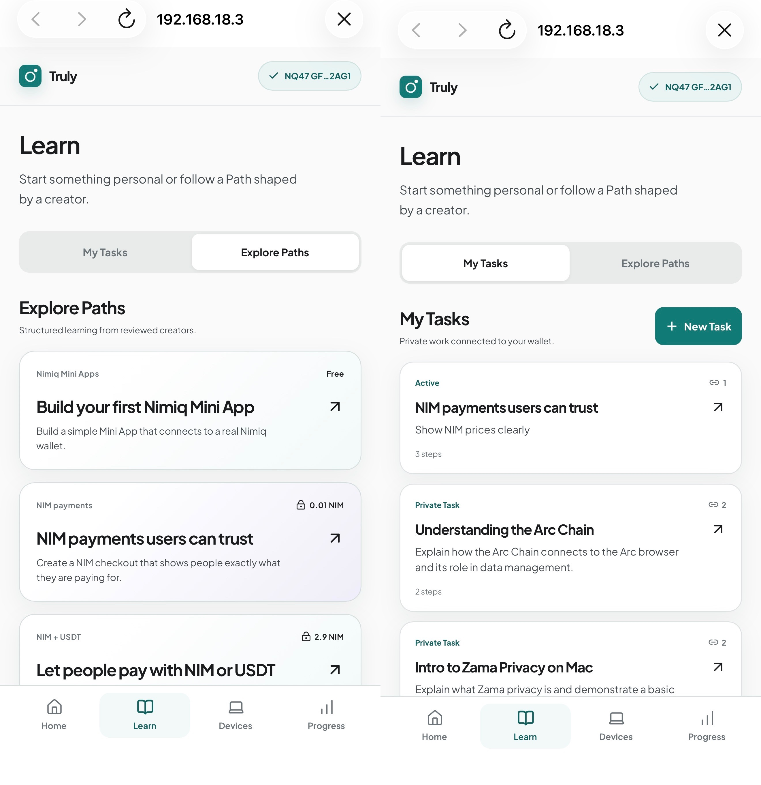
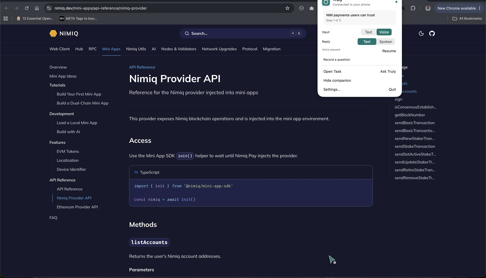

# Truly

> Learn anything. By doing it.

| Field | Value |
| --- | --- |
| Category | Education |
| Pricing | Freemium |
| Team name | Truly |
| Team members | _Not provided — optional_ |
| X account | https://x.com/DefiPreacherr |
| Heard about it via | X |
| Contact email | Bossfemzy10@gmail.com |
| GitHub login | @Femtech-web |
| Submitted at | 2026-09-18T19:48:13.000Z |

## Links

| Link | URL |
| --- | --- |
| Repo | [https://github.com/Femtech-web/Truly](<https://github.com/Femtech-web/Truly>) |
| Demo | [https://app.usetruly.site](<https://app.usetruly.site>) |
| Video | [https://youtu.be/ZSqqTbh_GzY](<https://youtu.be/ZSqqTbh_GzY>) |
| Skool post | _Not provided — optional_ |
| Social post | [https://x.com/DefiPreacherr/status/2100592392038502655?s=20](<https://x.com/DefiPreacherr/status/2100592392038502655?s=20>) |

## Description

Truly is a Nimiq Mini App paired with a native macOS AI learning companion. Learners start a private goal or choose a reviewed creator Path inside Nimiq Pay, send it to a wallet-authorized Mac, and learn beside the browser, editor, or app where the real work happens. Truly can an

## Builder story

Truly began with a frustration I kept seeing in learning products: the lesson ends exactly where the real work begins. An explanation lives in one tab, the editor or application lives in another, and the learner is left to reconnect the two alone.

I built Truly as two connected surfaces. The Nimiq Mini App owns identity, Tasks, creator Paths, payments, devices and progress. A native macOS companion stays beside the work, answers text or voice questions about a deliberately shared screen, and checks a visible result only when the learner asks it to. Teaching and completion are deliberately separate.

Nimiq became more than checkout. Purpose-bound wallet signatures authorize the learner, creator, reviewer and paired Mac; NIM lets creators sell reviewed learning Paths without Truly taking custody; and progress follows the wallet owner across devices. Building and physically testing the complete flow also surfaced concrete SDK feedback, which is documented openly in the repository for the Nimiq Pay team.

## Thumbnail

## Screenshots

---

_Generated from the submission form. `submission.yaml` in this folder is the machine-readable source of truth._
