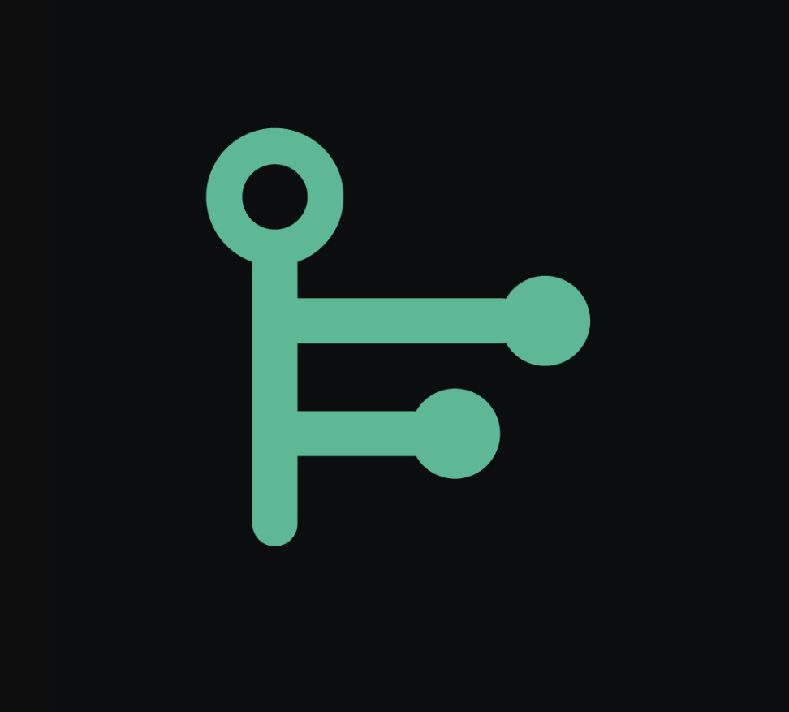
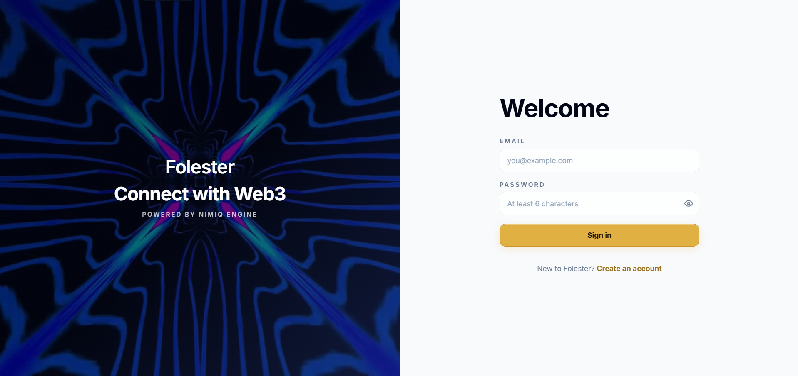
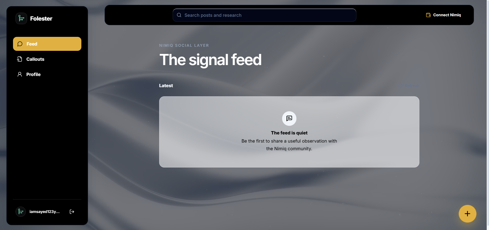
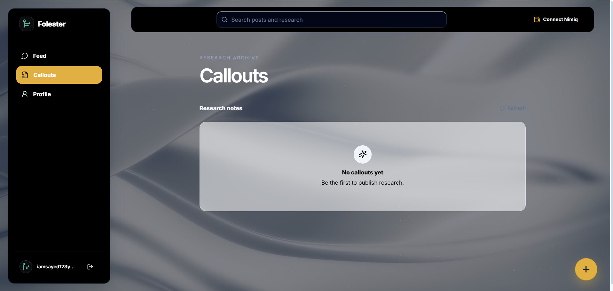
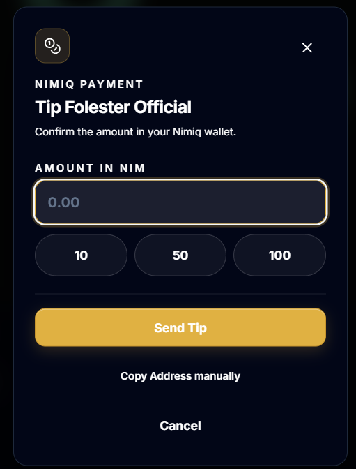
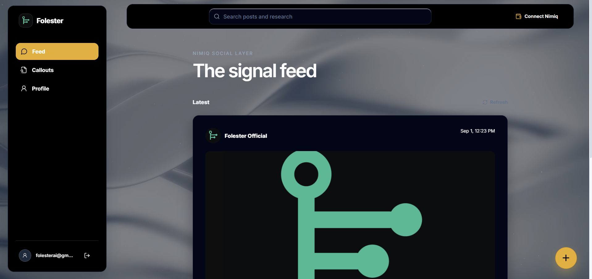

# Folester

> Social Media for Web3 on Mimiq

| Field | Value |
| --- | --- |
| Category | Social |
| Pricing | Free |
| Team name | _Not provided — optional_ |
| Team members | _Not provided — optional_ |
| X account | FlockGGs |
| Contact email | iamsayed123y@gmail.com |
| GitHub login | @FlockGG |
| Submitted at | 2026-09-01T09:23:09.001Z |

## Links

| Link | URL |
| --- | --- |
| Repo | [https://github.com/FlockGG/FolesterApp](<https://github.com/FlockGG/FolesterApp>) |
| Demo | [https://folester.xyz](<https://folester.xyz>) |
| Video | [https://youtu.be/TAfwtRhZhRU?si=oLln1kgtoOlx6D2t](<https://youtu.be/TAfwtRhZhRU?si=oLln1kgtoOlx6D2t>) |

## Description

Folester is a Web3 social platform built for the Nimiq ecosystem. It allows users to share market research, post updates, and instantly reward creators with direct crypto tips.

## Builder story

For a long time, my life has revolved around building things on a screen. I started coding just trying to figure out how things work, spending late nights at my desk learning as much as I could. Eventually, I stumbled into the crypto space. I was amazed by the technology and the community, but as I spent more time reading and exploring, I started to feel really frustrated with how messy it all was.

I would spend hours scrolling through social feeds trying to find actual good information, but my timeline was always flooded with noise. One night, I was reading a really brilliant piece of market research written by a small creator. They had clearly spent hours putting it together, but they were giving it away for free, and there was no easy way for me to just send them a small thank you.

That specific moment stuck with me. It made me realize that the current system is broken. We did not need just another social network. We needed a place that respects good content and actually rewards the people who put in the hard work to make it.

When the Nimiq competition came up, I knew this was my chance to solve the problem that had been bothering me. I decided to build Folester. I put everything else on pause and poured all my time into it. I wanted to build a space that felt calm, quiet, and professional, unlike the loud and cluttered apps we use every day.

It was an exhausting journey. There were days I felt completely stuck, especially when I was trying to make sure the tipping feature worked flawlessly for everyone. But remembering that initial feeling of wanting to help creators get paid kept me going. Seeing Folester live today is an amazing feeling. It is a real reflection of my journey as a developer and my belief that good work should always be rewarded.

## Thumbnail

## Screenshots

---

_Generated from the submission form. `submission.yaml` in this folder is the machine-readable source of truth._
