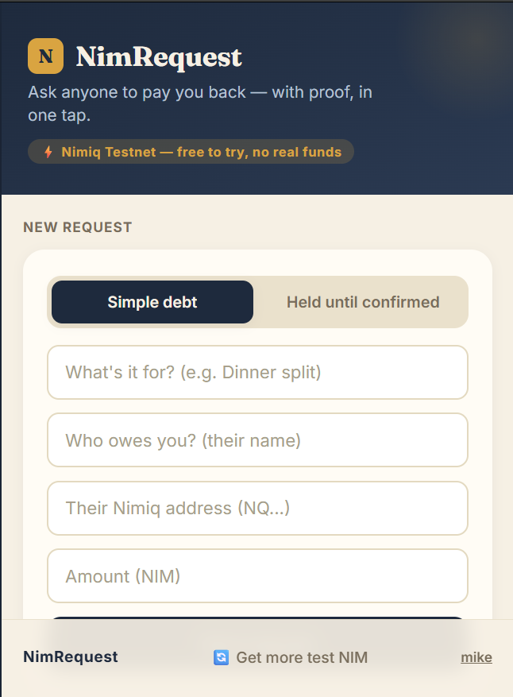
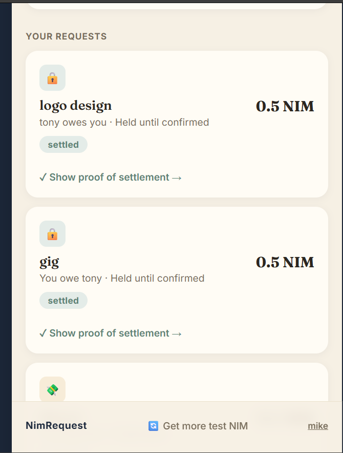
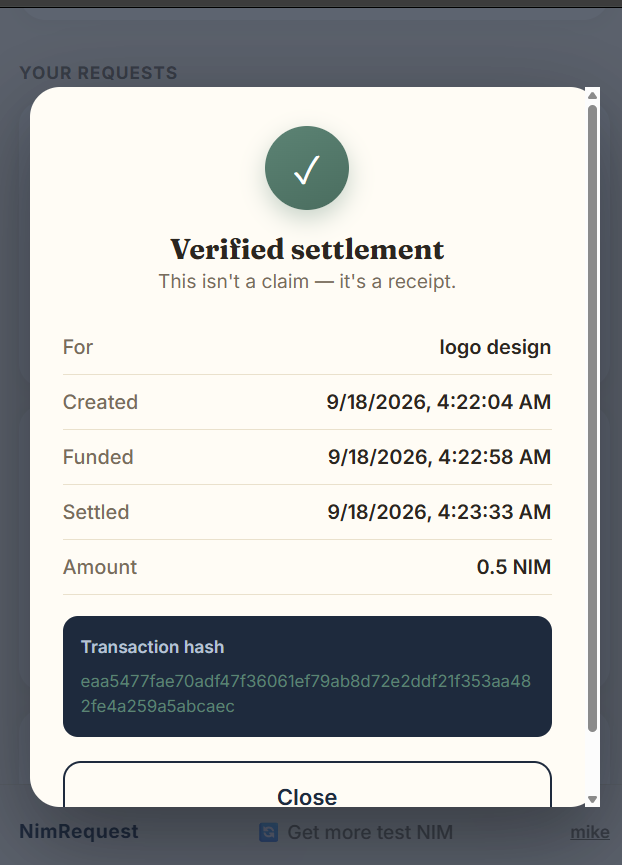
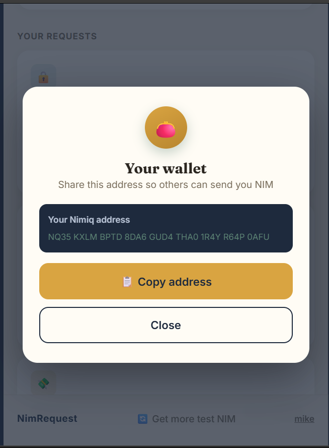

# nimrequest

> Ask anyone to pay you back  with proof, in one tap.

| Field | Value |
| --- | --- |
| Category | Productivity |
| Pricing | Free |
| Team name | _Not provided — optional_ |
| Team members | _Not provided — optional_ |
| X account | investormikeo2 |
| Heard about it via | x twitter |
| Contact email | seunoiye@gmail.com |
| GitHub login | @GODGRACE07 |
| Submitted at | 2026-09-18T20:42:41.819Z |

## Links

| Link | URL |
| --- | --- |
| Repo | [https://github.com/GODGRACE07/nimrequest](<https://github.com/GODGRACE07/nimrequest>) |
| Demo | [https://nimrequest.vercel.app](<https://nimrequest.vercel.app>) |
| Video | [https://youtu.be/94oYRILlCms](<https://youtu.be/94oYRILlCms>) |
| Skool post | _Not provided — optional_ |
| Social post | [https://x.com/investormikeo2/status/2100957248444862520?s=20](<https://x.com/investormikeo2/status/2100957248444862520?s=20>) |

## Description

NimRequest lets you request payment from anyone a friend, a client, anyone and get paid back with real proof it happened. Two modes: Simple Debt settles instantly, direct from the payer's own wallet. Held Until Confirmed puts payment in escrow until both sides agree the job's

## Builder story

I built NimRequest after noticing something simple but real: bill-splitting apps tell you who owes what, but nobody actually follows through, because asking a friend for money feels awkward — and freelancers face the same problem in reverse, doing work and just hoping they get paid. I wanted something that didn't just log a debt, but structurally solved it: either make the ask effortless, or hold the money until both sides genuinely agree it's earned. Every part of it  the escrow logic, the automatic payout, the proof-of-settlement view  is real and tested on Nimiq's testnet with actual on-chain transactions.

## Thumbnail

## Screenshots

---

_Generated from the submission form. `submission.yaml` in this folder is the machine-readable source of truth._
