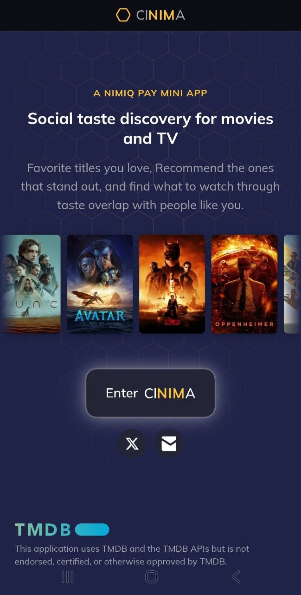
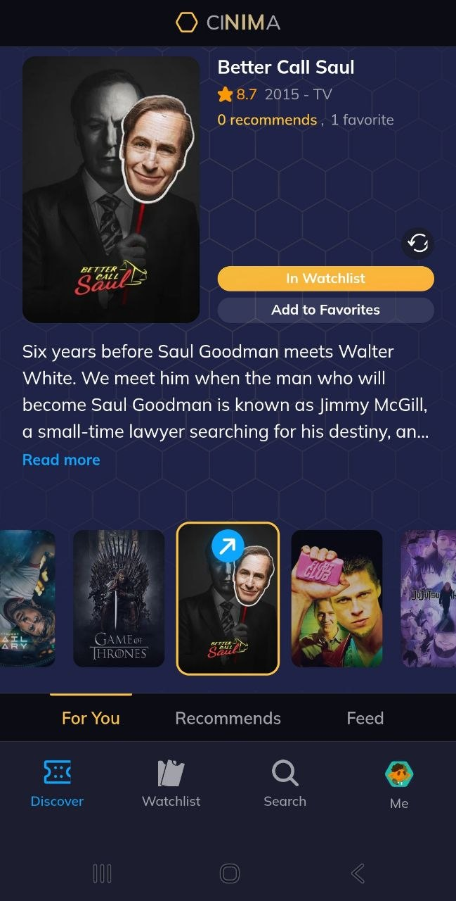
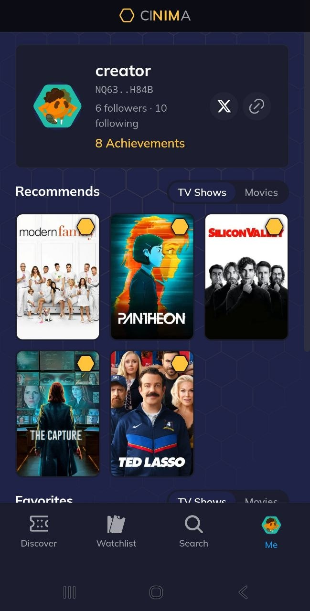
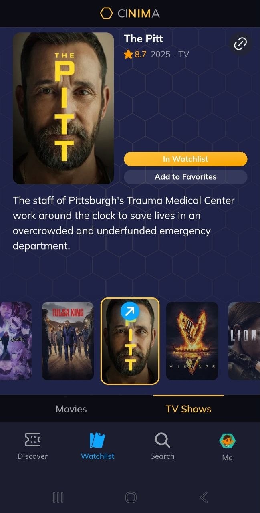
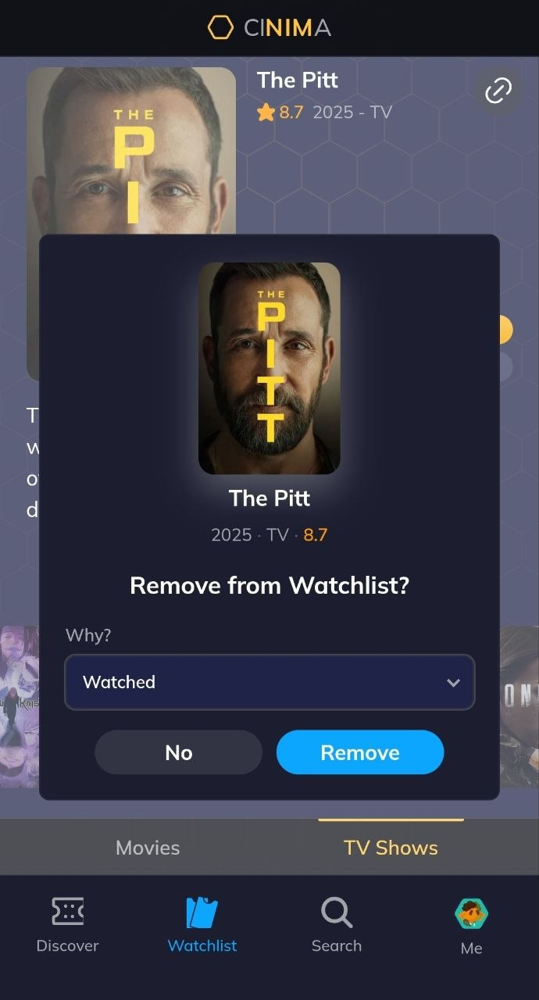

# Cinima

> CINIMA is social taste discovery for movies and TV.

| Field | Value |
| --- | --- |
| Category | Games |
| Pricing | Free |
| Team name | _Not provided — optional_ |
| Team members | _Not provided — optional_ |
| X account | cinima_app |
| Heard about it via | Community Member :) |
| Contact email | cinima.app@gmail.com |
| GitHub login | @Harlski |
| Submitted at | 2026-09-12T12:37:14.194Z |

## Links

| Link | URL |
| --- | --- |
| Repo | [https://github.com/harlski/cinima](<https://github.com/harlski/cinima>) |
| Demo | [https://cinima.app](<https://cinima.app>) |
| Video | [https://www.youtube.com/watch?v=NTltmhMOg88](<https://www.youtube.com/watch?v=NTltmhMOg88>) |
| Skool post | [https://www.skool.com/miniappscompetition/explore-cinimaapp](<https://www.skool.com/miniappscompetition/explore-cinimaapp>) |
| Social post | [https://x.com/cinima_app/status/2098750348886495543](<https://x.com/cinima_app/status/2098750348886495543>) |

## Description

Favorite what you love. Recommend what stands out. See what people like you picked. Save what you want to watch next.

## Builder story

I keep recommending a show to a friend, and five minutes later they have already forgotten the name. 

I do the same thing to myself. I finally have an evening free, sit down, and cannot remember a single title I had been meaning to watch. 

Bonding over a series is one of the easiest ways I know to build connection with people. Who else still quotes The Simpsons daily?

I wanted that habit inside Nimiq Pay, in two parts.

The first is a disposable share link. 
You send someone a title. They open it in a browser. No pressure to install Nimiq Pay. 
Try one: https://cinima.app/s/e0jmxk14

The second is the Mini App itself. 

Favorite what you love. 
Recommend what stands out. 
Save what you want to watch next. 
Find titles through taste overlap with people like you. 

This is the part I built for myself. Finding a night to actually watch something is hard enough. When that night comes, the queue should already be there.

## Thumbnail

## Screenshots

---

_Generated from the submission form. `submission.yaml` in this folder is the machine-readable source of truth._
