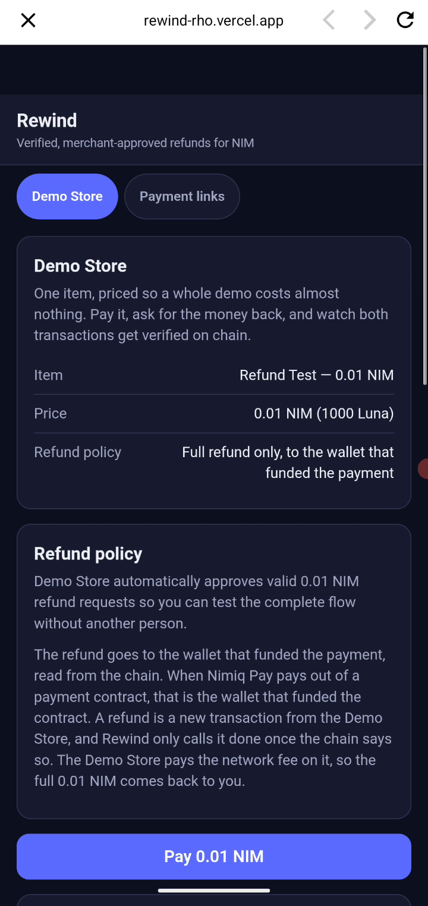
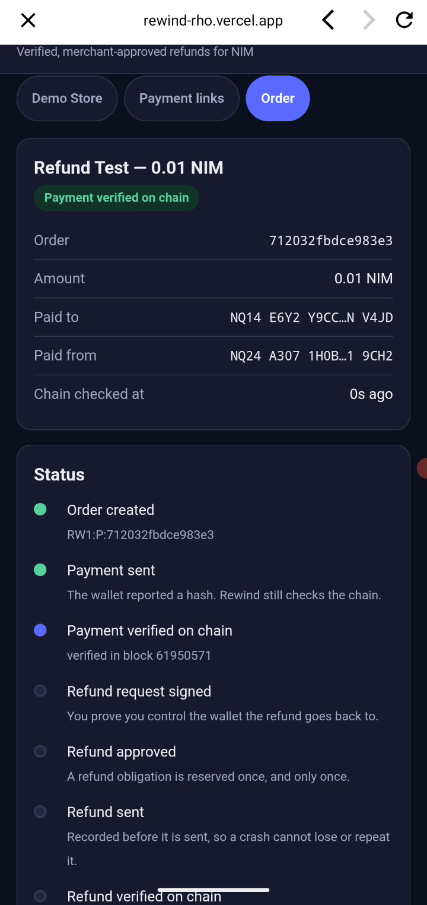
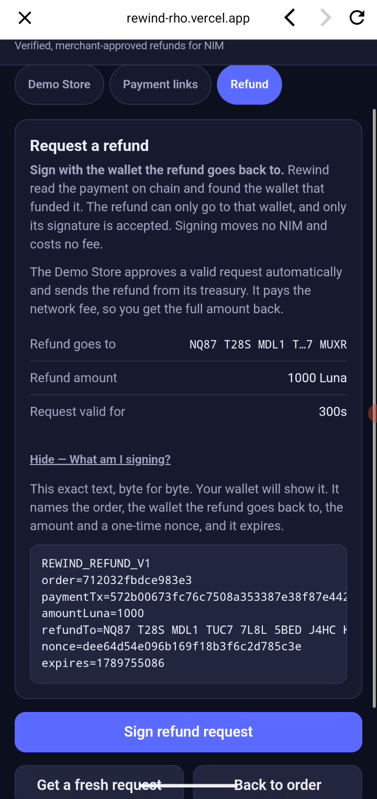
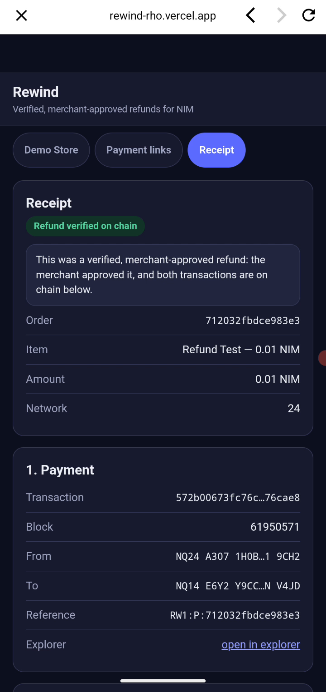
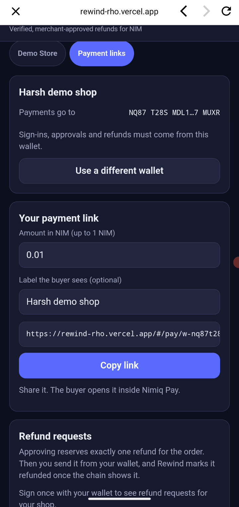

# Rewind

> Post-purchase for NIM commerce: refunds requested, approved and verified inside Nimiq Pay.

| Field | Value |
| --- | --- |
| Category | On-chain services |
| Pricing | Free |
| Team name | _Not provided — optional_ |
| Team members | _Not provided — optional_ |
| X account | hyadav42774 |
| Heard about it via | chatgpt |
| Contact email | harsh.2024a@vitstudent.ac.in |
| GitHub login | @Harshyadav442277 |
| Submitted at | 2026-09-18T20:36:06.255Z |

## Links

| Link | URL |
| --- | --- |
| Repo | [https://github.com/Harshyadav442277/rewind](<https://github.com/Harshyadav442277/rewind>) |
| Demo | [https://rewind-rho.vercel.app](<https://rewind-rho.vercel.app>) |
| Video | [https://www.youtube.com/shorts/od5swdRH7PY](<https://www.youtube.com/shorts/od5swdRH7PY>) |
| Skool post | [https://www.skool.com/miniappscompetition/rewind-refund-a-nim-payment-safely-inside-nimiq-pay-try-it-in-a-minute-for-001-nim-2](<https://www.skool.com/miniappscompetition/rewind-refund-a-nim-payment-safely-inside-nimiq-pay-try-it-in-a-minute-for-001-nim-2>) |
| Social post | [https://x.com/hyadav42774/status/2099882589402312812](<https://x.com/hyadav42774/status/2099882589402312812>) |

## Description

For shops that sell for NIM, and their buyers. Only the wallet that paid can request a refund, with one signature. The merchant approves and sends it from their own wallet, no custody, and Rewind verifies both transactions on chain on one receipt. Try the full loop for 0.01 NIM.

## Builder story

Paying with NIM is easy; giving money back is not. Today a crypto refund is a second payment to an address someone pasted into an email, with nothing proving that address belongs to the buyer. Rewind makes the refund part of the payment. Every payment carries an order reference; the server reads it on chain, and a refund can only be requested by signing a one-time message in Nimiq Pay with the wallet that funded the payment. The refund is a new transaction that Rewind also verifies on chain and links to the payment on one receipt.

Building it on mainnet taught me how Nimiq Pay actually pays: out of an HTLC contract that your wallet funds, signed by your wallet. My first refund to that contract failed on chain, so Rewind now reads the payment's account type and sends the refund to the wallet behind the contract, even after the contract has closed.

Try the Demo Store alone for 0.01 NIM, or register a shop with one signature and share a payment link. The code is MIT, and README-DEV lists the mainnet transactions behind each claim.

## Thumbnail

## Screenshots

---

_Generated from the submission form. `submission.yaml` in this folder is the machine-readable source of truth._
