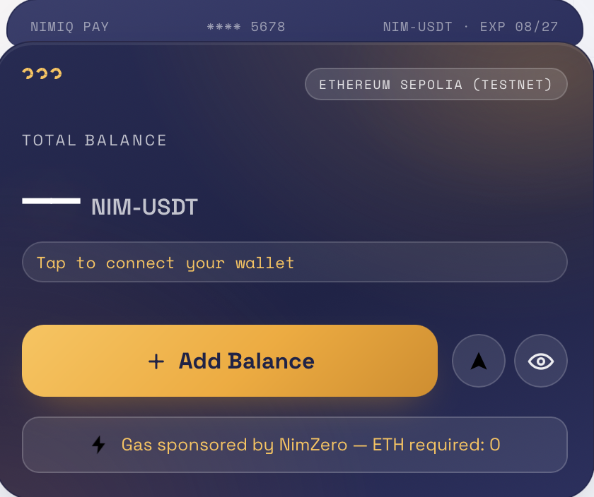
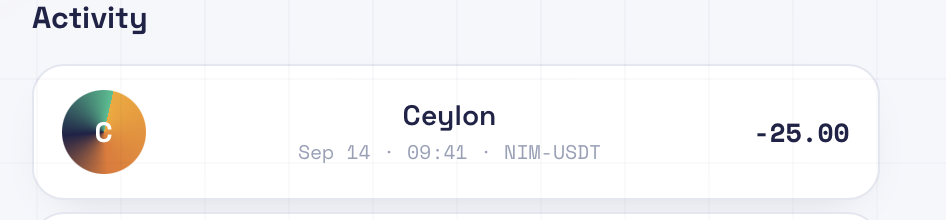
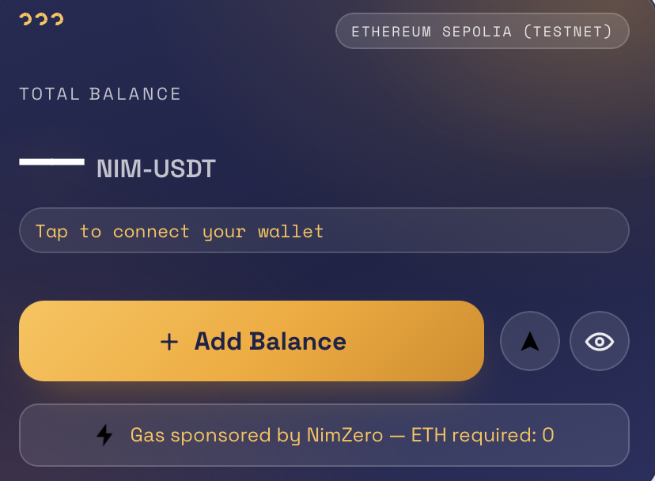
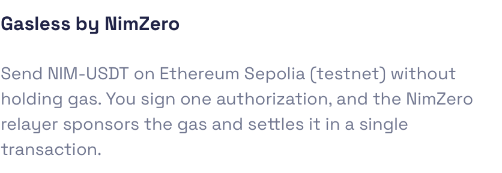
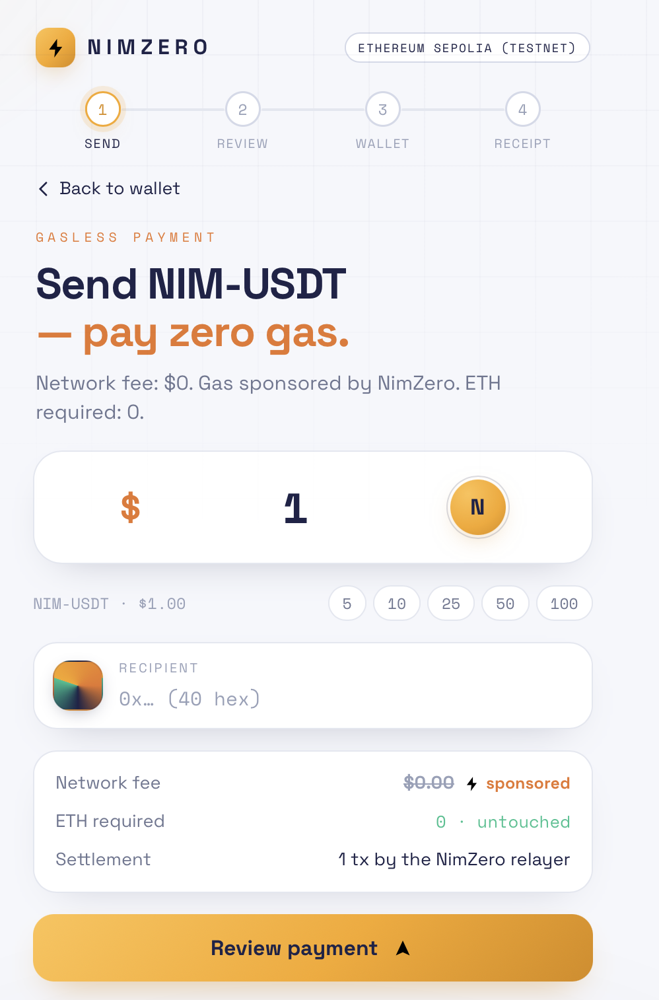

# NimZero

> Pay USDT on Polygon without POL.

| Field | Value |
| --- | --- |
| Category | On-chain services |
| Pricing | Free |
| Team name | Caelum |
| Team members | _Not provided — optional_ |
| X account | maisonlarii |
| Heard about it via | _Not provided — optional_ |
| Contact email | ikhaishillary@gmail.com |
| GitHub login | @HillaryIkhais |
| Submitted at | 2026-09-18T23:58:36.753Z |

## Links

| Link | URL |
| --- | --- |
| Repo | [https://github.com/HillaryIkhais/NimZero](<https://github.com/HillaryIkhais/NimZero>) |
| Demo | [https://zero-topaz-two.vercel.app/](<https://zero-topaz-two.vercel.app/>) |
| Video | [https://youtube.com/shorts/jLBVDO6Z-XU?si=qJTiwT06s_p-UmHZ](<https://youtube.com/shorts/jLBVDO6Z-XU?si=qJTiwT06s_p-UmHZ>) |
| Skool post | _Not provided — optional_ |
| Social post | _Not provided — optional_ |

## Description

NimZero lets NimiqPay users send USDT on Polygon without holding POL.

A user enters a recipient and amount, reviews the payment, and authorizes it directly in Nimiq Pay. NimZero sponsors the Polygon gas while binding the authorized amount and recipient

## Builder story

I kept running into the same friction with crypto payments: the asset you want to spend isn't always the asset you need to pay the network.

I built NimZero to remove that extra step. The idea is simple: if someone already has the money they want to send, they shouldn't have to acquire another token just to make the payment. I wanted to see how far that could be pushed inside Nimiq Pay, so I built the full flow around sponsored execution and independent on-chain verification.

## Thumbnail

## Screenshots

---

_Generated from the submission form. `submission.yaml` in this folder is the machine-readable source of truth._
