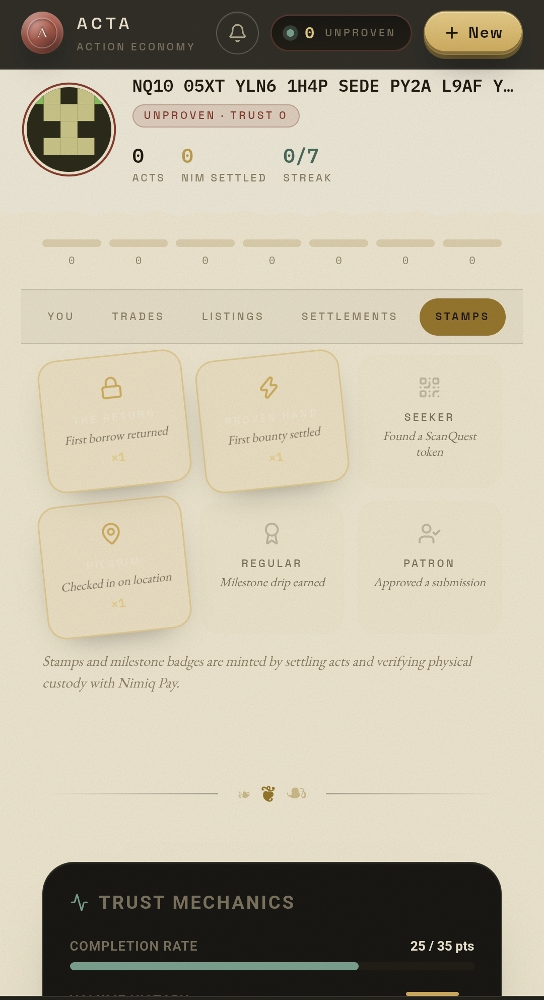
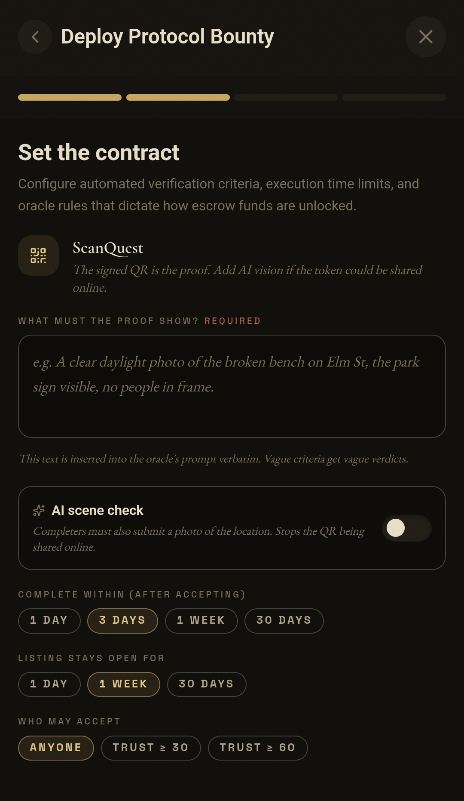
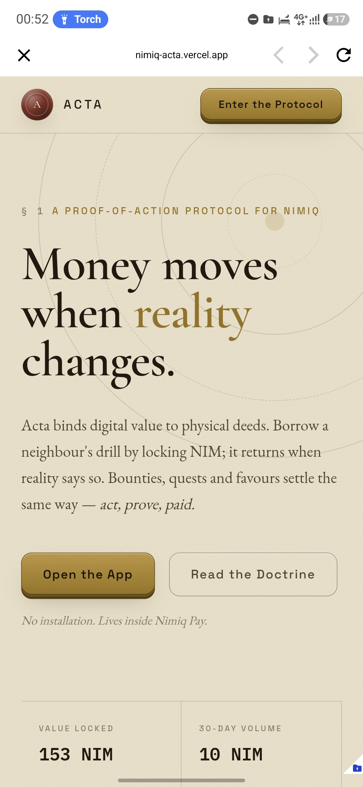
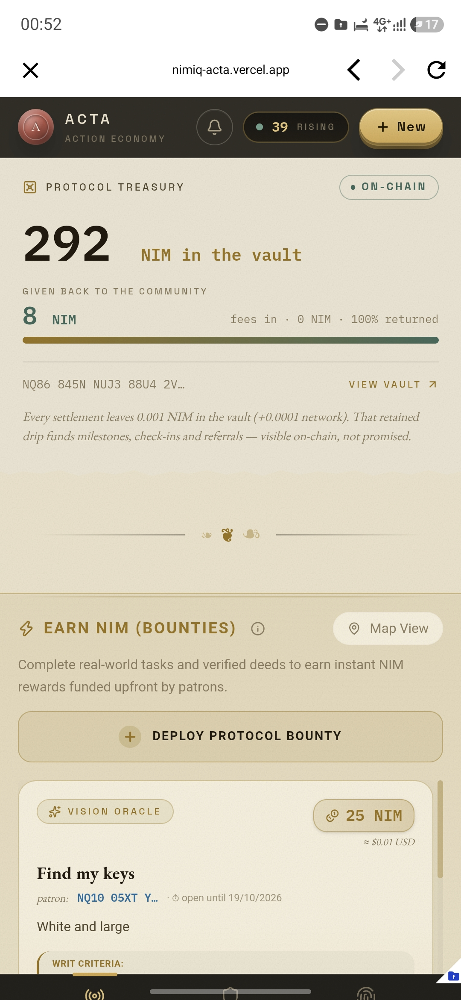
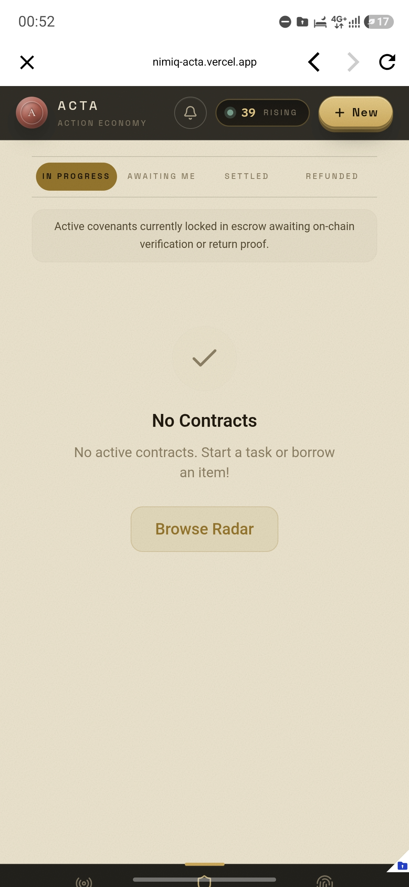

# Acta

> Proof-of-Action escrow: borrow items and fund bounties where NIM moves, only after the real world act is verified.

| Field | Value |
| --- | --- |
| Category | On-chain services |
| Pricing | Free |
| Team name | riot |
| Team members | _Not provided — optional_ |
| X account | 33xp_ |
| Heard about it via | Twitter |
| Contact email | quadcresent@gmail.com |
| GitHub login | @Idle0x |
| Submitted at | 2026-09-18T23:59:13.609Z |

## Links

| Link | URL |
| --- | --- |
| Repo | [https://github.com/Idle0x/nimiq-acta](<https://github.com/Idle0x/nimiq-acta>) |
| Demo | [https://nimiq-acta.vercel.app](<https://nimiq-acta.vercel.app>) |
| Video | [https://youtu.be/eLxVdYTx0Lo](<https://youtu.be/eLxVdYTx0Lo>) |
| Skool post | _Not provided — optional_ |
| Social post | [https://x.com/33xp_/status/2101074737300443270](<https://x.com/33xp_/status/2101074737300443270>) |

## Description

Acta is a proof of action protocol on Nimiq.

Borrow items or fund local bounties; collateral and rewards move as real NIM only when an oracle (AI judged photo, signed QR, GPS, or sponsor signature) confirms the act happened.

Sub second settlement with onchain receipts.

## Builder story

The problem
Trust is expensive. Lending a drill to a neighbor, paying someone to fix a bench, or offering rewards for certain tasks fails on the same thing: strangers don't trust each other.. and traditional escrow just means trusting a platform instead.

What Acta is
A proof-of-action protocol. Every interaction is one pipeline: 
- an act happens in reality
- an oracle verifies it
- NIM moves. 

Borrowing and bounties are the first two types of act on that pipeline, not the product itself.

Four oracles
- PhotoProof: an AI judge checks each photo against the sponsor's written criteria, inserted into the prompt verbatim.
- ScanQuest: an Ed25519 signed token hidden in the physical world; the signature itself is the proof of presence.
- CheckIn: GPS radius, sub 50m accuracy, and a time window.
- Request: the sponsor signs the release; the AI can pre-screen submissions, but the human decides.

Why Nimiq
1. Subsecond finality: in-person handoffs can't wait minutes for confirmations; locks feel like tap to pay.
2. Mini App SDK: Acta runs inside Nimiq Pay itself; one signature locks collateral, no installs, no extensions.
3. Real transactions: every lock, funding, and payout is an onchain transaction with an explorer receipt linked in the app. Remove `window.nimiq` and nothing can authenticate, lock, fund, or pay.

Honest scope
Escrow releases are server gated by the vault key in this build (locks and fundings are user signed onchain transactions); HTLC escrow is the documented production path. Limitations are listed in the README.

## Thumbnail

## Screenshots

---

_Generated from the submission form. `submission.yaml` in this folder is the machine-readable source of truth._
